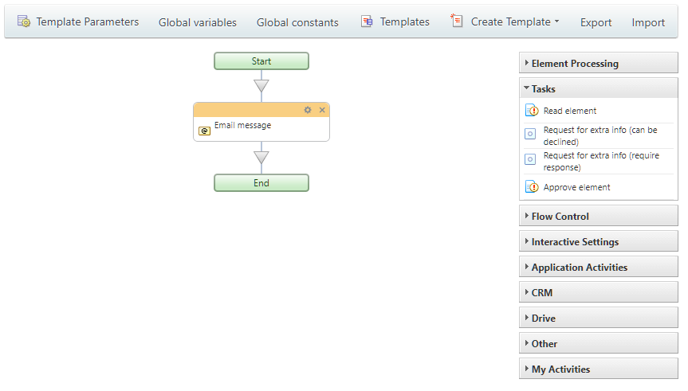
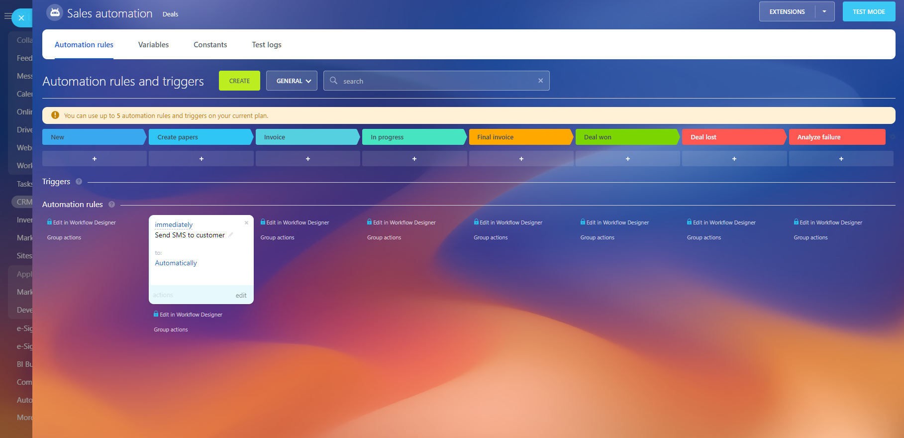

# Workflows and Automation Rules

Workflows in Bitrix24 are a low-code tool that allows you to automate everyday tasks without needing deep programming knowledge. Users can easily configure various operations using ready-to-use actions.

You will find these automated processes and can launch them directly from sections such as [News Feed](../log/index.md), [CRM](../crm/index.md), [Drive](../disk/index.md), [SPAs](../crm/universal/user-defined-object-types/index.md), and [Universal Lists](../lists/index.md).

Workflows can be automatically triggered by specific events (for example, when a new deal is added to CRM) or initiated by the user (such as a vacation approval process through the News Feed).

In addition to workflows, Bitrix24 offers [automation rules](https://helpdesk.bitrix24.com/open/21817474/) — an even simpler way to automate tasks, especially convenient for regular users. Automation rules are actively used in CRM and task management.

## Popular Scenarios Using REST API

With the appropriate methods, you can:

- Add ready-made industry [workflow templates](bizproc-workflow-template-add.md) accepted in specific business sectors or types of companies to Bitrix24
- Propose your scenarios for automatic [workflow launches](bizproc-workflow-start.md) (for example, generating an explanatory note in case of a serious project deadline violation, etc.)
- Offer workflow launches in your [widgets](../widgets/index.md) if standard interfaces do not provide such an option for the user

You can extend the capabilities of user automation in Bitrix24 by adding your own [workflow actions](bizproc-activity/bizproc-activity-add.md) and [automation rules](bizproc-robot/bizproc-robot-add.md) that can:

- Send documents to external systems
- Create or modify orders in an external online store
- Transfer data from external systems to Bitrix24
- Launch ready-made external processes (for example, connecting a special external chatbot to a conversation with a client when the deal moves to the delivery approval stage)
- Send payment data to external Sales Intelligence
- Execute a completed business scenario (for example, generating a complex invoice or collecting data from all deals of a single client and returning the total for further use)



- Add automation rules instead of workflow actions, as each registered automation rule can also be used as a workflow action. Additionally, your automation rules will be available in [Smart Scenarios](https://helpdesk.bitrix24.com/open/21319214/)
- If you want to send changes to an external system when deal or lead statuses change, it’s better to [register an automation rule](bizproc-robot/bizproc-robot-add.md) that the user will place at the desired stage, rather than intercepting the event on [deal change](../crm/deals/events/on-crm-deal-add.md) or [lead](../crm/leads/events/on-crm-lead-add.md). This will save you from having to create an interface for matching lead and deal stages with statuses or events from the external system and significantly simplify development.



## Features of Workflow Functionality

It is important to understand the terminology and relationships between the objects that implement workflow functionality.

### Workflow Template

This is essentially a logical scheme, an algorithm that implements the necessary business logic using individual actions and operations available in the workflow designer.

A [template](bizproc-workflow-template-add.md) is always tied to a specific **base object**, the data of which it will operate on. For example, a template may be linked to CRM deals. In this case, the base object will be a specific deal for which the workflow will be launched.

The link to the base object also defines the context for launching the workflow: for instance, you cannot launch a workflow for a lead based on a template created for a deal.

Objects can include leads, contacts, companies, invoices, and estimates in CRM, elements of user-defined object types (SPAs), Bitrix24 Drive files, and more.

A workflow template can have input parameters that the user (or your code) must fill out when launching the workflow based on the selected template.

In addition to input parameters, internal variables can also be used. The template developer must add them in the template settings.

It is important to understand that when we talk about input parameters and variables, we are referring to "descriptions." However, actual values for parameters and variables only arise when a real workflow is launched!

### Workflows

A workflow is, in fact, a "live" instance created from a template at the moment of [launch](bizproc-workflow-start.md) for a specific base object. Clearly, multiple workflows can be launched simultaneously for different base objects.

When a workflow is launched, a copy of the workflow template is created, which remains unchanged until the workflow is completed. If the user makes changes to the template during the execution of the workflow, it will not affect the logic of the already launched workflow.

The values of input parameters and internal variables also have specific values for each individual workflow and change only "for it."

### Workflow Tasks

During execution, a workflow can use special actions — tasks for workflow participants, when the logic of the workflow requires obtaining some additional information from the user, such as approving a document, uploading a file, etc.

Such actions generate **workflow tasks**. Users who receive tasks see the relevant information in Bitrix24 and also receive notifications. The [current tasks](bizproc-task/bizproc-task-list.md) for a user can also be retrieved using the corresponding REST API method for automatic processing.

### Workflow Actions

**Actions** in a workflow are the "building blocks" from which the workflow template is constructed. Typically, they represent isolated atomic operations like "Create Task," "Generate Invoice," "Change Document Field Value," etc.

Workflow actions can have input parameters that the user can specify in the workflow designer during the development of the required template.

Additionally, actions can return resulting data "back" to the workflow. This data can be used by the workflow designer as input parameters for subsequent actions.

With the REST API, you can [add your own actions](bizproc-activity/bizproc-activity-add.md) to workflows in Bitrix24.

### Automation Rules

**Automation rules** are objects similar to workflow actions, with the main difference being that they are primarily used not in the workflow designer but in special CRM and task interfaces.

Automation rules can also have input parameters, the values of which will be set by the user configuring the rules in lead, deal funnels, or smart scenarios. They can also return values for use as input parameters for subsequent automation rules.

With the REST API, you can [add your own automation rules](bizproc-robot/bizproc-robot-add.md) to Bitrix24. We recommend adding automation rules instead of workflow actions, as automation rules can be used within the workflow designer, meaning you will add your functionality to both the automation rules settings and the workflow designer at once.

## Recommended Learning Sequence

- Add [your automation rule](bizproc-robot/bizproc-robot-add.md) to Bitrix24
- Learn how to [launch a ready-made workflow](bizproc-workflow-start.md) or [stop](bizproc-workflow-kill.md) an already launched one
- Find out how to [add your template](bizproc-workflow-template-add.md)
- Learn how to get a list of current [workflow tasks](bizproc-task/bizproc-task-list.md) and how to automatically [complete](bizproc-task/bizproc-task-complete.md) them for the user.