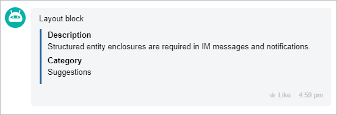

# GRID Block



If you are developing integrations for Bitrix24 using AI tools (Codex, Claude Code, Cursor), connect to the [MCP server](../../../../../../../sdk/mcp.md) so that the assistant can utilize the official REST documentation.



The `GRID` block displays data in a tabular format of "name-value" pairs with various display options.

## Display Options

- `BLOCK` — each `GRID` element is displayed as a separate block on a new line, forming a vertical list.
- `LINE` — elements are displayed in a single line as cards, wrapping to the next line when there is insufficient width.
- `ROW` — a classic two-column format of "NAME | VALUE".
- `TABLE` — tabular mode with a denser grid; support depends on the client application version. In some clients, it may appear as `ROW`.

### How It Looks in the Interface

- `BLOCK`

  Fields are listed one below the other, each on a new line.

  Example:

  ```text
  Project: BUGS
  Category: im
  Summary: Implementation required...
  ```

- `LINE`

  Fields are shown as compact cards in a single line. If space is insufficient, the cards wrap to the next line.

  Example:

  ```text
  [Project: BUGS] [Category: im] [Priority: High]
  [Executor: John Smith]
  ```

- `ROW`

  "Name-value" pairs are displayed in two columns: `NAME` on the left and `VALUE` on the right.

  Example:

  ```text
  Project      | BUGS
  Category     | im
  Priority     | High
  ```

- `TABLE`

  Tabular variant with a denser grid. Depending on the client, it may look like `ROW`.

  Example:

  ```text
  Project    | BUGS
  Category   | im
  Deadline   | 11/04/2015 05:50:43 PM
  ```



Do not mix different display formats within a single `GRID` entry. If different types of representation are needed, create separate `GRID` blocks.



## General Parameters of the GRID Element

#|
|| **Name**
`type` | **Description** ||
|| **DISPLAY***
[`string`](../../../../../../data-types.md) | Display format: `BLOCK`, `LINE`, `ROW`, `TABLE` ||
|| **NAME**
[`string`](../../../../../../data-types.md) | Field name. In `ROW` mode, it may be omitted, in which case `VALUE` occupies the entire width of the row ||
|| **VALUE**
[`string`](../../../../../../data-types.md) | Field value. BB codes are supported for `VALUE`. In `ROW` mode, it may be omitted, in which case `NAME` occupies the entire width of the row ||
|| **WIDTH**
[`integer`](../../../../../../data-types.md) | Width of the block or column in pixels ||
|| **HEIGHT**
[`integer`](../../../../../../data-types.md) | Height of the block in pixels ||
|| **COLOR_TOKEN**
[`string`](../../../../../../data-types.md) | Color token for the value: `primary`, `secondary`, `alert`, `base` ||
|| **COLOR**
[`string`](../../../../../../data-types.md) | HEX color of the value (`#RGB` or `#RRGGBB`) ||
|| **LINK**
[`string`](../../../../../../data-types.md) | External link for the value ||
|| **USER_ID**
[`integer`](../../../../../../data-types.md) | Internal link to the user ||
|| **CHAT_ID**
[`integer`](../../../../../../data-types.md) | Internal link to the chat ||
|#

## Supported BB Codes for VALUE

#|
|| **Code** | **Purpose** ||
|| `USER` | Mention a user with a link to their profile in the chat ||
|| `CHAT` | Link to the chat ||
|| `SEND` | Clickable action "send text to chat" ||
|| `PUT` | Clickable action "insert text into input field" ||
|| `CALL` | Clickable action for calling ||
|| `BR` | Line break ||
|| `B` | Bold text ||
|| `U` | Underlined text ||
|| `I` | Italic text ||
|| `S` | Strikethrough text ||
|| `URL` | Link ||
|#

## Examples



### Block Representation

`DISPLAY: 'BLOCK'` displays elements one below the other.

{width=420}

#### Example



- JS

    ```js
    {
        GRID: [
            {
                NAME: 'Description',
                VALUE: 'Implementation required to add structured entities to messages and notifications in the messenger.',
                DISPLAY: 'BLOCK',
                WIDTH: 250
            },
            {
                NAME: 'Category',
                VALUE: 'Requests',
                DISPLAY: 'BLOCK',
                WIDTH: 100
            }
        ]
    }
    ```

- PHP

    ```php
    [
        'GRID' => [
            [
                'NAME' => 'Description',
                'VALUE' => 'Implementation required to add structured entities to messages and notifications in the messenger.',
                'DISPLAY' => 'BLOCK',
                'WIDTH' => 250
            ],
            [
                'NAME' => 'Category',
                'VALUE' => 'Requests',
                'DISPLAY' => 'BLOCK',
                'WIDTH' => 100
            ]
        ]
    ]
    ```



### Line Representation

`DISPLAY: 'LINE'` displays elements in a line, wrapping to the next line when there is insufficient space.

{width=420}

In the mobile version, elements are displayed one below the other.

#### Example



- JS

    ```js
    {
        GRID: [
            {
                NAME: 'Priority',
                VALUE: 'High',
                COLOR_TOKEN: 'alert',
                COLOR: '#ff0000',
                DISPLAY: 'LINE',
                WIDTH: 250
            },
            {
                NAME: 'Category',
                VALUE: 'Requests',
                DISPLAY: 'LINE'
            }
        ]
    }
    ```

- PHP

    ```php
    [
        'GRID' => [
            [
                'NAME' => 'Priority',
                'VALUE' => 'High',
                'COLOR_TOKEN' => 'alert',
                'COLOR' => '#ff0000',
                'DISPLAY' => 'LINE',
                'WIDTH' => 250
            },
            [
                'NAME' => 'Category',
                'VALUE' => 'Requests',
                'DISPLAY' => 'LINE'
            ]
        ]
    ]
    ```



### Two-Column Representation

`DISPLAY: 'ROW'` displays data in two columns.


#### Example



- JS

    ```js
    {
        GRID: [
            {
                NAME: 'Priority',
                VALUE: 'High',
                DISPLAY: 'ROW'
            },
            {
                NAME: 'Category',
                VALUE: 'Requests',
                DISPLAY: 'ROW'
            }
        ]
    }
    ```

- PHP

    ```php
    [
        'GRID' => [
            [
                'NAME' => 'Priority',
                'VALUE' => 'High',
                'DISPLAY' => 'ROW',
                'WIDTH' => 250
            },
            [
                'NAME' => 'Category',
                'VALUE' => 'Requests',
                'DISPLAY' => 'ROW'
            ]
        ]
    ]
    ```



## Continue Learning

- [API Change Log for imbot.v2](../../../../change-log.md)
- [{#T}](./index.md)
- [{#T}](./text.md)
- [{#T}](./delimiter.md)