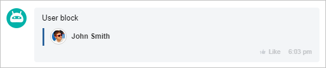
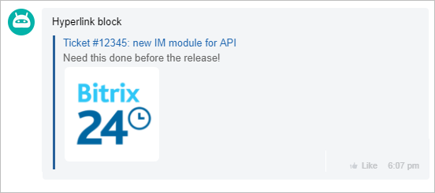
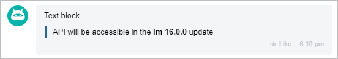
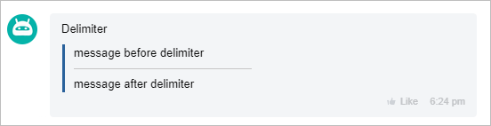
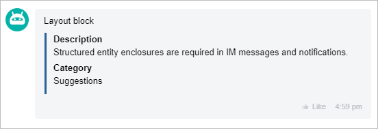
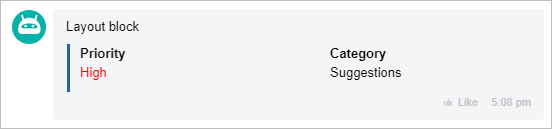
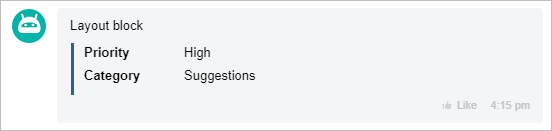
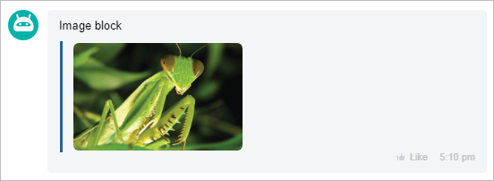
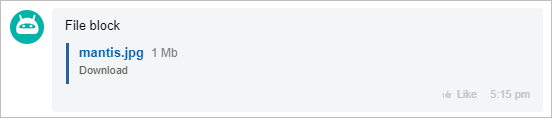

# ATTACH Block Collection



If you are developing integrations for Bitrix24 using AI tools (Codex, Claude Code, Cursor), connect to the [MCP server](../../../../../../../ai-tools/mcp.md) so that the assistant can utilize the official REST documentation.



Blocks define the structure and appearance of the `ATTACH` attachment. Each element of the `BLOCKS` array is an object with a single top-level key, and this key sets the block type.

## All Block Types {#all-blocks}

#|
|| **Key in BLOCKS** | **Block** | **What to Use It For** ||
|| `USER` | [User Block](./user.md) | A user card: name, avatar, and a link to the profile or an external resource ||
|| `LINK` | [Link Block](./links.md) | A clickable link with a caption — navigation to a task, document, deal, or external page ||
|| `MESSAGE` | [Text Block](./text.md) | A text fragment of the attachment with BB code support ||
|| `DELIMITER` | [Delimiter Block](./delimiter.md) | A visual divider between meaningful parts of the attachment ||
|| `GRID` | [Grid Block for Rows and Columns](./grid.md) | A tabular structure of name-value pairs in one of the modes: `BLOCK`, `LINE`, `ROW`, `TABLE` ||
|| `IMAGE` | [Image Block](./images.md) | One or several images within the attachment ||
|| `FILE` | [File Block](./files.md) | A file with a name, size, and download link ||
|#

Blocks of different types are combined in a single array and displayed in the order they are listed:

```json
"BLOCKS": [
    {"MESSAGE": "Request #142"},
    {"DELIMITER": {"SIZE": 200, "COLOR": "#c6c6c6"}},
    {"GRID": [{"DISPLAY": "ROW", "NAME": "Status", "VALUE": "In progress"}]},
    {"LINK": {"NAME": "Open the request", "LINK": "/crm/deal/details/142/"}}
]
```

The attachment limits are common to all blocks: the serialized `ATTACH` must not exceed 60,000 characters, and only absolute URLs `http://` and `https://` or relative paths from the Bitrix24 root are allowed in block links. If the structure is incorrect, the sending method returns the `ATTACH_ERROR` error, and if the limit is exceeded — `ATTACH_OVERSIZE`. More details — [Attachments in Messages ATTACH](../index.md).

Blocks describe only the request. In the response, the sending method returns only the ID of the created message, while the assembled attachment arrives in the `params` field of the Message object when the message is read or in an event — [What Is Returned in the Response](../index.md#response).

All seven block types are current, and none of them are outdated. Take into account only the differences in rendering: the `TABLE` mode of the `GRID` block is not supported in every client version and may be displayed as `ROW`, and in the mobile version the elements of the `LINE` mode are displayed one below the other.

## How Each Block Looks

### [User Block (USER)](./user.md)

Displays the user card within the attachment: name, avatar, and a link to the profile or external resource.

{width=420}

### [Link Block (LINK)](./links.md)

Adds a clickable link with a caption. Suitable for navigating to a task, document, deal, or external page.

{width=420}

### [Text Block (MESSAGE)](./text.md)

Outputs a text fragment of the attachment. Used for headings, explanations, comments, and main content.

{width=420}

### [Delimiter Block (DELIMITER)](./delimiter.md)

Adds a visual separator between parts of the attachment. Helps to distinguish meaningful blocks in a long card.

{width=420}

### [Grid Block for Rows and Columns (GRID)](./grid.md)

Forms a tabular structure from pairs of "name-value". Suitable for cards with properties and parameters.

1. [Block Representation (BLOCK)](./grid.md#block-representation)

   {width=420}

2. [Line Representation (LINE)](./grid.md#line-representation)

   {width=420}

   In the mobile version, blocks are displayed one below the other.

3. [Two-Column Representation (ROW)](./grid.md#two-column-representation)

   {width=420}

### [Image Block (IMAGE)](./images.md)

Displays one or more images within the attachment.

{width=420}

### [File Block (FILE)](./files.md)

Adds a file with a name and a link for downloading or opening.

{width=420}

## Continue Exploring

- [API Change Log for imbot.v2](../../../../change-log.md)
- [{#T}](../index.md)
- [{#T}](../constructor.md)
- [Messages imbot.v2](../../index.md)
- [{#T}](../../chat-message-send.md)
- [Working with Keyboards](../../message-keyboards.md) — buttons under the message for commands, links, and actions