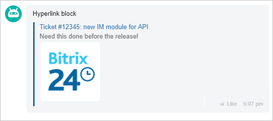
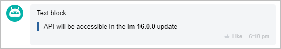
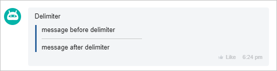
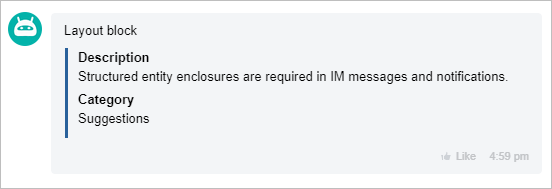
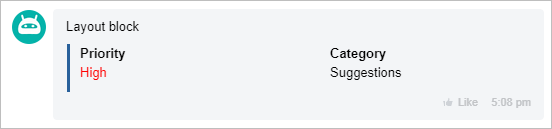
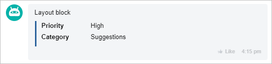
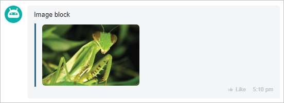
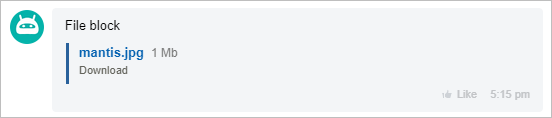

# ATTACH Block Collection



Choose a tool for developing with an AI agent:

- use [Alaio Vibecode](../../../../../../../ai-tools/vibecode.md) to build an app for Bitrix24 from a task description without knowing any programming language. The agent writes the code and deploys the app to a server, with no manual hosting setup
- use the [MCP server](../../../../../../../ai-tools/mcp.md) to develop a REST API integration in your own project. The agent refers to the official REST documentation



Blocks define the structure and appearance of the `ATTACH` attachment. There are seven block types: text, link, user, properties, images, files, and delimiter. Blocks of different types can be combined in a single attachment. The format of the `ATTACH` object itself, its limits, and errors are described on the [Attachments in Messages ATTACH](../index.md) page.

Each element of the `BLOCKS` array is an object with a single top-level key. The key sets the block type. In the short form of an attachment, the same rule applies to the elements of the `attach` array.

## All Block Types {#all-blocks}

#|
|| **Key in BLOCKS** | **Block** | **What to Use It For** ||
|| `USER` | [User Block](./user.md) | A user card: name, avatar, and a link to the profile or an external resource ||
|| `LINK` | [Link Block](./links.md) | A clickable link with a caption — navigation to a task, document, deal, or external page ||
|| `MESSAGE` | [Text Block](./text.md) | A text fragment of the attachment with BB code support ||
|| `DELIMITER` | [Delimiter Block](./delimiter.md) | A visual divider between meaningful parts of the attachment ||
|| `GRID` | [Grid Block for Rows and Columns](./grid.md) | A tabular structure of name-value pairs in one of the modes: `BLOCK`, `LINE`, `ROW` ||
|| `IMAGE` | [Image Block](./images.md) | One or several images within the attachment ||
|| `FILE` | [File Block](./files.md) | A file with a name, size, and download link ||
|#

### How to Choose a Block {#choose}

- object properties such as status, deadline, or responsible person — `GRID` in the `ROW` mode
- free text with markup and clickable commands — `MESSAGE`
- a link as a separate card with a description and a preview — `LINK`. A link inside the text — the `[URL]` BB code in `MESSAGE`
- an employee with an avatar — `USER`
- an image visible right in the message — `IMAGE`. A document for download — `FILE`

## How to Combine Blocks {#combine}

Blocks of different types are combined in a single array and displayed in the order they are listed:

```json
{
    "BLOCKS": [
        {"MESSAGE": "Deal #142"},
        {"DELIMITER": {"SIZE": 200, "COLOR": "#c6c6c6"}},
        {"GRID": [{"DISPLAY": "ROW", "NAME": "Status", "VALUE": "In progress"}]},
        {"LINK": {"NAME": "Open the deal", "LINK": "/crm/deal/details/142/"}}
    ]
}
```

Allowed links, the size limit, and error codes are described in the [Limitations and Errors](../index.md#limits) section, and the response format in the [What Is Returned in the Response](../index.md#response) section.

## How Each Block Looks {#screenshots}

### [User Block (USER)](./user.md)

{width=420}

### [Link Block (LINK)](./links.md)

{width=420}

### [Text Block (MESSAGE)](./text.md)

{width=420}

### [Delimiter Block (DELIMITER)](./delimiter.md)

{width=420}

### [Grid Block for Rows and Columns (GRID)](./grid.md)

1. [Block Representation (BLOCK)](./grid.md#block-view)

   {width=420}

2. [Line Representation (LINE)](./grid.md#inline-view) — in the mobile version, the elements are displayed one below the other

   {width=420}

3. [Two-Column Representation (ROW)](./grid.md#two-column-view)

   {width=420}

### [Image Block (IMAGE)](./images.md)

{width=420}

### [File Block (FILE)](./files.md)

{width=420}

## Continue Exploring

- [API Change Log for imbot.v2](../../../../change-log.md)
- [{#T}](../index.md)
- [{#T}](../constructor.md)
- [Messages imbot.v2](../../index.md)
- [{#T}](../../chat-message-send.md)
- [Working with Keyboards](../../message-keyboards.md) — buttons under the message for commands, links, and actions