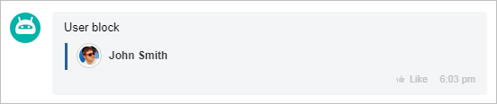

# User Block USER



Choose a tool for developing with an AI agent:

- use [Alaio Vibecode](../../../../../../../ai-tools/vibecode.md) to build an app for Bitrix24 from a task description without knowing any programming language. The agent writes the code and deploys the app to a server, with no manual hosting setup
- use the [MCP server](../../../../../../../ai-tools/mcp.md) to develop a REST API integration in your own project. The agent refers to the official REST documentation



The `USER` block displays the user's card within the attachment: name, avatar, and a link for navigation — for example, the person responsible for a request or the author of a comment. Pass the block as an element of the attachment's `BLOCKS` array — general rules and limits are described on the [Attachments in Messages ATTACH](../index.md#limits) page.

Only the `LINK` field makes the block clickable. For a Bitrix24 employee, pass the profile path in `LINK`, for example `/company/personal/user/1/`. For an external contact, pass an absolute URL.

The block stores a single navigation target. If several fields are passed, only the first one in order of priority remains: `NETWORK_ID`, `USER_ID`, `CHAT_ID`, `BOT_ID`, `LINK`. As a result, `LINK` is discarded together with any ID, and the web client does not implement navigation by ID, so the block is not clickable.

{width=420}

## Block Parameters

#| 
|| **Name**
`type` | **Description** ||
|| **NAME*** 
[`string`](../../../../../../data-types.md) | The name displayed in the block ||
|| **AVATAR** 
[`string`](../../../../../../data-types.md) | Avatar URL. Absolute URLs (`http://`, `https://`) and relative paths from the Bitrix24 root are allowed ||
|| **LINK** 
[`string`](../../../../../../data-types.md) | URL for navigation when clicking on the block: an absolute `http://` or `https://` URL or a path from the Bitrix24 root. Ignored if any of the IDs below is passed ||
|| **USER_ID** 
[`integer`](../../../../../../data-types.md) | Bitrix24 user ID. It is retained in the attachment, but the web client does not implement navigation by it ||
|| **CHAT_ID** 
[`integer`](../../../../../../data-types.md) | Bitrix24 chat ID. It is retained in the attachment, but the web client does not implement navigation by it. Changes the avatar placeholder to `CHAT` ||
|| **BOT_ID** 
[`integer`](../../../../../../data-types.md) | Bitrix24 chatbot ID. It is retained in the attachment, but the web client does not implement navigation by it. Changes the avatar placeholder to `BOT` ||
|| **NETWORK_ID** 
[`string`](../../../../../../data-types.md) | Bitrix24 Network user ID: a letter followed by a number. Overrides all other navigation fields ||
|| **AVATAR_TYPE** 
[`string`](../../../../../../data-types.md) | Type of placeholder displayed when `AVATAR` is not set: `USER`, `CHAT`, `BOT`. Defaults to `USER`, to `CHAT` with `CHAT_ID`, and to `BOT` with `BOT_ID`. An explicit value overrides the automatic one ||
|#

## Examples



The examples show a single element of the `BLOCKS` array.

### Bitrix24 Employee {#internal-user}

Clicking the block opens the profile of the user with ID `1`.



- JS

    ```js
    {
        USER: {
            NAME: 'John Smith',
            AVATAR: 'https://files.shelenkov.com/bitrix/images/avatar.png',
            LINK: '/company/personal/user/1/'
        }
    }
    ```

- Python

    ```python
    block = {
        "USER": {
            "NAME": "John Smith",
            "AVATAR": "https://files.shelenkov.com/bitrix/images/avatar.png",
            "LINK": "/company/personal/user/1/",
        },
    }
    ```

- PHP

    ```php
    [
        'USER' => [
            'NAME' => 'John Smith',
            'AVATAR' => 'https://files.shelenkov.com/bitrix/images/avatar.png',
            'LINK' => '/company/personal/user/1/'
        ]
    ]
    ```



### External Contact {#external-link}

Clicking the block opens the external page from `LINK`.



- JS

    ```js
    {
        USER: {
            NAME: 'John Smith',
            AVATAR: 'https://files.shelenkov.com/bitrix/images/avatar.png',
            LINK: 'https://shelenkov.com'
        }
    }
    ```

- Python

    ```python
    block = {
        "USER": {
            "NAME": "Stefan Meier",
            "AVATAR": "https://files.shelenkov.com/bitrix/images/avatar.png",
            "LINK": "https://shelenkov.com",
        },
    }
    ```

- PHP

    ```php
    [
        'USER' => [
            'NAME' => 'John Smith',
            'AVATAR' => 'https://files.shelenkov.com/bitrix/images/avatar.png',
            'LINK' => 'https://shelenkov.com'
        ]
    ]
    ```



## Continue Learning

- [API imbot.v2 Change Log](../../../../change-log.md)
- [{#T}](./index.md)
- [{#T}](./links.md)
- [{#T}](./grid.md)
- [{#T}](../constructor.md)
- [{#T}](../../chat-message-send.md)