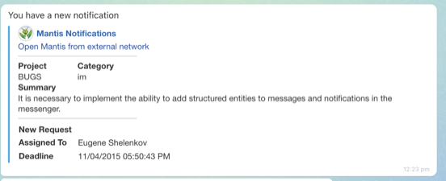
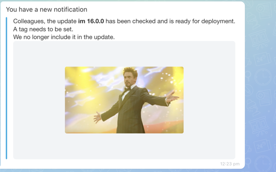

# Attachment Builder ATTACH



If you are developing integrations for Bitrix24 using AI tools (Codex, Claude Code, Cursor), connect to the [MCP server](../../../../../../ai-tools/mcp.md) so that the assistant can utilize the official REST documentation.



A composite attachment is assembled from blocks — for example, from a user card, a link, a delimiter, a table, and an image. The final appearance depends on the set of blocks and the order in which they are listed.

Below are two ready-made attachments with the code that sends them and the result in the chat: a bug tracker task card and an informational notification with an image. Copy either example as a whole and replace the data with your own.

Parameters of individual blocks are described in the [ATTACH Block Collection](./block-collections/index.md), and object formats and general limitations are on the [Attachments in Messages ATTACH](./index.md) page.

## How a Composite Attachment Is Assembled {#how-it-works}

The attachment is passed in the `fields.attach` parameter of the message sending method. The assembly rules are the same for both examples.

- Each element of the block array is an object with a single top-level key. The key defines the block type: `MESSAGE`, `LINK`, `USER`, `GRID`, `IMAGE`, `FILE`, `DELIMITER`.
- The value depends on the block type: `MESSAGE` takes a string, `USER`, `LINK`, and `DELIMITER` take an object, and `GRID`, `IMAGE`, and `FILE` take an array of objects.
- Blocks are displayed in the order they are listed in the array. To change the order of the card parts, swap the elements.
- The text of the `message` parameter is shown above the attachment as a regular message. The text inside the attachment is set by the `MESSAGE` block.
- The display mode is set by the `DISPLAY` field of each element of the `GRID` block separately. Modes are not mixed within a single block — otherwise the layout becomes unpredictable; assemble a separate block for each mode, as in [Example 1](#example-bugtracker).

Only the [`FILE`](./block-collections/files.md) block is not used in the examples.

[Example 1](#example-bugtracker) is assembled in the short form — an array of blocks without a wrapper. [Example 2](#example-notification) uses the full form: an object with the `BLOCKS` array. The full form is required when the blocks are accompanied by attachment metadata, such as the `COLOR_TOKEN` color scheme or the `COLOR` hex value. The fields of the full form are described in the [ATTACH Object Formats](./index.md#full-form-fields) section.

## What You Need {#requirements}

Both examples send a message with the [imbot.v2.Chat.Message.send](../chat-message-send.md) method.

> Scope: [`imbot`](../../../../../scopes/permissions.md)
>
> Who can execute the method: owner of the registered bot

Before running an example, substitute your own values:

- `botId` — identifier of the bot the message is sent on behalf of. It is returned by the bot registration method [imbot.v2.Bot.register](../../bots/bot-register.md) in the `result.bot.id` field
- `botToken` — the token specified when the bot was registered. It is required for webhook authorization and is not passed with OAuth
- `dialogId` — dialog identifier: `chat{chatId}` for a group chat and `{userId}` for a private one. The numeric `chatId` comes in method responses and in event data — [Chat Identifiers](../../chats/index.md#identifiers)
- links to avatars, images, and external pages — the examples use demo addresses, replace them with your own

The limitations are the same for any attachment: block links accept absolute `http://` and `https://` addresses or relative paths from the Bitrix24 root, and the size of the serialized `ATTACH` is limited to 60,000 characters. For the full list of limitations, see [Limitations and Errors](./index.md#limits).

Everyone in the chat sees the attachment, so never pass authorization tokens or other secrets in its links. The bot sends a message only to a chat it has access to.

## Example 1 — Bug Tracker Card {#example-bugtracker}

A notification about a new bug tracker ticket: who submitted it, where to go, the ticket parameters, and the deadline. Such a card suits integrations with external systems — task trackers, monitoring, and support services.

#|
|| **Order** | **Block** | **What It Displays** ||
|| 1 | [`USER`](./block-collections/user.md) | The notification sender: name and avatar with a link to the external tracker ||
|| 2 | [`LINK`](./block-collections/links.md) | A link to the ticket in the external system ||
|| 3 | [`DELIMITER`](./block-collections/delimiter.md) | A delimiter between the `USER` and `LINK` blocks and the ticket parameters ||
|| 4 | [`GRID`](./block-collections/grid.md) | The project and the category as compact cards in one line — the `LINE` mode ||
|| 5 | [`GRID`](./block-collections/grid.md) | The ticket summary: the name and the value below it — the `BLOCK` mode ||
|| 6 | [`DELIMITER`](./block-collections/delimiter.md) | A delimiter before the service fields ||
|| 7 | [`GRID`](./block-collections/grid.md) | The new ticket mark, the assignee, and the deadline in two columns — the `ROW` mode ||
|#





- cURL (Webhook)

    ```bash
    curl -X POST \
      -H "Content-Type: application/json" \
      -H "Accept: application/json" \
      -d '{"botId":456,"botToken":"my_bot_token","dialogId":"chat20921","fields":{"message":"You have a new notification","attach":[{"USER":{"NAME":"Mantis Notifications","AVATAR":"https://files.shelenkov.com/bitrix/images/mantis2.jpg","LINK":"https://shelenkov.com/"}},{"LINK":{"NAME":"Open Mantis from external network","LINK":"https://shelenkov.com/"}},{"DELIMITER":{"SIZE":200,"COLOR":"#c6c6c6"}},{"GRID":[{"NAME":"Project","VALUE":"BUGS","DISPLAY":"LINE","WIDTH":100},{"NAME":"Category","VALUE":"im","DISPLAY":"LINE","WIDTH":100}]},{"GRID":[{"NAME":"Summary","VALUE":"It is necessary to implement the ability to add structured entities to messages and notifications in the messenger.","DISPLAY":"BLOCK"}]},{"DELIMITER":{"SIZE":200,"COLOR":"#c6c6c6"}},{"GRID":[{"NAME":"New Request","VALUE":"","DISPLAY":"ROW","WIDTH":100},{"NAME":"Assigned To","VALUE":"Eugene Shelenkov","DISPLAY":"ROW","WIDTH":100},{"NAME":"Deadline","VALUE":"11/04/2015 05:50:43 PM","DISPLAY":"ROW","WIDTH":100}]}]}}' \
      https://**put_your_bitrix24_address**/rest/**put_your_user_id_here**/**put_your_webhook_here**/imbot.v2.Chat.Message.send
    ```

- cURL (OAuth)

    ```bash
    curl -X POST \
      -H "Content-Type: application/json" \
      -H "Accept: application/json" \
      -d '{"botId":456,"dialogId":"chat20921","fields":{"message":"You have a new notification","attach":[{"USER":{"NAME":"Mantis Notifications","AVATAR":"https://files.shelenkov.com/bitrix/images/mantis2.jpg","LINK":"https://shelenkov.com/"}},{"LINK":{"NAME":"Open Mantis from external network","LINK":"https://shelenkov.com/"}},{"DELIMITER":{"SIZE":200,"COLOR":"#c6c6c6"}},{"GRID":[{"NAME":"Project","VALUE":"BUGS","DISPLAY":"LINE","WIDTH":100},{"NAME":"Category","VALUE":"im","DISPLAY":"LINE","WIDTH":100}]},{"GRID":[{"NAME":"Summary","VALUE":"It is necessary to implement the ability to add structured entities to messages and notifications in the messenger.","DISPLAY":"BLOCK"}]},{"DELIMITER":{"SIZE":200,"COLOR":"#c6c6c6"}},{"GRID":[{"NAME":"New Request","VALUE":"","DISPLAY":"ROW","WIDTH":100},{"NAME":"Assigned To","VALUE":"Eugene Shelenkov","DISPLAY":"ROW","WIDTH":100},{"NAME":"Deadline","VALUE":"11/04/2015 05:50:43 PM","DISPLAY":"ROW","WIDTH":100}]}]},"auth":"**put_access_token_here**"}' \
      https://**put_your_bitrix24_address**/rest/imbot.v2.Chat.Message.send
    ```

- JS

    ```js
    try {
        const response = await $b24.callMethod(
            'imbot.v2.Chat.Message.send',
            {
                botId: 456,
                dialogId: 'chat20921',
                fields: {
                    message: 'You have a new notification',
                    attach: [
                    {
                        USER: {
                            NAME: 'Mantis Notifications',
                            AVATAR: 'https://files.shelenkov.com/bitrix/images/mantis2.jpg',
                            LINK: 'https://shelenkov.com/'
                        }
                    },
                    {
                        LINK: {
                            NAME: 'Open Mantis from external network',
                            LINK: 'https://shelenkov.com/'
                        }
                    },
                    {
                        DELIMITER: {
                            SIZE: 200,
                            COLOR: '#c6c6c6'
                        }
                    },
                    {
                        GRID: [
                            {
                                NAME: 'Project',
                                VALUE: 'BUGS',
                                DISPLAY: 'LINE',
                                WIDTH: 100
                            },
                            {
                                NAME: 'Category',
                                VALUE: 'im',
                                DISPLAY: 'LINE',
                                WIDTH: 100
                            }
                        ]
                    },
                    {
                        GRID: [
                            {
                                NAME: 'Summary',
                                VALUE: 'It is necessary to implement the ability to add structured entities to messages and notifications in the messenger.',
                                DISPLAY: 'BLOCK'
                            }
                        ]
                    },
                    {
                        DELIMITER: {
                            SIZE: 200,
                            COLOR: '#c6c6c6'
                        }
                    },
                    {
                        GRID: [
                            {
                                NAME: 'New Request',
                                VALUE: '',
                                DISPLAY: 'ROW',
                                WIDTH: 100
                            },
                            {
                                NAME: 'Assigned To',
                                VALUE: 'Eugene Shelenkov',
                                DISPLAY: 'ROW',
                                WIDTH: 100
                            },
                            {
                                NAME: 'Deadline',
                                VALUE: '11/04/2015 05:50:43 PM',
                                DISPLAY: 'ROW',
                                WIDTH: 100
                            }
                        ]
                    }
                    ]
                }
            }
        );

        const result = response.getData().result.id;
        console.log('Created message ID:', result);
    } catch (error) {
        console.error(error);
    }
    ```

- Python

    ```python
    from b24pysdk.errors import BitrixAPIError, BitrixSDKException

    try:
        bitrix_response = client.imbot.v2.chat.message.send(
            bot_id=456,
            dialog_id="chat20921",
            fields={
                "message": "You have a new notification",
                "attach": [
                    {
                        "USER": {
                            "NAME": "Mantis notifications",
                            "AVATAR": "https://files.shelenkov.com/bitrix/images/mantis2.jpg",
                            "LINK": "https://shelenkov.com/",
                        },
                    },
                    {
                        "LINK": {
                            "NAME": "Open Mantis from an external network",
                            "LINK": "https://shelenkov.com/",
                        },
                    },
                    {
                        "DELIMITER": {
                            "SIZE": 200,
                            "COLOR": "#c6c6c6",
                        },
                    },
                    {
                        "GRID": [
                            {
                                "NAME": "Project",
                                "VALUE": "BUGS",
                                "DISPLAY": "LINE",
                                "WIDTH": 100,
                            },
                            {
                                "NAME": "Category",
                                "VALUE": "im",
                                "DISPLAY": "LINE",
                                "WIDTH": 100,
                            },
                        ],
                    },
                    {
                        "GRID": [
                            {
                                "NAME": "Summary",
                                "VALUE": "We need to implement the ability to add structured entities to messenger messages and notifications.",
                                "DISPLAY": "BLOCK",
                            },
                        ],
                    },
                    {
                        "DELIMITER": {
                            "SIZE": 200,
                            "COLOR": "#c6c6c6",
                        },
                    },
                    {
                        "GRID": [
                            {
                                "NAME": "New ticket",
                                "VALUE": "",
                                "DISPLAY": "ROW",
                                "WIDTH": 100,
                            },
                            {
                                "NAME": "Assigned",
                                "VALUE": "Thomas Schneider",
                                "DISPLAY": "ROW",
                                "WIDTH": 100,
                            },
                            {
                                "NAME": "Deadline",
                                "VALUE": "04.11.2015 17:50:43",
                                "DISPLAY": "ROW",
                                "WIDTH": 100,
                            },
                        ],
                    },
                ],
            },
        ).response
        result = bitrix_response.result["id"]
        print(result)
    except BitrixAPIError as error:
        print(
            "Bitrix API error",
            f"error: {error.error}",
            f"error_description: {error.error_description}",
            sep="\n",
        )
    except BitrixSDKException as error:
        print(f"Bitrix SDK error: {error.message}")
    except Exception as error:
        print(f"Unexpected error: {error}")
    ```

- PHP

    ```php
    try {
        $response = $b24Service
            ->core
            ->call(
                'imbot.v2.Chat.Message.send',
                [
                    'botId' => 456,
                    'dialogId' => 'chat20921',
                    'fields' => [
                        'message' => 'You have a new notification',
                        'attach' => [
                        [
                            'USER' => [
                                'NAME' => 'Mantis Notifications',
                                'AVATAR' => 'https://files.shelenkov.com/bitrix/images/mantis2.jpg',
                                'LINK' => 'https://shelenkov.com/'
                            ]
                        ],
                        [
                            'LINK' => [
                                'NAME' => 'Open Mantis from external network',
                                'LINK' => 'https://shelenkov.com/'
                            ]
                        ],
                        [
                            'DELIMITER' => [
                                'SIZE' => 200,
                                'COLOR' => '#c6c6c6'
                            ]
                        ],
                        [
                            'GRID' => [
                                [
                                    'NAME' => 'Project',
                                    'VALUE' => 'BUGS',
                                    'DISPLAY' => 'LINE',
                                    'WIDTH' => 100
                                ],
                                [
                                    'NAME' => 'Category',
                                    'VALUE' => 'im',
                                    'DISPLAY' => 'LINE',
                                    'WIDTH' => 100
                                ]
                            ]
                        ],
                        [
                            'GRID' => [
                                [
                                    'NAME' => 'Summary',
                                    'VALUE' => 'It is necessary to implement the ability to add structured entities to messages and notifications in the messenger.',
                                    'DISPLAY' => 'BLOCK'
                                ]
                            ]
                        ],
                        [
                            'DELIMITER' => [
                                'SIZE' => 200,
                                'COLOR' => '#c6c6c6'
                            ]
                        ],
                        [
                            'GRID' => [
                                [
                                    'NAME' => 'New Request',
                                    'VALUE' => '',
                                    'DISPLAY' => 'ROW',
                                    'WIDTH' => 100
                                ],
                                [
                                    'NAME' => 'Assigned To',
                                    'VALUE' => 'Eugene Shelenkov',
                                    'DISPLAY' => 'ROW',
                                    'WIDTH' => 100
                                ],
                                [
                                    'NAME' => 'Deadline',
                                    'VALUE' => '11/04/2015 05:50:43 PM',
                                    'DISPLAY' => 'ROW',
                                    'WIDTH' => 100
                                ]
                            ]
                        ]
                        ]
                    ]
                ]
            );

        $result = $response->getResponseData()->getResult()['id'];
        echo 'Created message ID: ' . $result;
    } catch (Throwable $e) {
        error_log($e->getMessage());
        echo 'Error: ' . $e->getMessage();
    }
    ```

- BX24.js

    ```js
    BX24.callMethod(
        'imbot.v2.Chat.Message.send',
        {
            botId: 456,
            dialogId: 'chat20921',
            fields: {
                message: 'You have a new notification',
                attach: [
                {
                    USER: {
                        NAME: 'Mantis Notifications',
                        AVATAR: 'https://files.shelenkov.com/bitrix/images/mantis2.jpg',
                        LINK: 'https://shelenkov.com/'
                    }
                },
                {
                    LINK: {
                        NAME: 'Open Mantis from external network',
                        LINK: 'https://shelenkov.com/'
                    }
                },
                {
                    DELIMITER: {
                        SIZE: 200,
                        COLOR: '#c6c6c6'
                    }
                },
                {
                    GRID: [
                        {
                            NAME: 'Project',
                            VALUE: 'BUGS',
                            DISPLAY: 'LINE',
                            WIDTH: 100
                        },
                        {
                            NAME: 'Category',
                            VALUE: 'im',
                            DISPLAY: 'LINE',
                            WIDTH: 100
                        }
                    ]
                },
                {
                    GRID: [
                        {
                            NAME: 'Summary',
                            VALUE: 'It is necessary to implement the ability to add structured entities to messages and notifications in the messenger.',
                            DISPLAY: 'BLOCK'
                        }
                    ]
                },
                {
                    DELIMITER: {
                        SIZE: 200,
                        COLOR: '#c6c6c6'
                    }
                },
                {
                    GRID: [
                        {
                            NAME: 'New Request',
                            VALUE: '',
                            DISPLAY: 'ROW',
                            WIDTH: 100
                        },
                        {
                            NAME: 'Assigned To',
                            VALUE: 'Eugene Shelenkov',
                            DISPLAY: 'ROW',
                            WIDTH: 100
                        },
                        {
                            NAME: 'Deadline',
                            VALUE: '11/04/2015 05:50:43 PM',
                            DISPLAY: 'ROW',
                            WIDTH: 100
                        }
                    ]
                }
                ]
            }
        },
        function(result) {
            if (result.error()) {
                console.error(result.error().ex);
            } else {
                console.log('Message ID:', result.data().id);
            }
        }
    );
    ```

- PHP CRest

    ```php
    require_once('crest.php');

    $result = CRest::call(
        'imbot.v2.Chat.Message.send',
        [
            'botId' => 456,
            'dialogId' => 'chat20921',
            'fields' => [
                'message' => 'You have a new notification',
                'attach' => [
                [
                    'USER' => [
                        'NAME' => 'Mantis Notifications',
                        'AVATAR' => 'https://files.shelenkov.com/bitrix/images/mantis2.jpg',
                        'LINK' => 'https://shelenkov.com/'
                    ]
                ],
                [
                    'LINK' => [
                        'NAME' => 'Open Mantis from external network',
                        'LINK' => 'https://shelenkov.com/'
                    ]
                ],
                [
                    'DELIMITER' => [
                        'SIZE' => 200,
                        'COLOR' => '#c6c6c6'
                    ]
                ],
                [
                    'GRID' => [
                        [
                            'NAME' => 'Project',
                            'VALUE' => 'BUGS',
                            'DISPLAY' => 'LINE',
                            'WIDTH' => 100
                        ],
                        [
                            'NAME' => 'Category',
                            'VALUE' => 'im',
                            'DISPLAY' => 'LINE',
                            'WIDTH' => 100
                        ]
                    ]
                ],
                [
                    'GRID' => [
                        [
                            'NAME' => 'Summary',
                            'VALUE' => 'It is necessary to implement the ability to add structured entities to messages and notifications in the messenger.',
                            'DISPLAY' => 'BLOCK'
                        ]
                    ]
                ],
                [
                    'DELIMITER' => [
                        'SIZE' => 200,
                        'COLOR' => '#c6c6c6'
                    ]
                ],
                [
                    'GRID' => [
                        [
                            'NAME' => 'New Request',
                            'VALUE' => '',
                            'DISPLAY' => 'ROW',
                            'WIDTH' => 100
                        ],
                        [
                            'NAME' => 'Assigned To',
                            'VALUE' => 'Eugene Shelenkov',
                            'DISPLAY' => 'ROW',
                            'WIDTH' => 100
                        ],
                        [
                            'NAME' => 'Deadline',
                            'VALUE' => '11/04/2015 05:50:43 PM',
                            'DISPLAY' => 'ROW',
                            'WIDTH' => 100
                        ]
                    ]
                ]
                ]
            ]
        ]
    );

    if (!empty($result['error'])) {
        echo 'Error: ' . $result['error_description'];
    } else {
        echo 'Message ID: ' . $result['result']['id'];
    }
    ```



### Result: Bug Tracker Card {#example-bugtracker-result}

{width=520}

The `New Request` element is passed with an empty `VALUE`, so only its name is left in the card.

The method does not repeat the attachment structure in the response — see [What Is Returned in the Response](./index.md#response).

## Example 2 — Informational Notification {#example-notification}

A short message with an image: a release announcement, a deployment status, or a reminder for the team. It fits when a card with parameters is unnecessary and the text only needs to be highlighted by an attachment and supplemented with an image.

#|
|| **Order** | **Block** | **What It Displays** ||
|| 1 | [`MESSAGE`](./block-collections/text.md) | The notification text with BB code support ||
|| 2 | [`IMAGE`](./block-collections/images.md) | The image below the text ||
|#





- cURL (Webhook)

    ```bash
    curl -X POST \
      -H "Content-Type: application/json" \
      -H "Accept: application/json" \
      -d '{"botId":456,"botToken":"my_bot_token","dialogId":"chat20921","fields":{"message":"You have a new notification","attach":{"BLOCKS":[{"MESSAGE":"Colleagues, the update [B]im 16.0.0[/B] has been checked and is ready for deployment.[BR]A tag needs to be set.[BR]We no longer include it in the update."},{"IMAGE":[{"LINK":"https://files.shelenkov.com/bitrix/images/win.jpg"}]}]}}}' \
      https://**put_your_bitrix24_address**/rest/**put_your_user_id_here**/**put_your_webhook_here**/imbot.v2.Chat.Message.send
    ```

- cURL (OAuth)

    ```bash
    curl -X POST \
      -H "Content-Type: application/json" \
      -H "Accept: application/json" \
      -d '{"botId":456,"dialogId":"chat20921","fields":{"message":"You have a new notification","attach":{"BLOCKS":[{"MESSAGE":"Colleagues, the update [B]im 16.0.0[/B] has been checked and is ready for deployment.[BR]A tag needs to be set.[BR]We no longer include it in the update."},{"IMAGE":[{"LINK":"https://files.shelenkov.com/bitrix/images/win.jpg"}]}]}},"auth":"**put_access_token_here**"}' \
      https://**put_your_bitrix24_address**/rest/imbot.v2.Chat.Message.send
    ```

- JS

    ```js
    try {
        const response = await $b24.callMethod(
            'imbot.v2.Chat.Message.send',
            {
                botId: 456,
                dialogId: 'chat20921',
                fields: {
                    message: 'You have a new notification',
                    attach: {
                        BLOCKS: [
                            { MESSAGE: 'Colleagues, the update [B]im 16.0.0[/B] has been checked and is ready for deployment.[BR]A tag needs to be set.[BR]We no longer include it in the update.' },
                            { IMAGE: [{ LINK: 'https://files.shelenkov.com/bitrix/images/win.jpg' }] }
                        ]
                    }
                }
            }
        );

        const result = response.getData().result.id;
        console.log('Created message ID:', result);
    } catch (error) {
        console.error(error);
    }
    ```

- Python

    ```python
    from b24pysdk.errors import BitrixAPIError, BitrixSDKException

    try:
        bitrix_response = client.imbot.v2.chat.message.send(
            bot_id=456,
            dialog_id="chat20921",
            fields={
                "message": "You have a new notification",
                "attach": {
                    "BLOCKS": [
                        {
                            "MESSAGE": "Team, the [B]im 16.0.0[/B] update has been tested and is ready for release.[BR]The tag needs to be set.[BR]Nothing else goes into this update.",
                        },
                        {
                            "IMAGE": [
                                {
                                    "LINK": "https://files.shelenkov.com/bitrix/images/win.jpg",
                                },
                            ],
                        },
                    ],
                },
            },
        ).response
        result = bitrix_response.result["id"]
        print(result)
    except BitrixAPIError as error:
        print(
            "Bitrix API error",
            f"error: {error.error}",
            f"error_description: {error.error_description}",
            sep="\n",
        )
    except BitrixSDKException as error:
        print(f"Bitrix SDK error: {error.message}")
    except Exception as error:
        print(f"Unexpected error: {error}")
    ```

- PHP

    ```php
    try {
        $response = $b24Service
            ->core
            ->call(
                'imbot.v2.Chat.Message.send',
                [
                    'botId' => 456,
                    'dialogId' => 'chat20921',
                    'fields' => [
                        'message' => 'You have a new notification',
                        'attach' => [
                            'BLOCKS' => [
                                ['MESSAGE' => 'Colleagues, the update [B]im 16.0.0[/B] has been checked and is ready for deployment.[BR]A tag needs to be set.[BR]We no longer include it in the update.'],
                                ['IMAGE' => [['LINK' => 'https://files.shelenkov.com/bitrix/images/win.jpg']]]
                            ]
                        ]
                    ]
                ]
            );

        $result = $response->getResponseData()->getResult()['id'];
        echo 'Created message ID: ' . $result;
    } catch (Throwable $e) {
        error_log($e->getMessage());
        echo 'Error: ' . $e->getMessage();
    }
    ```

- BX24.js

    ```js
    BX24.callMethod(
        'imbot.v2.Chat.Message.send',
        {
            botId: 456,
            dialogId: 'chat20921',
            fields: {
                message: 'You have a new notification',
                attach: {
                    BLOCKS: [
                        { MESSAGE: 'Colleagues, the update [B]im 16.0.0[/B] has been checked and is ready for deployment.[BR]A tag needs to be set.[BR]We no longer include it in the update.' },
                        { IMAGE: [{ LINK: 'https://files.shelenkov.com/bitrix/images/win.jpg' }] }
                    ]
                }
            }
        },
        function(result) {
            if (result.error()) {
                console.error(result.error().ex);
            } else {
                console.log('Message ID:', result.data().id);
            }
        }
    );
    ```

- PHP CRest

    ```php
    require_once('crest.php');

    $result = CRest::call(
        'imbot.v2.Chat.Message.send',
        [
            'botId' => 456,
            'dialogId' => 'chat20921',
            'fields' => [
                'message' => 'You have a new notification',
                'attach' => [
                    'BLOCKS' => [
                        ['MESSAGE' => 'Colleagues, the update [B]im 16.0.0[/B] has been checked and is ready for deployment.[BR]A tag needs to be set.[BR]We no longer include it in the update.'],
                        ['IMAGE' => [['LINK' => 'https://files.shelenkov.com/bitrix/images/win.jpg']]]
                    ]
                ]
            ]
        ]
    );

    if (!empty($result['error'])) {
        echo 'Error: ' . $result['error_description'];
    } else {
        echo 'Message ID: ' . $result['result']['id'];
    }
    ```



### Result: Informational Notification {#example-notification-result}

{width=520}

The text of the `MESSAGE` block is marked up with BB codes: the version name is highlighted with the `[B]` code, and the sentences are split into lines with the `[BR]` code. The codes the block supports are listed on the [MESSAGE Block](./block-collections/text.md) page, and the full list of message codes is on the [Text Formatting](../message-formatting.md) page.

Besides the `LINK` address, the image block accepts `NAME`, `PREVIEW`, `WIDTH`, and `HEIGHT` — see [IMAGE Block](./block-collections/images.md).

## How to Adapt an Example to Your Task {#how-to-adapt}

Replace the data and the set of blocks in the example — all block types are collected in the [ATTACH Block Collection](./block-collections/index.md). The sent attachment is returned by the [imbot.v2.Chat.Message.get](../chat-message-get.md) method in the `params` field of the Message object — see [Objects and Fields](../../../entities.md#message).

A sent attachment is replaced as a whole: pass the new set of blocks in `fields.attach` to the [imbot.v2.Chat.Message.update](../chat-message-update.md) method.

Buttons below a message are set not by an attachment but by the separate `fields.keyboard` parameter — see [Working with Keyboards](../message-keyboards.md).

## Continue Learning

- [API imbot.v2 Change Log](../../../change-log.md)
- [{#T}](./index.md)
- [{#T}](./block-collections/index.md)
- [{#T}](../chat-message-send.md)
- [{#T}](../chat-message-update.md)
- [{#T}](../message-formatting.md)
- [{#T}](../message-keyboards.md)