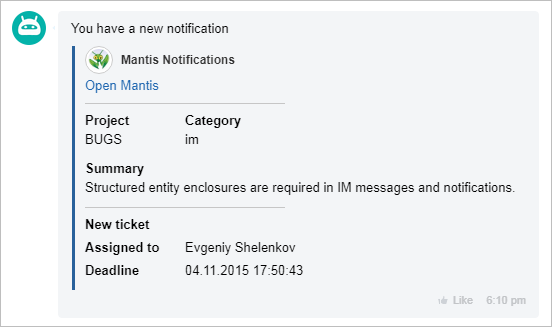

# Attachments in Messages ATTACH



If you are developing integrations for Bitrix24 using AI tools (Codex, Claude Code, Cursor), connect to the [MCP server](../../../../../../ai-tools/mcp.md) so that the assistant can utilize the official REST documentation.



Attachments `ATTACH` allow you to add structured content to messages: text blocks, links, images, files, dividers, and tables.

{width=520}

> Quick navigation: [all methods](#all-methods)

## How to Build an Attachment {#how-to-start}

1. Choose the form of the object: full — with the `ID`, `COLOR_TOKEN`, `COLOR` metadata and the `BLOCKS` array, or short — the array of blocks right away.
2. Compose the array of blocks. Each element is an object with a single top-level key, and this key sets the block type: `MESSAGE`, `LINK`, `USER`, `GRID`, `IMAGE`, `FILE`, `DELIMITER`.
3. Pass the object in the `fields.attach` parameter of the message sending method — for example, [imbot.v2.Chat.Message.send](../chat-message-send.md).
4. To modify an already sent attachment, call [imbot.v2.Chat.Message.update](../chat-message-update.md) with a new value of `fields.attach`.

Ready-made composite cards built from several blocks are described in [Attachment Builder ATTACH](./constructor.md).

## Block Types {#blocks}

#|
|| **Key in BLOCKS** | **Block** | **What to Use It For** ||
|| `MESSAGE` | [Text Block](./block-collections/text.md) | A text fragment with BB code support ||
|| `LINK` | [Link Block](./block-collections/links.md) | A clickable link with a caption ||
|| `USER` | [User Block](./block-collections/user.md) | A user card: name, avatar, link ||
|| `GRID` | [Grid Block for Rows and Columns](./block-collections/grid.md) | A table of name-value pairs ||
|| `IMAGE` | [Image Block](./block-collections/images.md) | One or several images ||
|| `FILE` | [File Block](./block-collections/files.md) | A file with a name, size, and link ||
|| `DELIMITER` | [Delimiter Block](./block-collections/delimiter.md) | A visual divider between parts of the attachment ||
|#

A full description of the parameters of each block is available in [ATTACH Block Collection](./block-collections/index.md).

## ATTACH Object Formats {#formats}

`ATTACH` can be passed in one of two formats:

1. Full form: an object with attachment metadata and an array of `BLOCKS`
2. Short form: an array of blocks without a wrapper

### Full Form ATTACH



- JS

    ```js
    ATTACH: {
        ID: 1,
        COLOR_TOKEN: 'secondary',
        COLOR: '#29619b',
        BLOCKS: [
            {...},
            {...}
        ]
    }
    ```

- Python

    ```python
    attach = {
        "ID": 1,
        "COLOR_TOKEN": "secondary",
        "COLOR": "#29619b",
        "BLOCKS": [
            Ellipsis,
            Ellipsis,
        ],
    }
    ```

- PHP

    ```php
    'ATTACH' => [
        'ID' => 1,
        'COLOR_TOKEN' => 'secondary',
        'COLOR' => '#29619b',
        'BLOCKS' => [
            [...],
            [...],
        ]
    ]
    ```



### Full Form Fields

#| 
|| **Field** 
`type` | **Description** ||
|| **ID**
[`integer`](../../../../../data-types.md) | Identifier of the attachment within the message ||
|| **COLOR_TOKEN**
[`string`](../../../../../data-types.md) | Color scheme of the attachment. Allowed values: `primary`, `secondary`, `alert`, `base`. Default: `base` ||
|| **COLOR**
[`string`](../../../../../data-types.md) | Explicit HEX color of the attachment. Used for compatibility with older scripts and in some types of notifications ||
|| **BLOCKS**
[`array`](../../../../../data-types.md) | Array of content blocks in the attachment. Block types are described in the [Block Collections](./block-collections/index.md) section ||
|#

### Example of Full Form





- cURL (Webhook)

    ```bash
    curl -X POST \
      -H "Content-Type: application/json" \
      -H "Accept: application/json" \
      -d '{"botId":456,"botToken":"my_bot_token","dialogId":"chat20921","fields":{"message":"Attachment with primary color","attach":{"ID":1,"COLOR_TOKEN":"primary","COLOR":"#29619b","BLOCKS":[{"MESSAGE":"The API will be available in the update [B]im 24.0.0[/B]"}]}}}' \
      https://**put_your_bitrix24_address**/rest/**put_your_user_id_here**/**put_your_webhook_here**/imbot.v2.Chat.Message.send
    ```

- cURL (OAuth)

    ```bash
    curl -X POST \
      -H "Content-Type: application/json" \
      -H "Accept: application/json" \
      -d '{"botId":456,"dialogId":"chat20921","fields":{"message":"Attachment with primary color","attach":{"ID":1,"COLOR_TOKEN":"primary","COLOR":"#29619b","BLOCKS":[{"MESSAGE":"The API will be available in the update [B]im 24.0.0[/B]"}]}},"auth":"**put_access_token_here**"}' \
      https://**put_your_bitrix24_address**/rest/imbot.v2.Chat.Message.send
    ```

- JS

    ```js
    try {
      const response = await $b24.callMethod('imbot.v2.Chat.Message.send', {
        botId: 456,
        dialogId: 'chat20921',
        fields: {
          message: 'Attachment with primary color',
          attach: {
            ID: 1,
            COLOR_TOKEN: 'primary',
            COLOR: '#29619b',
            BLOCKS: [
              {
                MESSAGE: 'The API will be available in the update [B]im 24.0.0[/B]'
              }
            ]
          }
        }
      });

      const result = response.getData().result.id;
      console.log('Created message ID:', result);
    } catch (error) {
      console.error(error);
    }
    ```

- Python

    ```python
    from b24pysdk.errors import BitrixAPIError, BitrixSDKException

    try:
        bitrix_response = client.imbot.v2.chat.message.send(
            bot_id=456,
            dialog_id="chat20921",
            fields={
                "message": "Attachment with the primary color",
                "attach": {
                    "ID": 1,
                    "COLOR_TOKEN": "primary",
                    "COLOR": "#29619b",
                    "BLOCKS": [
                        {
                            "MESSAGE": "The API will be available in the [B]im 24.0.0[/B] update",
                        },
                    ],
                },
            },
        ).response
        result = bitrix_response.result["id"]
        print(result)
    except BitrixAPIError as error:
        print(
            "Bitrix API error",
            f"error: {error.error}",
            f"error_description: {error.error_description}",
            sep="\n",
        )
    except BitrixSDKException as error:
        print(f"Bitrix SDK error: {error.message}")
    except Exception as error:
        print(f"Unexpected error: {error}")
    ```

- PHP

    ```php
    try {
        $response = $b24Service
            ->core
            ->call(
                'imbot.v2.Chat.Message.send',
                [
                    'botId' => 456,
                    'dialogId' => 'chat20921',
                    'fields' => [
                        'message' => 'Attachment with primary color',
                        'attach' => [
                            'ID' => 1,
                            'COLOR_TOKEN' => 'primary',
                            'COLOR' => '#29619b',
                            'BLOCKS' => [
                                [
                                    'MESSAGE' => 'The API will be available in the update [B]im 24.0.0[/B]'
                                }
                            ]
                        ]
                    ]
                ]
            );

        $result = $response->getResponseData()->getResult()['id'];
        echo 'Created message ID: ' . $result;
    } catch (Throwable $e) {
        error_log($e->getMessage());
        echo 'Error: ' . $e->getMessage();
    }
    ```

- BX24.js

    ```js
    BX24.callMethod(
        'imbot.v2.Chat.Message.send',
        {
            botId: 456,
            dialogId: 'chat20921',
            fields: {
                message: 'Attachment with primary color',
                attach: {
                    ID: 1,
                    COLOR_TOKEN: 'primary',
                    COLOR: '#29619b',
                    BLOCKS: [
                        {
                            MESSAGE: 'The API will be available in the update [B]im 24.0.0[/B]'
                        }
                    ]
                }
            }
        },
        function(result) {
            if (result.error()) {
                console.error(result.error().ex);
            } else {
                console.log('Message ID:', result.data().id);
            }
        }
    );
    ```

- PHP CRest

    ```php
    require_once('crest.php');

    $result = CRest::call(
        'imbot.v2.Chat.Message.send',
        [
            'botId' => 456,
            'dialogId' => 'chat20921',
            'fields' => [
                'message' => 'Attachment with primary color',
                'attach' => [
                    'ID' => 1,
                    'COLOR_TOKEN' => 'primary',
                    'COLOR' => '#29619b',
                    'BLOCKS' => [
                        [
                            'MESSAGE' => 'The API will be available in the update [B]im 24.0.0[/B]'
                        }
                    ]
                ]
            ]
        ]
    );

    if (!empty($result['error'])) {
        echo 'Error: ' . $result['error_description'];
    } else {
        echo 'Message ID: ' . $result['result']['id'];
    }
    ```



### Short Form ATTACH

If attachment metadata (`ID`, `COLOR_TOKEN`, `COLOR`) is not needed, you can directly pass an array of blocks:



- JS

    ```js
    ATTACH: [
        {...},
        {...}
    ]
    ```

- Python

    ```python
    attach = [
        Ellipsis,
        Ellipsis,
    ]
    ```

- PHP

    ```php
    'ATTACH' => [
        [...],
        [...],
    ]
    ```



### Example of Short Form





- cURL (Webhook)

    ```bash
    curl -X POST \
      -H "Content-Type: application/json" \
      -H "Accept: application/json" \
      -d '{"botId":456,"botToken":"my_bot_token","dialogId":"chat20921","fields":{"message":"Text block","attach":[{"MESSAGE":"The API will be available in the update [B]im 24.0.0[/B]"}]}}' \
      https://**put_your_bitrix24_address**/rest/**put_your_user_id_here**/**put_your_webhook_here**/imbot.v2.Chat.Message.send
    ```

- cURL (OAuth)

    ```bash
    curl -X POST \
      -H "Content-Type: application/json" \
      -H "Accept: application/json" \
      -d '{"botId":456,"dialogId":"chat20921","fields":{"message":"Text block","attach":[{"MESSAGE":"The API will be available in the update [B]im 24.0.0[/B]"}]},"auth":"**put_access_token_here**"}' \
      https://**put_your_bitrix24_address**/rest/imbot.v2.Chat.Message.send
    ```

- JS

    ```js
    try {
      const response = await $b24.callMethod('imbot.v2.Chat.Message.send', {
        botId: 456,
        dialogId: 'chat20921',
        fields: {
          message: 'Text block',
          attach: [
            {
              MESSAGE: 'The API will be available in the update [B]im 24.0.0[/B]'
            }
          ]
        }
      });

      const result = response.getData().result.id;
      console.log('Created message ID:', result);
    } catch (error) {
      console.error(error);
    }
    ```

- Python

    ```python
    from b24pysdk.errors import BitrixAPIError, BitrixSDKException

    try:
        bitrix_response = client.imbot.v2.chat.message.send(
            bot_id=456,
            dialog_id="chat20921",
            fields={
                "message": "Text block",
                "attach": [
                    {
                        "MESSAGE": "The API will be available in the [B]im 24.0.0[/B] update",
                    },
                ],
            },
        ).response
        result = bitrix_response.result["id"]
        print(result)
    except BitrixAPIError as error:
        print(
            "Bitrix API error",
            f"error: {error.error}",
            f"error_description: {error.error_description}",
            sep="\n",
        )
    except BitrixSDKException as error:
        print(f"Bitrix SDK error: {error.message}")
    except Exception as error:
        print(f"Unexpected error: {error}")
    ```

- PHP

    ```php
    try {
        $response = $b24Service
            ->core
            ->call(
                'imbot.v2.Chat.Message.send',
                [
                    'botId' => 456,
                    'dialogId' => 'chat20921',
                    'fields' => [
                        'message' => 'Text block',
                        'attach' => [
                            [
                                'MESSAGE' => 'The API will be available in the update [B]im 24.0.0[/B]'
                            ]
                        ]
                    ]
                ]
            );

        $result = $response->getResponseData()->getResult()['id'];
        echo 'Created message ID: ' . $result;
    } catch (Throwable $e) {
        error_log($e->getMessage());
        echo 'Error: ' . $e->getMessage();
    }
    ```

- BX24.js

    ```js
    BX24.callMethod(
        'imbot.v2.Chat.Message.send',
        {
            botId: 456,
            dialogId: 'chat20921',
            fields: {
                message: 'Text block',
                attach: [
                    {
                        MESSAGE: 'The API will be available in the update [B]im 24.0.0[/B]'
                    }
                ]
            }
        },
        function(result) {
            if (result.error()) {
                console.error(result.error().ex);
            } else {
                console.log('Message ID:', result.data().id);
            }
        }
    );
    ```

- PHP CRest

    ```php
    require_once('crest.php');

    $result = CRest::call(
        'imbot.v2.Chat.Message.send',
        [
            'botId' => 456,
            'dialogId' => 'chat20921',
            'fields' => [
                'message' => 'Text block',
                'attach' => [
                    [
                        'MESSAGE' => 'The API will be available in the update [B]im 24.0.0[/B]'
                    }
                ]
            ]
        ]
    );

    if (!empty($result['error'])) {
        echo 'Error: ' . $result['error_description'];
    } else {
        echo 'Message ID: ' . $result['result']['id'];
    }
    ```



## What Is Returned in the Response {#response}

The sending method itself returns only the ID of the created message — it does not repeat the attachment structure in the response:

```json
{
    "result": {
        "id": 789,
        "uuidMap": {}
    }
}
```

To see the sent attachment, read the message with the [imbot.v2.Chat.Message.get](../chat-message-get.md) method or receive it in the [ONIMBOTV2MESSAGEADD](../../events/events.md#onimbotv2messageadd) event. The attachment arrives in the `params` field of the Message object together with the keyboard and files — [Objects and Fields](../../../entities.md#message).

## Limitations and Errors {#limits}

#|
|| **Limit** | **Value** ||
|| Maximum size of serialized `ATTACH` | 60,000 characters ||
|| Allowed links in blocks | Absolute URLs `http://` and `https://` or relative paths from the Bitrix24 root, for example `/company/personal/user/1/` ||
|| External channels | The content of `ATTACH` is not automatically transmitted to XMPP, email, and push notifications ||
|#

Error codes specific to attachments:

#|
|| **Code** | **When It Is Returned** ||
|| `ATTACH_ERROR` | The attachment structure is incorrect ||
|| `ATTACH_OVERSIZE` | The limit of 60,000 characters is exceeded ||
|#

The remaining error codes depend on the sending method — they are listed in the “Possible Error Codes” section on the method page, for example [imbot.v2.Chat.Message.send](../chat-message-send.md).

## Methods That Support ATTACH {#all-methods}

The methods that support working with `ATTACH` are listed below:

**Chatbots 2.0 (`imbot.v2`)**

- [imbot.v2.Chat.Message.send](../chat-message-send.md) — send a message on behalf of the chatbot
- [imbot.v2.Chat.Message.update](../chat-message-update.md) — modify a chatbot message
- [imbot.v2.Command.answer](../../commands/command-answer.md) — send a chatbot response to a command

**Chats (`im`)**

- [im.message.add](../../../../../chats/messages/im-message-add.md) — send a message in a chat
- [im.message.update](../../../../../chats/messages/im-message-update.md) — modify a sent message

**Notifications (`im.notify`)**

- [im.notify](../../../../../chats/notifications/im-notify.md) — send a notification
- [im.notify.personal.add](../../../../../chats/notifications/im-notify-personal-add.md) — send a personal notification
- [im.notify.system.add](../../../../../chats/notifications/im-notify-system-add.md) — send a system notification

## Continue Learning

- [API imbot.v2 Change Log](../../../change-log.md)
- [{#T}](./constructor.md)
- [{#T}](./block-collections/index.md)
- [Messages imbot.v2](../index.md)
- [{#T}](../message-keyboards.md)
- [{#T}](../message-formatting.md)
- [{#T}](../chat-message-send.md)
- [{#T}](../chat-message-update.md)
- [{#T}](../../../../../chats/notifications/im-notify.md)