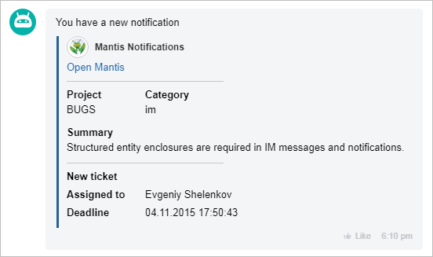

# Attachments in Messages ATTACH



Choose a tool for developing with an AI agent:

- use [Alaio Vibecode](../../../../../../ai-tools/vibecode.md) to build an app for Bitrix24 from a task description without knowing any programming language. The agent writes the code and deploys the app to a server, with no manual hosting setup
- use the [MCP server](../../../../../../ai-tools/mcp.md) to develop a REST API integration in your own project. The agent refers to the official REST documentation



Attachments `ATTACH` allow you to add structured content to messages: text blocks, links, images, files, dividers, and tables. The attachment format is shared by `imbot.v2` chatbot messages, `im.*` chat messages, and `im.notify*` notifications.

How to choose a formatting method:

- text with markup — BB codes in the message text, the syntax is described in the [Text Formatting (BB Codes)](../message-formatting.md) article
- action buttons under the message — a keyboard, described in the [Working with Keyboards](../message-keyboards.md) article
- a card with properties, links, images, or files — an `ATTACH` attachment

{width=520}

> Quick navigation: [all methods](#all-methods)

## How to Build an Attachment {#how-to-start}

1. Choose the [object form](#formats): full or short.
2. Compose the array of blocks. Each element is an object with a single top-level key. The key sets the block type and is written in uppercase — `message` instead of `MESSAGE` is not recognized: [MESSAGE](./block-collections/text.md), [LINK](./block-collections/links.md), [USER](./block-collections/user.md), [GRID](./block-collections/grid.md), [IMAGE](./block-collections/images.md), [FILE](./block-collections/files.md), [DELIMITER](./block-collections/delimiter.md). How to choose and combine blocks is described on the [ATTACH Block Collection](./block-collections/index.md) page.
3. Pass the object to the sending method. In `imbot.v2` methods (scope `imbot`), this is the `fields.attach` parameter — for example, in [imbot.v2.Chat.Message.send](../chat-message-send.md). In `im.*` and `im.notify*` methods (scope `im`), this is the top-level `ATTACH` parameter, with the same object structure.
4. To modify an already sent attachment, call [imbot.v2.Chat.Message.update](../chat-message-update.md) with a new value of `fields.attach` in the full form, with the `BLOCKS` array. The method does not accept the short form: the attachment is removed, and the method returns `true`. To remove the attachment, pass an empty string.

Ready-made cards built from several blocks are described in [Attachment Builder ATTACH](./constructor.md).

## ATTACH Object Formats {#formats}

An attachment is passed in the full form — an object with a color and the `BLOCKS` array — or in the short form — a plain array of blocks.

### Full Form ATTACH

```json
{
    "COLOR_TOKEN": "secondary",
    "BLOCKS": [
        {"MESSAGE": "..."},
        {"GRID": [...]}
    ]
}
```

### Full Form Parameters {#full-form-fields}

#| 
|| **Name** 
`type` | **Description** ||
|| **ID**
[`integer`](../../../../../data-types.md) | Do not pass it: the value is ignored, and the attachment ID is assigned automatically ||
|| **COLOR_TOKEN**
[`string`](../../../../../data-types.md) | Color scheme of the attachment. Allowed values: `primary`, `secondary`, `alert`, `base`. Defaults to `base`, which is also used for an invalid value ||
|| **COLOR**
[`string`](../../../../../data-types.md) | HEX color of the attachment stripe (`#RGB` or `#RRGGBB`). Only the legacy web interface applies it; current clients use `COLOR_TOKEN`. If it is not specified or is incorrect, a random color is used ||
|| **DESCRIPTION**
[`string`](../../../../../data-types.md) | Text displayed instead of the attachment where blocks are not shown: in the chat list, push notifications, and emails. If not specified, the caption "Attachment" is displayed ||
|| **BLOCKS**
[`array`](../../../../../data-types.md) | Array of content blocks in the attachment. Block types are described on the [ATTACH Block Collection](./block-collections/index.md) page ||
|#

### Example of Full Form





- cURL (Webhook)

    ```bash
    curl -X POST \
      -H "Content-Type: application/json" \
      -H "Accept: application/json" \
      -d '{"botId":456,"botToken":"my_bot_token","dialogId":"chat20921","fields":{"message":"Attachment with primary color","attach":{"COLOR_TOKEN":"primary","BLOCKS":[{"MESSAGE":"The API will be available in the update [B]im 24.0.0[/B]"}]}}}' \
      https://**put_your_bitrix24_address**/rest/**put_your_user_id_here**/**put_your_webhook_here**/imbot.v2.Chat.Message.send
    ```

- cURL (OAuth)

    ```bash
    curl -X POST \
      -H "Content-Type: application/json" \
      -H "Accept: application/json" \
      -d '{"botId":456,"dialogId":"chat20921","fields":{"message":"Attachment with primary color","attach":{"COLOR_TOKEN":"primary","BLOCKS":[{"MESSAGE":"The API will be available in the update [B]im 24.0.0[/B]"}]}},"auth":"**put_access_token_here**"}' \
      https://**put_your_bitrix24_address**/rest/imbot.v2.Chat.Message.send
    ```

- JS

    ```js
    try {
      const response = await $b24.callMethod('imbot.v2.Chat.Message.send', {
        botId: 456,
        dialogId: 'chat20921',
        fields: {
          message: 'Attachment with primary color',
          attach: {
            COLOR_TOKEN: 'primary',
            BLOCKS: [
              {
                MESSAGE: 'The API will be available in the update [B]im 24.0.0[/B]'
              }
            ]
          }
        }
      });

      const result = response.getData().result.id;
      console.log('Created message ID:', result);
    } catch (error) {
      console.error(error);
    }
    ```

- Python

    ```python
    from b24pysdk.errors import BitrixAPIError, BitrixSDKException

    try:
        bitrix_response = client.imbot.v2.chat.message.send(
            bot_id=456,
            dialog_id="chat20921",
            fields={
                "message": "Attachment with the primary color",
                "attach": {
                    "COLOR_TOKEN": "primary",
                    "BLOCKS": [
                        {
                            "MESSAGE": "The API will be available in the [B]im 24.0.0[/B] update",
                        },
                    ],
                },
            },
        ).response
        result = bitrix_response.result["id"]
        print(result)
    except BitrixAPIError as error:
        print(
            "Bitrix API error",
            f"error: {error.error}",
            f"error_description: {error.error_description}",
            sep="\n",
        )
    except BitrixSDKException as error:
        print(f"Bitrix SDK error: {error.message}")
    except Exception as error:
        print(f"Unexpected error: {error}")
    ```

- PHP

    ```php
    try {
        $response = $b24Service
            ->core
            ->call(
                'imbot.v2.Chat.Message.send',
                [
                    'botId' => 456,
                    'dialogId' => 'chat20921',
                    'fields' => [
                        'message' => 'Attachment with primary color',
                        'attach' => [
                            'COLOR_TOKEN' => 'primary',
                            'BLOCKS' => [
                                [
                                    'MESSAGE' => 'The API will be available in the update [B]im 24.0.0[/B]'
                                }
                            ]
                        ]
                    ]
                ]
            );

        $result = $response->getResponseData()->getResult()['id'];
        echo 'Created message ID: ' . $result;
    } catch (Throwable $e) {
        error_log($e->getMessage());
        echo 'Error: ' . $e->getMessage();
    }
    ```

- BX24.js

    ```js
    BX24.callMethod(
        'imbot.v2.Chat.Message.send',
        {
            botId: 456,
            dialogId: 'chat20921',
            fields: {
                message: 'Attachment with primary color',
                attach: {
                    COLOR_TOKEN: 'primary',
                    BLOCKS: [
                        {
                            MESSAGE: 'The API will be available in the update [B]im 24.0.0[/B]'
                        }
                    ]
                }
            }
        },
        function(result) {
            if (result.error()) {
                console.error(result.error().ex);
            } else {
                console.log('Message ID:', result.data().id);
            }
        }
    );
    ```

- PHP CRest

    ```php
    require_once('crest.php');

    $result = CRest::call(
        'imbot.v2.Chat.Message.send',
        [
            'botId' => 456,
            'dialogId' => 'chat20921',
            'fields' => [
                'message' => 'Attachment with primary color',
                'attach' => [
                    'COLOR_TOKEN' => 'primary',
                    'BLOCKS' => [
                        [
                            'MESSAGE' => 'The API will be available in the update [B]im 24.0.0[/B]'
                        }
                    ]
                ]
            ]
        ]
    );

    if (!empty($result['error'])) {
        echo 'Error: ' . $result['error_description'];
    } else {
        echo 'Message ID: ' . $result['result']['id'];
    }
    ```



### Short Form ATTACH

If you do not need the attachment parameters (`COLOR_TOKEN`, `DESCRIPTION`), you can pass an array of blocks directly. The method call is the same as in the full form example; only the `attach` value changes. The sending methods and `im.message.update` accept the short form, but `imbot.v2.Chat.Message.update` does not:

```json
[
    {"MESSAGE": "..."},
    {"GRID": [...]}
]
```

## What Is Returned in the Response {#response}

The `imbot.v2` sending methods return the `id` of the created message — they do not repeat the attachment structure in the response.

To see the sent attachment, read the message with the [imbot.v2.Chat.Message.get](../chat-message-get.md) method or receive it in the [ONIMBOTV2MESSAGEADD](../../events/events.md#onimbotv2messageadd) event. The attachment arrives in the `params` field of the Message object together with the keyboard and files — [Objects and Fields](../../../entities.md#message).

## Limitations and Errors {#limits}

#|
|| **Limit** | **Value** ||
|| Maximum size of serialized `ATTACH` | Less than 60,000 characters ||
|| Allowed links in blocks | Absolute URLs `http://` and `https://` or relative paths from the Bitrix24 root, for example `/company/personal/user/1/`. `LINK`, `IMAGE`, and `FILE` elements with a different link are skipped without an error; in `USER` and `GRID`, only the field is discarded ||
|| External channels | `ATTACH` blocks are not passed to XMPP, email, or push notifications. Email and push notifications display `DESCRIPTION` or the caption "Attachment" instead of the attachment ||
|#

Invalid blocks and elements are discarded without an error. An error occurs only if no valid block remains in the attachment or the size limit is exceeded.

Error codes specific to attachments:

#|
|| **Code** | **Methods** | **When It Is Returned** ||
|| `PARAM_ATTACH_ERROR` | `imbot.v2.Chat.Message.send` | The attachment contains no valid block, or the limit of 60,000 characters is exceeded ||
|| `PARAM_ATTACH_ERROR` | `imbot.v2.Chat.Message.update` | The limit of 60,000 characters is exceeded; the previous attachment is retained. An attachment without valid blocks does not cause an error — it is removed from the message ||
|| `ATTACH_ERROR` | `im.*`, `im.notify*` | The attachment contains no valid block ||
|| `ATTACH_OVERSIZE` | `im.*`, `im.notify*` | The limit of 60,000 characters is exceeded ||
|#

The remaining error codes depend on the sending method — they are listed in the “Possible Error Codes” section on the method page, for example [imbot.v2.Chat.Message.send](../chat-message-send.md).

## Methods That Support ATTACH {#all-methods}

**Chatbots 2.0 (`imbot.v2`)**, scope `imbot`, attachment in `fields.attach`

- [imbot.v2.Chat.Message.send](../chat-message-send.md) — send a message on behalf of the chatbot
- [imbot.v2.Chat.Message.update](../chat-message-update.md) — modify a chatbot message
- [imbot.v2.Command.answer](../../commands/command-answer.md) — send a chatbot response to a command

**Chats (`im`)**, scope `im`, attachment in the `ATTACH` parameter

- [im.message.add](../../../../../chats/messages/im-message-add.md) — send a message in a chat
- [im.message.update](../../../../../chats/messages/im-message-update.md) — modify a sent message

**Notifications (`im.notify`)**, scope `im`, attachment in the `ATTACH` parameter

- [im.notify](../../../../../chats/notifications/im-notify.md) — send a notification
- [im.notify.personal.add](../../../../../chats/notifications/im-notify-personal-add.md) — send a personal notification
- [im.notify.system.add](../../../../../chats/notifications/im-notify-system-add.md) — send a system notification

## Continue Learning

- [API imbot.v2 Change Log](../../../change-log.md)
- [{#T}](./constructor.md)
- [{#T}](./block-collections/index.md)
- [Messages imbot.v2](../index.md)
- [{#T}](../message-keyboards.md)
- [{#T}](../message-formatting.md)
- [{#T}](../chat-message-send.md)
- [{#T}](../chat-message-update.md)
- [{#T}](../../../../../chats/notifications/im-notify.md)