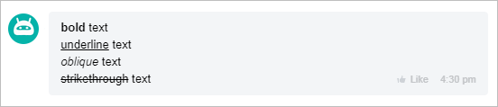
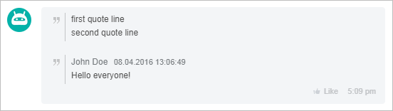

# Text Formatting (BB Codes)

Chatbot messages support BB codes: text highlighting, quotes, links, line breaks, and control tags for commands.



Currently, the platform only supports **BBCode**.  
Support for **Markdown** will be added in future updates.  
At this time, **Markdown is not supported**.



Methods that support formatting:

**Chatbots 2.0 (`imbot.v2`)**

- [imbot.v2.Chat.Message.send](./chat-message-send.md) — send a message on behalf of the bot
- [imbot.v2.Chat.Message.update](./chat-message-update.md) — update the text of a sent message
- [imbot.v2.Command.answer](../commands/command-answer.md) — send a response to a command

**Chats (`im`)**

- [im.message.add](../../../../chats/messages/im-message-add.md) — send a message in a chat
- [im.message.update](../../../../chats/messages/im-message-update.md) — update a sent message

**Notifications (`im.notify`)**

- [im.notify](../../../../chats/notifications/im-notify.md) — send a notification
- [im.notify.personal.add](../../../../chats/notifications/im-notify-personal-add.md) — send a personal notification
- [im.notify.system.add](../../../../chats/notifications/im-notify-system-add.md) — send a system notification

**Outdated Chatbots (`imbot`)**

- [imbot.message.add](../../../outdated/messages/imbot-message-add.md) — send a message on behalf of the chatbot
- [imbot.message.update](../../../outdated/messages/imbot-message-update.md) — update a sent message from the chatbot
- [imbot.command.answer](../../../outdated/commands/imbot-command-answer.md) — send a response to a chatbot command

## Supported BB Codes

### Text Formatting

#| 
|| **Code** | **Purpose** | **Example** ||
|| `[b]...[/b]` | Bold text | `[b]bold[/b]` ||
|| `[i]...[/i]` | Italic | `[i]italic[/i]` ||
|| `[u]...[/u]` | Underline | `[u]underlined[/u]` ||
|| `[s]...[/s]` | Strikethrough | `[s]strikethrough[/s]` ||
|| `[size=N]...[/size]` | Font size | `[size=20]large[/size]` ||
|| `[color=#HEX]...[/color]` | Text color | `[color=#ff0000]red[/color]` ||
|#



For `size`, a range of `8-30px` is used. For `color`, HEX values of 3 or 6 characters are supported.



### Links and Navigation

#| 
|| **Code** | **Purpose** | **Example** ||
|| `[url]...[/url]` | Link where text equals URL | `[url]https://example.com[/url]` ||
|| `[url=URL]...[/url]` | Link with custom text | `[url=https://example.com]text[/url]` ||
|| `[user=userId]...[/user]` | User mention | `[user=123]John[/user]` ||
|| `[user=all]...[/user]` | Mention all chat participants | `[user=all]Everyone[/user]` ||
|| `[chat=chatId]...[/chat]` | Chat mention | `[chat=456]Group[/chat]` ||
|| `[chat=imol|ID]...[/chat]` | Mention open channel | `[chat=imol|789]Line[/chat]` ||
|| `[context=dialog/message]...[/context]` | Link to a message in a dialog | `[context=chat123/456]link[/context]` ||
|#

### Quotes and Code

#| 
|| **Code** | **Purpose** | **Example** ||
|| `>>text` | Quote line (at the beginning of the line) | `>>this is a quote` ||
|| `------ ... ------` | Full quote of a message | `------ ... ------` ||
|| `[code]...[/code]` | Code block | `[code]console.log("hi")[/code]` ||
|#

### Images and Icons

#| 
|| **Code** | **Purpose** | **Example** ||
|| `[img size=SIZE]URL [/img]` | Insert image | `[img size=medium]https://example.com/pic.jpg [/img]` ||
|| `[icon=URL ...]` | Inline icon | `[icon=https://example.com/i.png size=20 title=smile]` ||
|#



For the `img` tag, the `size` parameter is required: `small`, `medium`, `large`. A space is required after the URL before `[/img]`.



### Actions and Calls

#| 
|| **Code** | **Purpose** | **Example** ||
|| `[put=command]text[/put]` | Insert command into input field | `[put=/help]Help[/put]` ||
|| `[send=command]text[/send]` | Immediately send command | `[send=/start]Start[/send]` ||
|| `[call=number]text[/call]` | Link to call | `[call=+19991234567]Call[/call]` ||
|| `[call]number[/call]` | Number taken from text | `[call]+19991234567[/call]` ||
|#

### Date/Time and Files

#| 
|| **Code** | **Purpose** | **Example** ||
|| `[timestamp=UNIX format=FORMAT]` | Formatted date/time in user's timezone | `[timestamp=1645844720 format=SHORT_TIME_FORMAT]` ||
|| `[disk=ID]` | Link to a file on Bitrix24.Drive | `[disk=123]` ||
|#

## Service Elements

#| 
|| **Element** | **Purpose** ||
|| `[br]` | Line break ||
|| `\n` | Line break ||
|| `4 spaces` | Tabulation ||
|#

## Examples

### Basic Formatting

```markdown
[b]bold[/b] text
[u]underlined[/u] text
[i]italic[/i] text
[s]strikethrough[/s] text
```



### Line Breaks and Quotes

```markdown
First line[br]Second line
>>first line of quote
>>second line of quote
```




### Links and Commands

```markdown
[url=https://bitrix24.com]Link to Bitrix24[/url]
[send=/help]Show help[/send]
[put=/search]Enter search string[/put]
```


### Icons

```markdown
[icon=http://files.shelenkov.com/images/unicorn.png size=30 title=Unicorn]
```


## Example of Sending a Formatted Message





- cURL (Webhook)

  ```bash
  curl -X POST \
    -H "Content-Type: application/json" \
    -H "Accept: application/json" \
    -d '{"botId":456,"botToken":"my_bot_token","dialogId":"chat2725","fields":{"message":"[b]Important message[/b][br]Open [url=https://bitrix24.com]site[/url][br][send=/help]Help[/send]"}}' \
    https://**put_your_bitrix24_address**/rest/**put_your_user_id_here**/**put_your_webhook_here**/imbot.v2.Chat.Message.send
  ```

- cURL (OAuth)

  ```bash
  curl -X POST \
    -H "Content-Type: application/json" \
    -H "Accept: application/json" \
    -d '{"botId":456,"dialogId":"chat2725","fields":{"message":"[b]Important message[/b][br]Open [url=https://bitrix24.com]site[/url][br][send=/help]Help[/send]"},"auth":"**put_access_token_here**"}' \
    https://**put_your_bitrix24_address**/rest/imbot.v2.Chat.Message.send
  ```

- JS

  ```js
  try {
      const response = await $b24.callMethod('imbot.v2.Chat.Message.send', {
          botId: 456,
          dialogId: 'chat2725',
          fields: {
              message: '[b]Important message[/b][br]Open [url=https://bitrix24.com]site[/url][br][send=/help]Help[/send]',
          },
      });

      const result = response.getData().result.id;
      console.log('Created message ID:', result);
  } catch (error) {
      console.error('Error:', error);
  }
  ```

- PHP

  ```php
  try {
      $response = $b24Service
          ->core
          ->call(
              'imbot.v2.Chat.Message.send',
              [
                  'botId' => 456,
                  'dialogId' => 'chat2725',
                  'fields' => [
                      'message' => '[b]Important message[/b][br]Open [url=https://bitrix24.com]site[/url][br][send=/help]Help[/send]',
                  ],
              ]
          );

      $result = $response
          ->getResponseData()
          ->getResult()['id'];

      echo 'Created message ID: ' . $result;
  } catch (Throwable $e) {
      error_log($e->getMessage());
      echo 'Error: ' . $e->getMessage();
  }
  ```

- BX24.js

  ```js
  BX24.callMethod(
      'imbot.v2.Chat.Message.send',
      {
          botId: 456,
          dialogId: 'chat2725',
          fields: {
              message: '[b]Important message[/b][br]Open [url=https://bitrix24.com]site[/url][br][send=/help]Help[/send]',
          },
      },
      function(result) {
          if (result.error()) {
              console.error(result.error().ex);
          } else {
              console.log('Message ID:', result.data().id);
          }
      }
  );
  ```

- PHP CRest

  ```php
  require_once('crest.php');

  $result = CRest::call(
      'imbot.v2.Chat.Message.send',
      [
          'botId' => 456,
          'dialogId' => 'chat2725',
          'fields' => [
              'message' => '[b]Important message[/b][br]Open [url=https://bitrix24.com]site[/url][br][send=/help]Help[/send]',
          ],
      ]
  );

  if (!empty($result['error'])) {
      echo 'Error: ' . $result['error_description'];
  } else {
      echo 'Message ID: ' . $result['result']['id'];
  }
  ```



## Continue Learning

- [API imbot.v2 Change Log](../../change-log.md)
- [{#T}](./message-keyboards.md)
- [{#T}](./attachments/index.md)
- [{#T}](./chat-message-send.md)
- [{#T}](./chat-message-update.md)