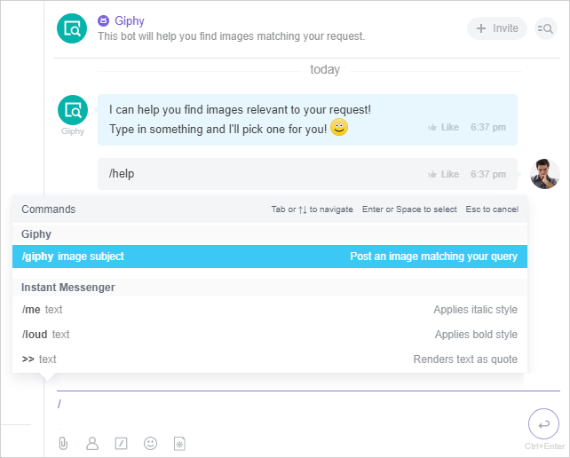
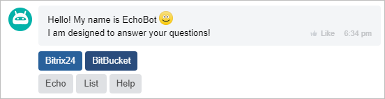

# About Chatbot Commands



Some data may be missing — we will fill it in shortly.







- edits needed to meet writing standards
- links to pages that have not yet been created are not specified
- from Sergey’s file: how they look, how to apply





> Scope: [`imbot`](../../scopes/permissions.md)
>
> Who can execute the method: any user

Commands can be **global** or **local**.



Please note! To process a command, the application must handle the command addition event [ONIMCOMMANDADD](./events/index.md).



## Global

They work in any dialogue or chat. An example of such a command (`COMMON = Y`):

```
/giphy image
```

Calling it in any chat will generate a response from the chatbot, even in a chat where the chatbot is not a member.



## Local

They work only in direct messages with the chatbot and in group chats where it is a participant. An example of such a command (`COMMON = N`):

```
/help
```

Calling it in the [EchoBot](https://github.com/bitrix24com/bots) (**bot.php**) will display a list of available commands.


