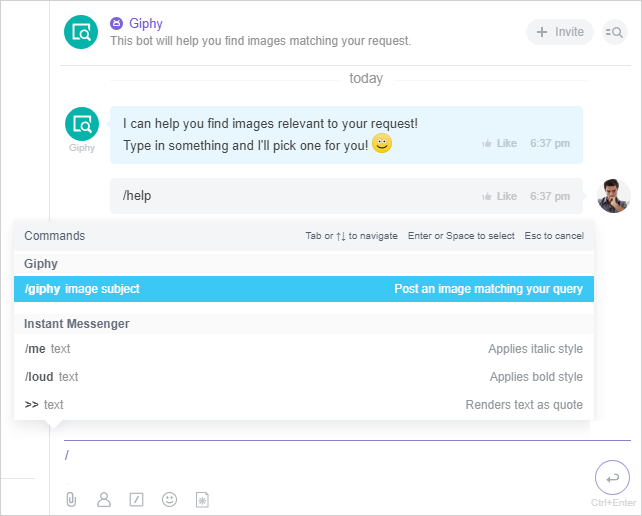
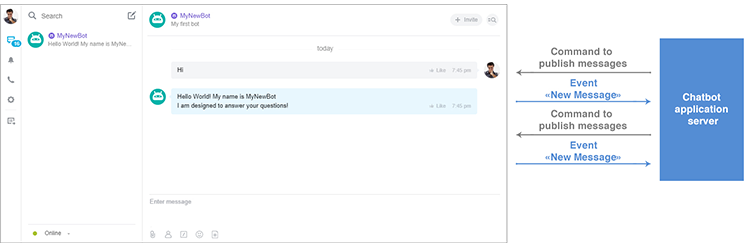

# Bitrix24 Chatbots



Some data may be missing — we will fill it in shortly.







- edits needed for writing standards
- links to yet-to-be-created pages are not specified
- from Sergey's file: this works in the internal messenger, supports open lines, and has useful scenarios







The Bitrix24 bot platform is a new format for applications based on chats in the web messenger.



## What are chatbots and what can they do?

What are chatbots, why are they needed, and why should we engage in their development?



**Chatbot** — is a virtual conversational partner, a program designed to simulate human behavior when communicating with one or more interlocutors.



This trend is largely being shaped abroad — there are a vast number of bots for Slack or Telegram that solve a wide range of tasks — from searching for airline tickets to managing small teams of developers. To access all these features, users don’t even need to leave their preferred messenger.

**What can chatbots do?**

- **Routine replacement** — allows certain functions to be performed without human involvement, and the work will be done instantly and flawlessly;
- **Searching and aggregating** news, analytics, data (Data-Driven Collaboration), making data available at the decision-making point — in messengers and to all participants who need it;
- **E-commerce** — for spontaneous purchases without lengthy searches, mobile ecommerce + visual search + chatbots, for communicating with customers;
- **First line** of customer interaction, assistants, consultants, standard questions, telephony;
- **Just for Fun** — simply for entertainment.

## Bitrix24 Bot Platform

In _Bitrix24_, chats (both individual and group) are part of a much more complex ecosystem, one of the main communication channels for users, fully integrated with other business tools. In this context, the use of chatbots opens up significantly more interesting prospects for business users, as _Bitrix24_ (in the browser, desktop, and mobile applications) is already the primary workplace for a large number of companies.

It is very easy to write a chatbot that, for example, will notify the necessary users in the chat about urgent information regarding the indicators of an internal accounting system integrated with _Bitrix24_. You can create a chatbot that helps couriers conveniently process orders based on _Bitrix24 CRM_ deals on a mobile device directly in the messenger — and there will be no need to write a separate mobile application for them.

Developing a chatbot in _Bitrix24_ is a very promising option for quick and convenient automation of specific workflows. Convenient because, as we have already established, obtaining information and managing through a messenger is what the mass user currently prefers. And quick because developing a chatbot for _Bitrix24_ is quite a straightforward process.



For a clearer understanding of what chatbots can do on the _Bitrix24_ platform, you can watch video examples of the capabilities of already ready chatbots [here](#possible-types-of-bitrix24-chatbots).





There is a limitation on creating chatbots within REST applications: no more than 5 per application.

 

## Chatbot Capabilities

A chatbot:

- is a special user in the system, with whom you can communicate in chat, but no one can log in under it;
- supports the processing of slash commands;
- allows the use of custom keyboards for responses, turning a simple chat into a terminal.

### Slash Commands

Slash commands allow you to quickly create requests to output or obtain information, format messages.



You can read more about working with commands [here](./commands/index.md).



### Keyboards

The capabilities of [keyboards](*keyboard) are quite broad.

**Giphy**
   
The **More** button allows you to browse other images on the same topic without re-entering the search term:



You can read more about working with keyboards [here](../chats/messages/keyboards.md).



### Chats

Chatbots can communicate in chat almost like real people. They can also remind users of various events (current tasks, meetings) or provide reference information. In addition to writing in chats, chatbots can also create such chats and automatically invite people to them, for example, for discussing a particular task.



You can read more about working with chats [here](../chats/index.md).



### Notifications

Notifications from chatbots can be useful and informative. They can consist of several blocks of various information from external systems.



You can read more about working with notifications [here](../chats/notifications/index.md).



## Chatbot Lifecycle

A chatbot publishes its messages in the chat via the Rest API, receives responses and user commands through [Rest API Events](../events/index.md) (POST request).

The lifecycle of a chatbot looks like this:

## Creating Your Own Application

The main thing we need to understand about chatbots is that their logic is usually built on responding to certain actions from the user and the system.

We have 6 events that fully cover the necessary spectrum of reactions:

- [ONAPPINSTALL](../common/events/on-app-install.md) — event for installing an application with a chatbot.
- [ONAPPUPDATE](./events/on-app-update.md) — event for updating an application.
- [ONIMJOINCHAT](./chats/events/on-imbot-join-chat.md) — event after inviting the chatbot "to the conversation," i.e., either when called by a user in an individual chat or when connected to a group chat.
- [ONIMBOTMESSAGEADD](./messages/events/index.md) — event after a message is sent from a user to the chatbot (in a group chat, with an explicit mention of the bot).
- [ONIMCOMMANDADD](./commands/events/index.md) — event after a command is sent from a user to the chatbot (in personal correspondence with it, or in a group chat (if the command is global, it may not participate in the chat)).
- [ONIMBOTDELETE](./chats/events/on-imbot-delete.md) — event after the application is deleted. This event is triggered simultaneously with [OnAppUninstall](../common/events/on-app-uninstall.md).

In other words, we need to write handlers for the specified events to implement simple logic:

1. Register the chatbot on the user's account upon installation.
2. Display a greeting-help message from the chatbot when it is invited to the chat.
3. Learn to analyze the text of the message from the user and send something in response, where analysis means a simple "command line parsing," not a lexical analysis of natural language.

For this, we have a set of simple methods added to the REST API. We will only need two to get started:

- [imbot.register](./imbot-register.md) – registering the chatbot.
- [imbot.message.add](./messages/imbot-message-add.md) – sending a message from the chatbot.

It is clear that in the event handler [ONAPPINSTALL](../common/events/on-app-install.md) we will call the method [imbot.register](./imbot-register.md) to add the chatbot to the current account, and then in the event [`ONIMJOINCHAT`](./chats/events/on-imbot-join-chat.md) we will use the method [imbot.message.add](./messages/imbot-message-add.md) to output help about the chatbot's functionality, and in the handler [`ONIMBOTMESSAGEADD`](./messages/events/index.md) we will respond to the user using the same [imbot.message.add](./messages/imbot-message-add.md). Nothing complicated, right?

You also won’t have to implement a full OAuth 2.0 in the application, as the parameters required for authorization come to the handlers in the **$_REQUEST** array.

## See Also

You can view the complete list of chatbots for the Bitrix24 platform in the [corresponding section](https://www.bitrix24.com/apps/?category=chat_bots) of the Bitrix24 Market.

[*keyboard]: A [keyboard](../chats/messages/keyboards.md) is a set of buttons, each button can consist of specific keys.