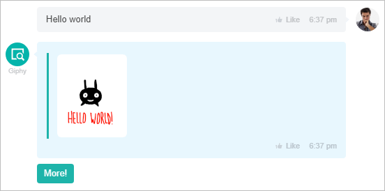
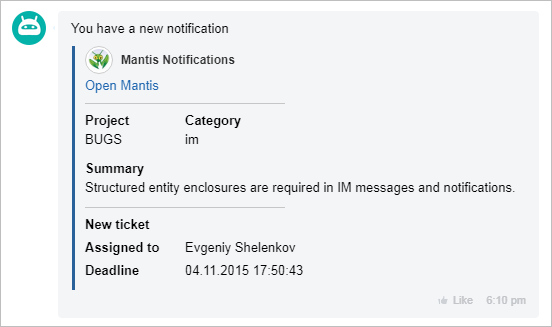

# Bitrix24 Chatbots



Some data may be missing — we will fill it in shortly.







- edits needed for writing standards
- links to pages not yet created are not specified
- from Sergey's file: this works in the internal messenger, supports open lines, and has useful scenarios like these







The Bitrix24 bot platform is a new format of applications based on chats in the web messenger.



> Quick navigation: [all methods and events](#all-methods) 

## What are chatbots and what can they do?

What are chatbots, why are they needed, and why should we even engage in their development?



**Chatbot** — is a virtual conversational partner, a program designed to simulate human behavior when communicating with one or more interlocutors.



This trend is largely being shaped abroad — there are a vast number of bots for Slack or Telegram that solve a wide range of tasks — from finding airline tickets to managing small teams of developers. And to access all this wealth, users don't even need to leave their preferred messenger.

**What can chatbots do?**

- **Routine replacement** — allows certain functions to be performed without involving people, and the work will be done instantly and flawlessly;
- **Searching and aggregating** news, analytics, data (Data-Driven Collaboration), data is available at the decision-making point — in messengers and to all participants who need it;
- **E-commerce** — for spontaneous purchases without lengthy searches, mobile ecommerce + visual search + chatbots, for communicating with customers;
- **First line** of customer interaction, assistants, consultants, typical questions, telephony;
- **Just for Fun** — simply for entertainment.

## Bitrix24 Bot Platform

In _Bitrix24_, chats (both individual and group) are part of a much more complex ecosystem, one of the main communication channels for users, fully integrated with other business tools. In this context, the use of chatbots opens up significantly more interesting prospects for business users, as _Bitrix24_ (in browser, desktop, and mobile applications) is already the main workplace for a large number of companies.

It's very easy to write a chatbot that, for example, will notify the necessary users in the chat about urgent information regarding the indicators of the internal accounting system integrated with _Bitrix24_. You can write a chatbot that helps couriers conveniently process orders based on _Bitrix24 CRM_ deals on a mobile device right in the messenger — and there will be no need to write a separate mobile application for them.

Developing a chatbot in _Bitrix24_ is a very promising option for quick and convenient automation of specific workflows. Convenient, because, as we have already established, obtaining information and managing through a messenger is what the mass user currently prefers. And quick — because developing a chatbot for _Bitrix24_ is quite a simple process.



For a clearer understanding of what chatbots can do on the _Bitrix24_ platform, you can watch video examples of the capabilities of already ready chatbots [below](#opportunities).





There is a limitation on creating chatbots within REST applications: no more than 5 per application.

 

## Chatbot Capabilities {#opportunities}

A chatbot:

- is a special user in the system, with whom you can communicate in chat, but no one can log in under it;
- supports the processing of slash commands;
- allows the use of custom keyboards for responses, turning a simple chat into a terminal.

### Slash Commands

Slash commands allow you to quickly create requests to output or obtain some information, format messages.



You can read more about working with commands [here](./commands/index.md).



### Keyboards

The capabilities of [keyboards](*keyboard) are quite broad.

1. **EchoBot**

    Page navigation, buttons when calling the "Help" command

2. **Martha**
   
    Just tell Martha "Play with me!". The keyboard is used as a game board

3. **Giphy**
   
    The **More** button allows you to browse other images on the same topic without re-entering the search term:

    



You can read more about working with keyboards [here](../chats/messages/keyboards.md).



### Chats

Chatbots can communicate in chat almost like live people. They can also remind about various events (current tasks, meetings) or provide reference information. In addition to being able to write in chats, chatbots can also create such chats and automatically invite people there, for example, to discuss a specific task.



You can read more about working with chats [here](../chats/index.md).



### Notifications

Notifications from chatbots can be useful and informative. They can consist of several blocks of various information from external systems.



You can read more about working with notifications [here](../chats/notifications/index.md).



## Chatbot Lifecycle

A chatbot publishes its messages in chat via the REST API, receives responses and user commands through [REST API Events](../events/index.md) (POST request).

## Creating Your Application

The main thing we need to understand about chatbots is that their logic is usually built on reacting to certain actions of the user and the system.

And we have 6 events that fully cover the necessary spectrum of reactions:

- [ONAPPINSTALL](../common/events/on-app-install.md) — event for installing an application with a chatbot.
- [ONAPPUPDATE](./events/on-app-update.md) — event for updating an application.
- [ONIMJOINCHAT](./chats/events/on-imbot-join-chat.md) — event after inviting the chatbot "to the conversation", i.e., either when called by a user in an individual chat or when connected to a group chat.
- [ONIMBOTMESSAGEADD](./messages/events/on-imbot-message-add.md) — event after a message is sent from a user to the chatbot (in a group chat, when explicitly mentioning the bot).
- [ONIMCOMMANDADD](./commands/events/on-im-command-add.md) — event after a command is sent from a user to the chatbot (in personal correspondence with it, or in a group chat (if the command is global, it may not participate in the chat)).
- [ONIMBOTDELETE](./chats/events/on-imbot-delete.md) — event after deleting the application. The event is triggered simultaneously with [OnAppUninstall](../common/events/on-app-uninstall.md).

In other words, we need to write handlers for the specified events to implement simple logic:

1. Register the chatbot on the user's account upon installation.
2. Output a greeting-help message from the chatbot when invited to the chat.
3. Learn to analyze the text of the message from the user and send something in response, where analysis means a simple "command line parsing," not a lexical analysis of natural language.

And for this, we have a set of simple methods added to the REST API. We will only need two to start:

- [imbot.register](./imbot-register.md) – registering the chatbot.
- [imbot.message.add](./messages/imbot-message-add.md) – sending a message from the chatbot.

It is obvious that in the event handler [ONAPPINSTALL](../common/events/on-app-install.md) we will call the method [imbot.register](./imbot-register.md) to add the chatbot to the current account, and then in the event [ONIMJOINCHAT](./chats/events/on-imbot-join-chat.md) we will use the method [imbot.message.add](./messages/imbot-message-add.md) to output help about the chatbot's functionality, and in the handler [ONIMBOTMESSAGEADD](./messages/events/on-imbot-message-add.md) we will respond to the user using the same [imbot.message.add](./messages/imbot-message-add.md). Nothing complicated, right?

You also won’t have to implement a full OAuth 2.0 in the application, as the parameters required for authorization come to the handlers in the **$_REQUEST** array.



The complete list of methods and events of the **Bot API** can be viewed [below](#all-methods).



## Possible Types of Bitrix24 Chatbots

For a clearer understanding of what chatbots can do on the *Bitrix24* platform, here are video examples of the capabilities of already ready chatbots. The types of chatbots are conditional; you can create a chatbot that combines 2 or 3 types.

### Personal Assistant

- **Martha** (“1C-Bitrix”) — your personal assistant. She helps find answers to questions, reminds about meetings, you can play "Tic-Tac-Toe" with her, and she is ready to just chat.

### Reference System

- **Counterparty Details** (“1C-Bitrix”) — searches the FNS database and provides the necessary information.
- **Search24** (studio “G-Tech”) — your personal search robot. Searches in Google and outputs the 5 most accurate answers.

### For Special Tasks

- **Support Bot** (“1C-Bitrix”) — an internal chatbot for quick access to the Bitrix24 ticket system.

### Working with Services

- **OCR Bot** (First Open Systems) — recognizes scans of any documents and saves them in RTF.
- **Translator** (PWEB) — helps translate texts from one language to another. Supports translation into 63 languages.
- **MKAD Finder** (IA “Insight”) — searches for the distance from MKAD to the required address. The distance is calculated both in a straight line and by roads.

### Working with Open Lines

- **Chatbot for Open Lines** (“1C-Bitrix”) can assist during the first contact with the user or help you in the middle of a dialogue.

### For Entertainment

- **Andreyka** (PWEB) — a master of jokes. Engages in dialogue with jokes and funny quotes.
- **Giphy** (“1C-Bitrix”) — searches a large library of animated GIFs, making it easy to find the necessary image and share it with colleagues.

## See Also

The complete list of chatbots for the *Bitrix24* platform can be seen in the [corresponding section](https://www.bitrix24.com/apps/?category=chat_bots) of the *Bitrix24 App Store*.

## Overview of Methods {#all-methods}



- Methods

    #| 
    || **Method** | **Description** ||
    || [im.revision.get](./im-revision-get.md) | Returns information about API revisions ||
    || [imbot.register](./imbot-register.md) | Registers a new chatbot ||
    || [imbot.unregister](./imbot-unregister.md) | Removes a registered bot ||
    || [imbot.update](./imbot-update.md) | Updates chatbot data ||
    || [imbot.bot.list](./imbot-bot-list.md) | Returns a list of available chatbots ||
    |#

- Events

    #| 
    || **Event** | **Triggered** ||
    || [ONAPPINSTALL](./events/on-app-install.md) | When installing the application ||
    || [ONAPPUPDATE](./events/on-app-update.md) | When updating the application ||
    |#



### Chats



- Methods

    #| 
    || **Method** | **Description** ||
    || [imbot.chat.add](./chats/imbot-chat-add.md) | Creates a new chat ||
    || [imbot.chat.get](./chats/imbot-chat-get.md) | Returns information about the chat ||
    || [imbot.chat.leave](./chats/imbot-chat-leave.md) | Makes the chatbot leave the specified chat ||
    || [imbot.chat.setOwner](./chats/imbot-chat-set-owner.md) | Sets a new owner for the chat ||
    || [imbot.chat.updateAvatar](./chats/imbot-chat-update-avatar.md) | Updates the chat avatar ||
    || [imbot.chat.updateColor](./chats/imbot-chat-update-color.md) | Updates the chat color ||
    || [imbot.chat.updateTitle](./chats/imbot-chat-update-title.md) | Updates the chat title ||
    || [imbot.chat.user.add](./chats/imbot-chat-user-add.md) | Adds a user to the chat ||
    || [imbot.chat.user.list](./chats/imbot-chat-user-list.md) | Returns a list of users in the chat ||
    || [imbot.chat.user.delete](./chats/imbot-chat-user-delete.md) | Removes a user from the chat ||
    || [imbot.dialog.get](./chats/imbot-dialog-get.md) | Returns information about the dialogue ||
    |#

- Events

    #| 
    || **Event** | **Triggered** ||
    || [ONIMBOTDELETE](./chats/events/on-imbot-delete.md) | When deleting the chatbot ||
    || [ONIMBOTJOINCHAT](./chats/events/on-imbot-join-chat.md) | When the chatbot receives information about being included in a chat (or personal correspondence) ||
    |#



### Commands



- Methods

    #| 
    || **Method** | **Description** ||
    || [imbot.command.register](./commands/imbot-command-register.md) | Registers a new command for the chatbot ||
    || [imbot.command.unregister](./commands/imbot-command-unregister.md) | Removes a registered command from the chatbot ||
    || [imbot.command.update](./commands/imbot-command-update.md) | Updates information about a registered command of the chatbot ||
    || [imbot.command.answer](./commands/imbot-command-answer.md) | Sends a response to the chatbot command ||
    |#

- Events

    #| 
    || **Event** | **Triggered** ||
    || [ONIMCOMMANDADD](./commands/events/on-im-command-add.md) | When a new command is added by the chatbot ||
    |#



### Messages



- Methods

    #| 
    || **Method** | **Description** ||
    || [imbot.message.add](./messages/imbot-message-add.md) | Adds a new message from the chatbot ||
    || [imbot.message.update](./messages/imbot-message-update.md) | Updates an existing message from the chatbot ||
    || [imbot.message.delete](./messages/imbot-message-delete.md) | Deletes a message from the chatbot ||
    || [imbot.message.like](./messages/imbot-message-like.md) | Likes a message from the chatbot ||
    || [imbot.chat.sendTyping](./messages/imbot-chat-send-typing.md) | Sends a typing indicator in the chat ||
    |#

- Events

    #| 
    || **Event** | **Triggered** ||
    || [ONIMBOTMESSAGEADD](./messages/events/on-imbot-message-add.md) | When sending a message ||
    || [ONIMBOTMESSAGEUPDATE](./messages/events/on-imbot-message-update.md) | When updating a message from the chatbot ||
    || [ONIMBOTMESSAGEDELETE](./messages/events/on-imbot-message-delete.md) | When deleting a message from the chatbot ||
    |#



[*keyboard]: [Keyboard](../chats/messages/keyboards.md) — is a set of buttons, each button can consist of specific keys.