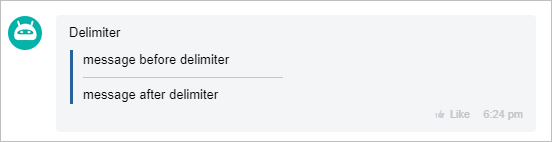

# Block with DELIMITER



Some data may be missing — we will fill it in shortly.







- edits needed to meet writing standards.







`DELIMITER` - outputs a delimiter.

You can set the size using the SIZE parameter. This parameter is optional.

## Example





- JS

    ```js
    {
        DELIMITER: {
            SIZE: 200,
        }
    },
    ```

- PHP

    ```php
    Array(
        "DELIMITER" => Array(
            'SIZE' => 200,
        )
    ),
    ```

