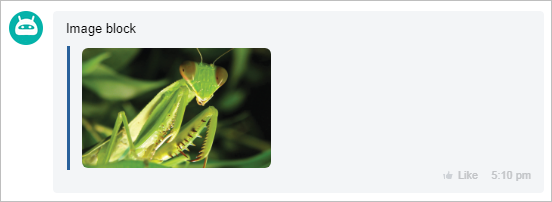

# Image Block IMAGE



Some data may be missing here — we will complete it shortly.







- edits are needed to meet the writing standard.







`IMAGE` - an image block.

It is recommended to fill in the **PREVIEW** field with a reduced copy of the image; if the field is not filled, **LINK** will be used.

The **NAME** (title) and **PREVIEW** (preview image) fields are not mandatory.

The **WIDTH** (width) and **HEIGHT** (height) fields are not mandatory, but it is advisable to specify them now to correctly display the image.

## Example



- JS

    ```js
    {
        IMAGE: {
            NAME: "This is Mantis",
            LINK: "https://files.shelenkov.com/bitrix/images/mantis.jpg",
            PREVIEW: "https://files.shelenkov.com/bitrix/images/mantis.jpg",
            WIDTH: 1000,
            HEIGHT: 638,
        }
    },
    ```

- PHP

    ```php
    Array(
        "IMAGE" => Array(
            Array(
                "NAME" => "This is Mantis",
                "LINK" => "https://files.shelenkov.com/bitrix/images/mantis.jpg",
                "PREVIEW" => "https://files.shelenkov.com/bitrix/images/mantis.jpg",
                "WIDTH" => "1000",
                "HEIGHT" => "638"
            )
        )
    ),
    ```



