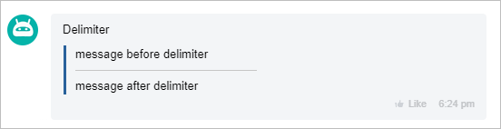
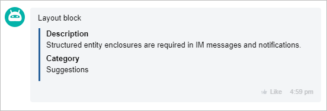
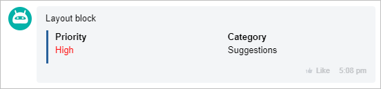
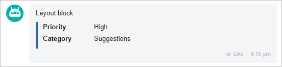

# About the Block Collection



Some data may be missing here — we will complete it soon.



Below are all types of blocks.

## [User Block (USER)](./user.md)

## [Link Block (LINK)](./links.md)

## [Text Block (MESSAGE)](./text.md)

## [Delimiter Block (DELIMITER)](./delimiter.md)

## [Grid Block (GRID)](./grid.md)

1. [Block Representation (BLOCK)](./grid.md#block-representation)

    

2. [Line Representation (LINE)](./grid.md#line-representation)

    

3. [Two-Column Representation (COLUMN)](./grid.md#two-column-representation)

    

## [Image Block (IMAGE)](./images.md)

## [File Block (FILE)](./files.md)

