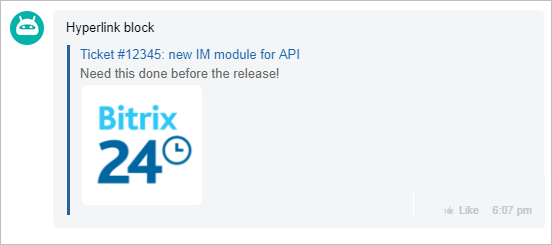
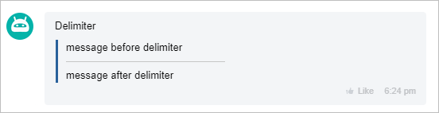
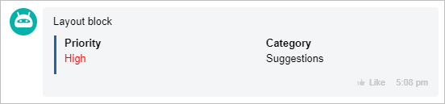
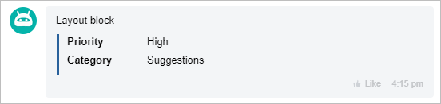
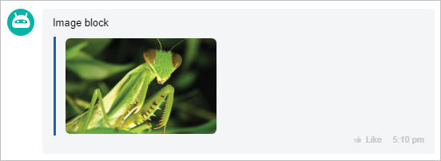

# ATTACH Block Collection

Blocks define the structure and appearance of the `ATTACH` attachment.

## Block Types

### [User Block (USER)](./user.md)

Displays a user card within the attachment: name, avatar, and a link to the profile or external resource.

### [Link Block (LINK)](./links.md)

Adds a clickable link with a caption. Suitable for navigating to a task, document, deal, or external page.

### [Text Block (MESSAGE)](./text.md)

Outputs a text fragment of the attachment. Used for headings, explanations, comments, and main content.

### [Delimiter Block (DELIMITER)](./delimiter.md)

Adds a visual separator between parts of the attachment. Helps to distinguish meaningful blocks in a long card.

### [Grid Block (GRID)](./grid.md)

Forms a tabular structure from pairs of "name-value". Suitable for cards with properties and parameters.

1. [Block Representation (BLOCK)](./grid.md#block-representation)

    

2. [Line Representation (LINE)](./grid.md#line-representation)

   

   In the mobile version, blocks are displayed one below the other.

3. [Two-Column Representation (ROW)](./grid.md#two-column-representation)

    

### [Image Block (IMAGE)](./images.md)

Displays one or more images within the attachment.

### [File Block (FILE)](./files.md)

Adds a file with a title and a link for downloading or opening.

## Continue Exploring

- [{#T}](../index.md)
- [{#T}](../constructor.md)