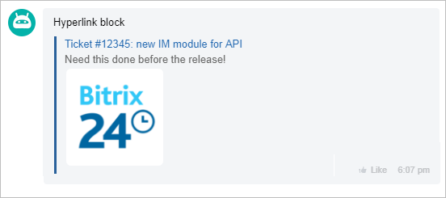

# Link Block



Some data may be missing here — we will fill it in shortly.







- edits needed to meet writing standards







`LINK` - outputs a block with a resource link, description, and explanatory image. This block is used for automatically creating "rich links."

The fields **DESC** (description) and **PREVIEW** (image) are not mandatory fields.

The fields **WIDTH** (width) and **HEIGHT** (height) are not mandatory, but it is recommended to specify them now to display the image correctly.

## Example



- JS

    ```js
    {
        LINK: {
            PREVIEW: "https://bitrix24.com/bitrix/templates/1c-bitrix-new/images/logo.png",
            WIDTH: 1000,
            HEIGHT: 638,
            NAME: "Ticket #12345: new API for the \"Web Messenger\" module",
            DESC: "Must be implemented by the release!",
            LINK: "https://api.bitrix24.com/",
        }
    },
    ```

- PHP

    ```php
    Array(
        "LINK" => Array(
            "PREVIEW" => "https://bitrix24.com/bitrix/templates/1c-bitrix-new/images/logo.png",
            "WIDTH" => "1000",
            "HEIGHT" => "638",
            "NAME" => "Ticket #12345: new API for the \"Web Messenger\" module",
            "DESC" => "Must be implemented by the release!",
            "LINK" => "https://api.bitrix24.com/"
        )
    ),
    ```





Instead of the key **LINK**, you can also use links to entities:
- `CHAT_ID => 1` - to specify a link to a chat;
- `USER_ID => 1` - to specify a link to a user.