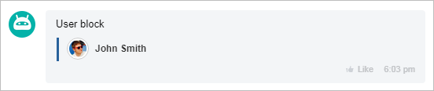

# User Block USER



Some data may be missing here — we will fill it in shortly.







- edits needed to meet writing standards







`USER` - displays a block with the user's avatar and name.

The fields **AVATAR** (avatar) and **LINK** (link) are not mandatory.

## Example



- JS

    ```js
    {
        USER: {
            NAME: "John Smith",
            AVATAR: "https://files.shelenkov.com/bitrix/images/avatar.png",
            LINK: "https://shelenkov.com"
        }
    },
    ```

- PHP

    ```php
    Array(
        "USER" => Array(
            "NAME" => "John Smith",
            "AVATAR" => "https://files.shelenkov.com/bitrix/images/avatar.png",
            "LINK" => "https://shelenkov.com/",
        )
    ),
    ```





Instead of the key **LINK**, you can also use links to entities:
- `CHAT_ID` - to specify a link to a chat;
- `BOT_ID` - to specify a link to a bot;
- `USER_ID` - to specify a link to a user.