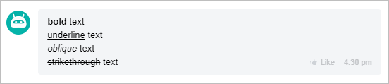
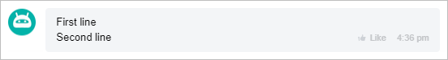
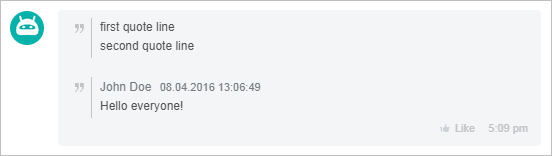
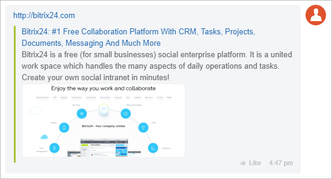
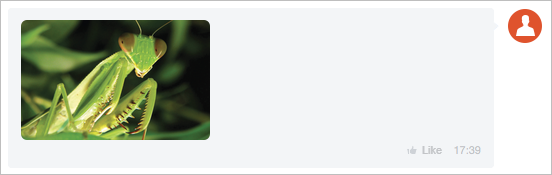
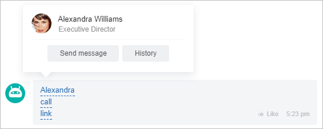

# Formatting



Some data may be missing — we will complete it soon.







- edits needed to meet writing standards





Messages can be formatted, with options for bold text, strikethrough, and quotes. The lesson includes user commands, appearance, and REST API for formatting chat messages.

## Formatting Codes

If you send the following message in chat:

```markdown
[B]bold[/B] text
[U]underline[/U] text
[I]oblique[/I] text
[S]strikethrough[/S] text
```

It will be displayed like this:



Formatting using the REST API:



```php
restCommand(
    'imbot.message.add',
    Array(
        "DIALOG_ID" => $_REQUEST['data']['PARAMS']['DIALOG_ID'],
        "MESSAGE" => "bold text
            underlined text
            italic text
            strikethrough text",
    ),
    $_REQUEST["auth"]
);
```

## Line Breaks

Line breaks are created by adding the following characters to the text:

```markdown
[BR]
\# BR \# (without spaces)
\n
```

Any of these codes will create a line break:



Line breaks using the REST API:

```php
restCommand(
    'imbot.message.add',
    Array(
        "DIALOG_ID" => $_REQUEST['data']['PARAMS']['DIALOG_ID'],
        "MESSAGE" => "First line
            Second line",
    ),
    $_REQUEST["auth"]
);
```

## Quoting

You can quote text in two ways:

```markdown
>>first quote line
>>second quote line

------------------------------------------------------
John Doe [08.04.2016 13:06:49]
Hello everyone!
------------------------------------------------------
```

The appearance of the quote will differ slightly - in the second case, the author and time of the quote will be indicated:



Quoting using the REST API:

```php
restCommand(
    'imbot.message.add',
    Array(
        "DIALOG_ID" => $_REQUEST['data']['PARAMS']['DIALOG_ID'],
        "MESSAGE" => ">>first quote line
            >>second quote line

            ------------------------------------------------------
            John Doe [08.04.2016 13:06:49]
            Hello everyone!
            ------------------------------------------------------",
    ),
    $_REQUEST["auth"]
);
```

## Links

Any link in the text will automatically become clickable. If the link address has "rich formatting," the link will automatically adopt it:



Links using the REST API:

```php
restCommand(
    'imbot.message.add',
    Array(
        "DIALOG_ID" => $_REQUEST['data']['PARAMS']['DIALOG_ID'],
        "MESSAGE" => "http://bitrix24.com",
    ),
    $_REQUEST["auth"]
);
```


"Rich formatting" can be disabled by passing the key `'URL_PREVIEW' => 'N'` when creating the message:

```php
restCommand(
    'imbot.message.add',
    Array(
        "DIALOG_ID" => $_REQUEST['data']['PARAMS']['DIALOG_ID'],
        "MESSAGE" => "http://bitrix24.com",
        "URL_PREVIEW" => "N"
    ),
    $_REQUEST["auth"]
);
```



If you send a link to an image `https://files.shelenkov.com/bitrix/images/mantis.jpg` (the link must end with .png, .jpg, .gif), it will automatically be converted into an image:



You can create a link manually using the **URL** code - `[URL=http://bitrix24.com]Link to Bitrix24[/URL]`:


Creating a link using the REST API:
```php
restCommand(
    'imbot.message.add',
    Array(
        "DIALOG_ID" => $_REQUEST['data']['PARAMS']['DIALOG_ID'],
        "MESSAGE" => "[URL=http://bitrix24.com]Link to Bitrix24[/URL]",
    ),
    $_REQUEST["auth"]
);
```

Similarly to the **URL** code, there are special codes for links within the messenger.

- `[USER=5]Alexandra[/USER]` - link to a user.
- `[CALL=18012334455]call[/CALL]` - button to make a call via *Bitrix24*.
- `[CHAT=12]link[/CHAT]` - link to a chat.



Formatting special codes using the REST API:

```php
restCommand(
    'imbot.message.add',
    Array(
        "DIALOG_ID" => $_REQUEST['data']['PARAMS']['DIALOG_ID'],
        "MESSAGE" => "[USER=5]Alexandra[/USER]
            [CALL=18012334455]call[/CALL]
            [CHAT=12]link[/CHAT]",
    ),
    $_REQUEST["auth"]
);
```

## Indents

To create indents in a message, use the tab character:

[send=text]button name[/send] - instant sending of text to the bot.

Indents using the REST API:

```php
restCommand(
    'imbot.message.add',
    Array(
        "DIALOG_ID" => $_REQUEST['data']['PARAMS']['DIALOG_ID'],
        "MESSAGE" => "
            Indent
                Indent
                    Indent",
    ),
    $_REQUEST["auth"]
);
```

## Active Links (Commands)

If you want the user to send some text by clicking on a link, use the **SEND** tag:
```markdown
[send=text]button caption[/send] - sends text to the bot.
```

With this tag, you can prompt the user to send a command to your bot, but there is a more preferred method - [Keyboards](./keyboards.md)


Active links (commands) using the REST API:

```php
restCommand(
    'imbot.message.add',
    Array(
        "DIALOG_ID" => $_REQUEST['data']['PARAMS']['DIALOG_ID'],
        "MESSAGE" => "[send=text]button caption[/send] - sends text to the bot",
    ),
    $_REQUEST["auth"]
);
```

If you need the user to add something to the command, use the **PUT** code:

```markdown
[put=/search]Enter search text[/put]
```

Sending a bot command using the REST API:

```php
restCommand(
    'imbot.message.add',
    Array(
        "DIALOG_ID" => $_REQUEST['data']['PARAMS']['DIALOG_ID'],
        "MESSAGE" => "[put=/search]Enter search text[/put]",
    ),
    $_REQUEST["auth"]
);
```

## Icons

To add your own icon to a message, send the code:

```markdown
[icon=http://files.shelenkov.com/images/unicorn.png size=30 title=Unicorn]
```

Additionally, the icon will be added to the Business Chat emoji set. You can remove the icon from the set by right-clicking on the icon in the set and selecting **Delete**.

A required property is specifying the path to the image (without spaces).

Additional attributes are available:
- **title** - title;
- **height** - height;
- **width** - width;
- **size** - height and width.

For optimal display on all devices, the icon size should be twice as large as specified in the display parameters.

Adding your own icon using the REST API:

```php
restCommand(
    'imbot.message.add',
    Array(
        "DIALOG_ID" => $_REQUEST['data']['PARAMS']['DIALOG_ID'],
        "MESSAGE" => "[icon=http://files.shelenkov.com/images/unicorn.png size=30 title=Unicorn]",
    ),
    $_REQUEST["auth"]
);
```



For more details on how to use advanced format attachments within messages, read [here](./attachments/index.md).

