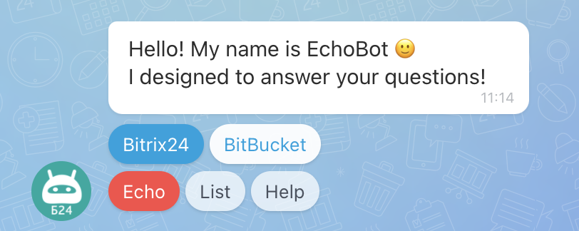
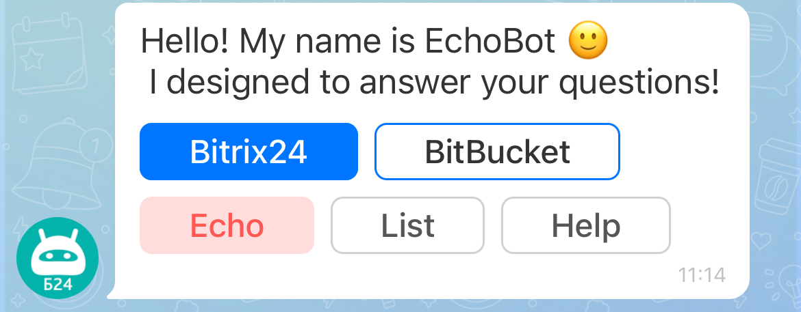
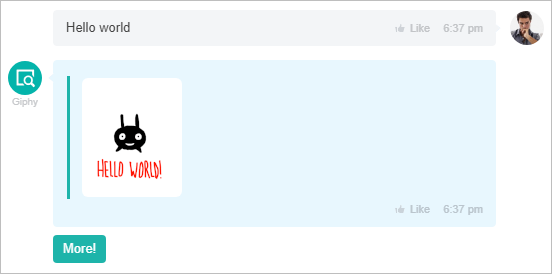

# Working with Keyboards



Some data may be missing here — we will fill it in shortly.







- edits needed for writing standards





The keyboards you type will allow users to interact with the chat bot simply by pressing buttons.

## How to Add a Keyboard to a Chat Bot

A keyboard is part of a message; when creating a message, you need to add the key **KEYBOARD** and pass the parameters.

Methods that support keyboards:
- [imbot.message.add](../../chat-bots/messages/imbot-message-add.md) - sending a message from the chat bot.
- [imbot.message.update](../../chat-bots/messages/imbot-message-update.md) - sending an update to the chat bot's message.
- [imbot.command.answer](../../chat-bots/commands/imbot-command-answer.md) - publishing a response to a command.
- [im.message.add](./im-message-add.md) - sending a message in chat.
- [im.message.update](./im-message-update.md) - sending an update to the chat bot's message.

Let's consider an example of a chat bot message. In the web version of the chat, the keyboard looks like this:



And in the mobile version, it looks like this:







```php
restCommand(
    'imbot.command.answer',
    Array(
        "COMMAND_ID" => $command['COMMAND_ID'],
        "MESSAGE_ID" => $command['MESSAGE_ID'],
        "MESSAGE" => "Hello! My name is EchoBot :)[br] I am designed to answer your questions!",
        "KEYBOARD" => Array(
 // Blue button with text Bitrix24 on the first line
            Array(
                "TEXT" => "Bitrix24",
                "LINK" => "http://bitrix24.com",
                "BG_COLOR_TOKEN" => "primary",
                "BG_COLOR" => "#29619b",
                "TEXT_COLOR" => "#fff",
                "DISPLAY" => "LINE",		
            ),
// White button with text BitBucket on the first line
            Array(
                "TEXT" => "BitBucket", 
                "LINK" => "https://bitbucket.org/Bitrix24com/rest-bot-echotest",
                "BG_COLOR_TOKEN" => "secondary",
                "BG_COLOR" => "#2a4c7c",
                "TEXT_COLOR" => "#fff",
                "DISPLAY" => "LINE",
            ),
// Line break, the next buttons will be placed on the second line
            Array(
                "TYPE" => "NEWLINE" 
            ), 
// Red button with text Echo on the second line
            Array(
                "TEXT" => "Echo", 
                "COMMAND" => "echo",
                "COMMAND_PARAMS" => "test from keyboard",
                "DISPLAY" => "LINE",
                "BG_COLOR_TOKEN" => "alert",
            ),
// Basic button with text List on the second line
            Array(
                "TEXT" => "List",
                "COMMAND" => "echoList",
                "DISPLAY" => "LINE"
            ),
// Basic button with text Help on the second line
            Array(
                "TEXT" => "Help", 
                "COMMAND" => "help",
                "DISPLAY" => "LINE"
            ),
        )
    ),
    $_REQUEST["auth"]
);
```

A keyboard is a set of buttons, and each button can consist of the following keys:

- **TEXT** — button text
- **LINK** — link
- **COMMAND** — command that will be sent to the bot
- **COMMAND_PARAMS** — parameters for the command
- **BG_COLOR_TOKEN** — token for the button color in the chat. Can take one of the following values:
  - `primary`
  - `secondary`
  - `alert`
  - `base`
    Defaults to `base`
- **BG_COLOR** — button color in HEX code format. Used for backward compatibility in open line chat buttons
- **BLOCK** — if set to Y, the keyboard will be blocked after clicking one button. Only buttons that send ajax to the bot block the keyboard (note that links to external resources **LINK** and instant actions **ACTION** do not block the keyboard). Blocking is necessary to limit the execution of ajax commands due to their asynchronous nature and waiting time: after pressing a button, the keyboard is blocked and waits for a response from the Bitrix24 backend, so the user does not press a second button, etc. The backend processes commands and decides whether to unblock the keyboard by creating a new one or hiding it.
- **DISABLED** — if set to Y, this button will not be clickable
- **TEXT_COLOR** — button text color in HEX code format. Used for backward compatibility in open line chat buttons
- **DISPLAY** — button type. If type **BLOCK** is specified, only this button can be on one line. If type **LINE** is specified, the buttons will be arranged one after another.
- **WIDTH** — button width. **Note**, for maximum convenience, it is not recommended to make a set of buttons in one line wider than 225 pixels; this is the maximum width on a mobile device.
- **APP_ID** — identifier of the installed application for the chat
- **APP_PARAMS** — parameters for launching the application for the chat
- **ACTION** — action, can be one of the following types ([REST revision 28](../../chat-bots/im-revision-get.md)):
  - **PUT** — insert into the input field
  - **SEND** — send text
  - **COPY** — copy text to clipboard
  - **CALL** — call
  - **DIALOG** — open the specified
- **ACTION_VALUE** — value, which means different things for each type ([REST revision 28](../../chat-bots/im-revision-get.md)):
  - **PUT** — text that will be inserted into the input field
  - **SEND** — text that will be sent
  - **COPY** — text that will be copied to the clipboard
  - **CALL** — phone number in international format
  - **DIALOG** — dialog ID, which can be a user ID or chat ID in the format chatXXX

The required fields are **TEXT** and either the **LINK** field or the **COMMAND** field.

If the **LINK** key is specified, the button becomes an external link. If the **COMMAND** and **COMMAND_PARAMS** fields are specified, the button is an action and sends a command to the chat bot without publishing it in the chat.

If the **APP_ID** and **APP_PARAMS** fields are specified, the button will open a window with the chat application.

If you need to make two rows of buttons in a row, you need to add a button with the following content to separate them: `"TYPE" => "NEWLINE"`.

## Handling Commands by the Chat Bot

To handle button presses on the keyboard, **commands** are used.

1. To ensure the command works on the keyboard (and not only), it must first be registered using the method [imbot.command.register](../../chat-bots/commands/imbot-command-register.md) (to make the command available only for the keyboard, it must be created with the key `"HIDDEN" => "Y"`).

    In the button, the following keys are specified:

    ```php
    "COMMAND" => "page", // command that will be sent to the chat bot
    "COMMAND_PARAMS" => "1", // parameters for the command
    ```

2. Pressing the button will generate the event [ONIMCOMMANDADD](../../chat-bots/commands/events/index.md).

3. Inside this event, you need to either create a new message or edit an old one (thereby creating the effect of pagination).

4. Inside the event, the array **[data][COMMAND]** will contain data about the invoked event. It includes the value **COMMAND_CONTEXT** - a special key describing the context in which the command was invoked:
   - if the command was written by the user themselves, it will be **TEXTAREA**;
   - if the command came from the keyboard, it will be **KEYBOARD**;
   - if the command came from the context menu, it will be **MENU**.

You can see a complete example in the updated version of the [EchoBot](https://github.com/bitrix24com/bots) (**bot.php**).

## Handling Opening the Chat Application

Chat applications launched from the context menu operate on the principles of [Context Application](../outdated/chat-apps.md).

## Examples of Using the Keyboard

**Giphy**

The **More** button allows you to view other images on the same topic without re-entering the search word:

