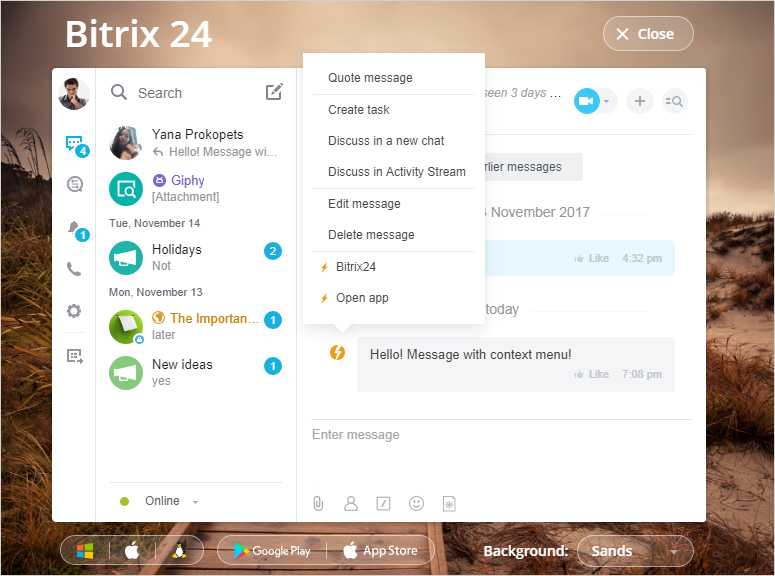

# Context Menu



Some data may be missing here — we will fill it in shortly.







- edits are needed to meet writing standards
- links to pages that have not yet been created are not specified





The context menu allows the user to interact with the chatbot or chat application from the message's context menu.



## How to Add Your Items to the Context Menu

The context menu is part of the message; when creating a message, you need to add the key `MENU` and pass the parameters.

Methods that support the context menu:
- [imbot.message.add](../../chat-bots/messages/imbot-message-add.md) - sending a message from the chatbot.
- [imbot.message.update](../../chat-bots/messages/imbot-message-update.md) - sending an update to the chatbot's message.
- [imbot.command.answer](../../chat-bots/commands/imbot-command-answer.md) - publishing a response to a command.
- [im.message.add](./im-message-add.md) - sending a message in the chat.
- [im.message.update](./im-message-update.md) - sending an update to the chatbot's message.

Let's consider this message as an example:





- PHP

    ```php
    restCommand(
        'im.message.add',
        Array(
            "DIALOG_ID" => 12,
            "MESSAGE" => "Hello! Message with context menu!",
            "MENU" => Array(
                Array(
                    "TEXT" => "Bitrix24",
                    "LINK" => "http://bitrix24.com",
                ),
                Array(
                    "TEXT" => "Echo",
                    "COMMAND" => "echo",
                    "COMMAND_PARAMS" => "test from keyboard"
                ),
                Array(
                    "TEXT" => "Open app",
                    "APP_ID" => "12",
                    "APP_PARAMS" => "TEST"
                ),
            )
        ),
        $_REQUEST["auth"]
    );
    ```



The context menu is a set of buttons, each button can consist of the following keys:

- **TEXT** - button text;
- **LINK** - link;
- **COMMAND** - command that will be sent to the bot;
- **COMMAND_PARAMS** - parameters for the command;
- **APP_ID** - identifier of the installed chat application.
- **APP_PARAMS** - parameters for launching the chat application.
- **DISABLED** - if set to `Y`, this button will not be clickable.
- **ACTION** - action, can be one of the following types ([REST revision 28](../../chat-bots/im-revision-get.md)):
  - **PUT** - insert into the input field.
  - **SEND** - send text.
  - **COPY** - copy text to the clipboard.
  - **CALL** - make a call.
  - **DIALOG** - open the specified dialog.
- **ACTION_VALUE** - value, each type has its own meaning ([REST revision 28](../../chat-bots/im-revision-get.md)):
  - **PUT** - text that will be inserted into the input field.
  - **SEND** - text that will be sent.
  - **COPY** - text that will be copied to the clipboard.
  - **CALL** - phone number in international format.
  - **DIALOG** - dialog identifier, which can be a `ID` of the user or `ID` of the chat in the format `chatXXX`.

The required fields are **TEXT** and either the **LINK** field or the **COMMAND** field.

If the **LINK** key is specified, the button becomes an external link. If the **COMMAND** and **COMMAND_PARAMS** fields are specified, the button is an action and sends a command to the chatbot without publishing it in the chat. Available from version 26 of the [API revision (platform version)](../../chat-bots/im-revision-get.md).

If the **APP_ID** and **APP_PARAMS** fields are specified, the button will open a window with the chat application.

If you need to make two rows of buttons in a row, you need to add a button with the following content to separate them: `"TYPE" => "NEWLINE"`.

## Handling Commands by the Chatbot

To handle button presses and menu items, **commands** are used.

1. To ensure that the command works on the keyboard (and not only), it must first be registered through the method [imbot.command.register](../../chat-bots/commands/imbot-command-register.md) (to make the command available only for the keyboard, it must be created with the key `"HIDDEN" => "Y"`).

    In the button, the following keys are specified:

    ```php
    "COMMAND" => "page", // command that will be sent to the chatbot
    "COMMAND_PARAMS" => "1", // parameters for the command
    ```

2. Pressing the button will create an event [ONIMCOMMANDADD](../../chat-bots/commands/events/index.md).

3. Inside this event, you need to either create a new message or edit an old one (thus creating the effect of pagination).

4. Inside the event, the **[data][COMMAND]** array will contain data about the triggered event. It includes the value **COMMAND_CONTEXT** - a special key describing the context in which the command was invoked:
   - if the command was written by the user themselves, it will be **TEXTAREA**;
   - if the command came from the keyboard, it will be **KEYBOARD**;
   - if the command came from the context menu, it will be **MENU**.

## Handling the Opening of the Chat Application

Chat applications launched from the context menu operate on the principles of [Context Application](../outdated/context.md).