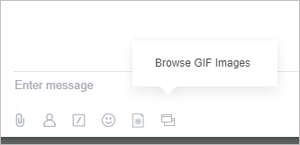
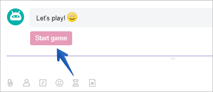
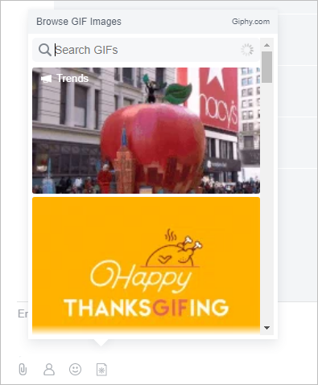
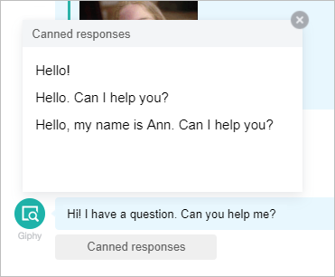

# About Chat Applications



The embedding format for chat applications described in this section currently works correctly; however, for the New Chat, applications need to be embedded in the [Rest Placement](../widgets/index.md) format.



## Types of Applications

Developers can integrate into the Messenger by adding their icon to the text input panel:

If the application fails to load the image, a default icon **Chat Applications** will be displayed. Clicking on the icon will show its text version.

Chat applications come in two types — **JS command** or **IFRAME application**.

### JS Command

When the icon is clicked, a command for the chatbot is inserted into the input field, which either sends a command to the chat, initiates a phone call, or opens a support line.

Using this format, developers can create a button in their chatbots for users to contact them.

An example of such a command for the chatbot Martha is the icon for playing Tic-Tac-Toe:

### IFRAME Application

This is an enhanced format. When the icon is clicked, an IFRAME application will open, allowing the developer to implement any functions. The application can interact with the chat using JS commands:

- to insert a message into the input field
- to send a message on behalf of the user
- to close the dialog
- to open the technical support chat (consultant OL)
- to make a call

You can see an example of this implementation with the Giphy chatbot:

Feel the difference — previously, you would write a command as a message, and Giphy would provide you with a random image on the topic. Now you see what you are sending.



Note that icons can understand context, meaning that the application can only be displayed in the chats where it is needed.

For example, for contacting technical support, it would be more appropriate to place the application in the context of your chatbot, as it would be unnecessary in other chats. Alternatively, you can create a special application for open lines — it should only be shown in the context of open lines.

Available contexts: `all`, `chat`, `bot`, `lines`, `user`, `call`.

You can add the postfix `-admin` to each context — then the icon will be shown in the required context only to administrators.



## Contextual Applications

Contextual applications are designed to assist users in interacting with the chatbot within a specific dialogue (message).

For example, when a client writes in an open line, the open line chatbot analyzes the message and prepares response options. To avoid disrupting operators and not to show them the entire flow of information, we carefully create a button that, when clicked, will open an IFRAME application.

