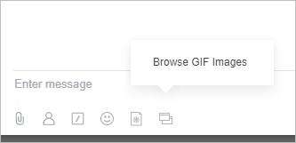

# Create an Application Icon for Chat

When creating an **Application Icon for Chat**, follow these guidelines:

1. The icon must be in .PNG format and have a transparent background
    
    

2. Canvas size: 108x66 px, the left part is used for the inactive icon, and the right part is for displaying the active one
    
    

3. The main part of the icon should not exceed 45x32 px and must be centered in the middle of each section
    
    

4. The primary color for the inactive icon is `#b3b7bc`, and for the active icon, it is `#2fc7f7`
    
    

    To simplify the icon creation process, we provide several templates. You can download them and use them in your work.

    #|
    ||  |  |  ||
    || [textarea_icon_f.psd](https://training.bitrix24.com/images/chat_bot/im_app/textarea_icon.psd) | [marta_icon.psd](https://training.bitrix24.com/images/chat_bot/im_app/marta_icon.psd) | [textarea_icon.psd](https://training.bitrix24.com/images/chat_bot/im_app/textarea_icon_f.psd) ||
    |#

5. To upload the image when registering or updating the application, you need to pass the key `ICON_FILE`. The value of this key should be the base64 of your image

    ```php
    'ICON_FILE' => base64_encode(
        file_get_contents(
            __DIR__.'/icon_button.png'
        )
    ),
    ```



If you do not create an icon for the application, it will be grouped under a service button:



