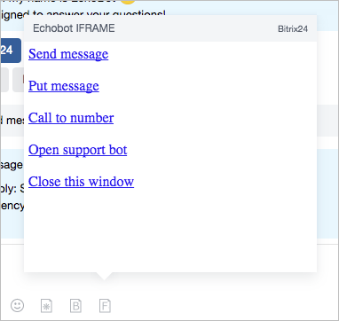

# Create an IFRAME Handler

After registering the chat application, you need to create an **IFRAME handler**.



Even though you specify the window sizes during registration, the application may reduce them according to the actual available sizes. It is recommended to design the application to fit within the minimum sizes and to be adaptable to both increases and decreases. This is especially important for mobile devices.



## Data on the Page

The page will be opened with the following data:

```php
Array
(
    [BOT_ID] => 17
    [BOT_CODE] => echoBot
    [APP_ID] => 11
    [APP_CODE] => echoFrame
    [DOMAIN] => https://test.bitrix24.com
    [DOMAIN_HASH] => 0e9c40cee01d6f182e9261b38b30b5c3
    [USER_ID] => 2
    [USER_HASH] => 7e23ac8b6f6c7044076301c7f81cd745
    [DIALOG_ID] => 950
    [CONTEXT] => textarea
    [LANG] => en
    [IS_CHROME] => Y
    [MESSAGE_ID] => 12333
    [BUTTON_PARAMS] => test
    [DIALOG_ENTITY_ID] => telegrambot|8|173633217|569
    [DIALOG_ENTITY_DATA_1] => Y|LEAD|56|N|N|1765
    [DIALOG_CONTEXT] => lines

)
```

### Parameters

- `BOT_ID` and `BOT_CODE` — data about the chat bot under which the application is running
- `APP_ID` and `APP_CODE` — data about the chat application that is running
- `DOMAIN` — the address of the account from which the application was launched
- `DOMAIN_HASH` — this is the `HASH` field passed during the registration of the icon. Used to filter unauthorized requests
- `USER_ID` — user identifier
- `USER_HASH` — hash string for validating the correctness of requests on the client account
- `DIALOG_ID` — identifier of the dialog started by the user at the moment the frame is opened
- `CONTEXT` — this is the context of the dialog call, which can be `textarea` or `button`
- `LANG` — the current language of the client interface
- `IS_CHROME` — whether this frame is running in the Google Chrome browser or not
- `DIALOG_CONTEXT` — **this parameter is currently unavailable**. It can be `all`, `chat`, `bot`, `lines`, `user`, `call`
- `DIALOG_ENTITY_ID` — additional data about the chat (**this parameter is currently unavailable**). For Open Lines, the data is separated by |. The values for Open Lines are: 1 — the channel through which the user wrote, 2 — the identifier of the OL, 3 and 4 — service data (parameter currently unavailable)
- `DIALOG_ENTITY_DATA_1` — additional data about the chat (**this parameter is currently unavailable**). For Open Lines, the data is separated by |. The values for Open Lines are: 1 — saved in CRM, 2 — type of CRM entity, 3 — identifier of the CRM entity, 4 and 5 — service data, 6 — identifier of the open line session

If the frame is running in context mode:

- `MESSAGE_ID` — message identifier
- `BUTTON_PARAMS` — button parameter set during sending

## Interaction with the Parent Window (with the Messenger)

You need to create functions for interaction with the main window, initialization, and data sending.

### Implementation Examples

```js
<script type="text/javascript">
// function to initialize communication with the main window
function frameCommunicationInit()
{
     if (!window.frameCommunication)
     {
         window.frameCommunication = {timeout: {}};
     }
     if(typeof window.postMessage === 'function')
     {
         window.addEventListener('message', function(event){
            var data = {};
            try { data = JSON.parse(event.data); } catch (err){}

            if (data.action == 'init')
            {
             frameCommunication.uniqueLoadId = data.uniqueLoadId;
             frameCommunication.postMessageSource = event.source;
             frameCommunication.postMessageOrigin = event.origin;
            }
         });
     }
}

// function to send data to the main window
function frameCommunicationSend(data)
{
     data['uniqueLoadId'] = frameCommunication.uniqueLoadId;
     var encodedData = JSON.stringify(data);
     if (!frameCommunication.postMessageOrigin)
     {
         clearTimeout(frameCommunication.timeout[encodedData]);
         frameCommunication.timeout[encodedData] = setTimeout(function(){
            frameCommunicationSend(data);
         }, 10);
         return true;
     }
    
     if(typeof window.postMessage === 'function')
     {
         if(frameCommunication.postMessageSource)
         {
            frameCommunication.postMessageSource.postMessage(
             encodedData,
             frameCommunication.postMessageOrigin
            );
         }
     }
}
frameCommunicationInit();
</script>
```

After this, the following functions are available:

- Command to send text on behalf of the user:
`frameCommunicationSend({'action': 'send', 'message': 'Send message'})`

- Command to insert text into the input field:
`frameCommunicationSend({'action': 'put', 'message': 'Put message'})`

- Command to start a call:
`frameCommunicationSend({'action': 'call', 'number': '123456'})`

- Command to open a dialog with your open line:
`frameCommunicationSend({'action': 'support', 'code': '6a4cdbcf753addac1a573ea64be826ca'})`

- Command to close the frame:
`frameCommunicationSend({'action': 'close'})`



## Registration and Security

You may choose not to verify incoming requests, but we **strongly recommend doing so**.

Based on the incoming data, you can implement **necessary checks**:

1. It is recommended to check the REFERER for a match with the specified domain
2. It is recommended to check the domain and its hash
3. It is recommended to check the user and its hash
4. Use a unique HASH for each new registration

By combining all these factors, you can create a sufficiently secure application.

When registering commands, you must specify the HASH string that will be used to sign the domain and user:

```php
$hash = '0e9c40cee01d6f182e9261b38b30b5c3'; // hash specified during application registration

$check = parse_url($_GET['DOMAIN']);

// check the validity of the specified domain
if ($_GET['DOMAIN_HASH'] == md5($check['host'].$hash))
{
echo 'OK';
}

// check the validity of the specified user
if ($_GET['USER_HASH'] == md5($_GET['USER_ID'].$hash))
{
echo 'OK';
}

// check the REFERER
if (strpos($_SERVER['HTTP_REFERER'], $_GET['DOMAIN'])!== 0)
{
echo 'OK';
}
```