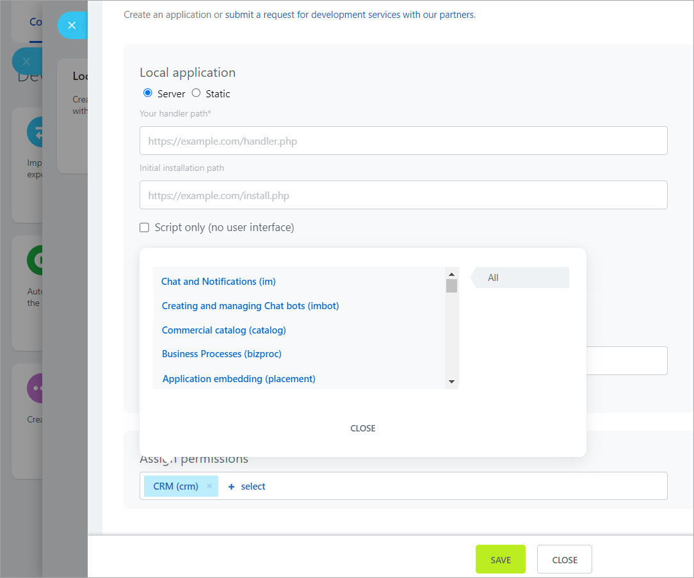

# Adding Custom Methods to the REST API of the On-Premise Version of Bitrix24

When creating custom applications for on-premise editions, there is a need to add new methods to the REST API.

Steps to follow:

1. Register the event handler **OnRestServiceBuildDescription** of the **rest** module. The handler returns an array structured like this:

```php
return array(
    'scope_name' => array(
        'method_name' => array(
            'callback' => method_handler,
            'options' => array(),
        ),
        'method_name' => array(
            'callback' => method_handler,
            'options' => array(),
        ),
    )
);
```

The name of the **scope** is arbitrary. If a custom scope is registered, it will be available in the list of permissions for local applications. To add methods to an existing scope, specify the method name. If methods are added that are available to all applications, use the constant `\CRestUtil::GLOBAL_SCOPE` instead of a name.

The method name is also arbitrary, and both upper and lower case are allowed. However, it is recommended to stick to lower case. The traditional naming convention is **scope_name.entity_name.action**.

The method handler is a standard PHP pseudo-type [callback](http://www.php.net/types.callable). Anonymous functions are not supported yet.

2. The handler function will receive 3 parameters:
    - An associative array of the call data without authorization parameters
    - A parameter for returning pagination
    - An instance of the **\CRestServer** class, from which some useful data can be obtained

3. The handler function can:
    - Return a response (array or scalar value), which will be converted to JSON or XML format
    - Throw an exception, which will be caught and displayed as a REST error

If you need to specify an HTTP error status, use the class `\Bitrix\Rest\RestException`. If an old exception was previously generated by the core (`$APPLICATION->ThrowException()`), it will overwrite the error in the response.

By the time the handler function is called, access permission checks have already been performed, and the `$USER` object has been initialized with the authorization of the user associated with the token.

Example:

```php
class RestTest
{
    public static function OnRestServiceBuildDescription()
    {
        return array(
            'sigurdtest' => array(
                'sigurdtest.test' => array(
                    'callback' => array(__CLASS__, 'test'),
                    'options' => array(),
                ),
            )
        );
    }

    public static function test($query, $n, \CRestServer $server)
    {
        if($query['error'])
        {
            throw new \Bitrix\Rest\RestException(
                'Message',
                'ERROR_CODE',
                \CRestServer::STATUS_PAYMENT_REQUIRED
            );
        }

        return array(
            'yourquery' => $query,
            'myresponse' => 'My own response'
        );
    }
}

AddEventHandler(
    'rest',
    'OnRestServiceBuildDescription',
    array(
        '\RestTest',
        'OnRestServiceBuildDescription'
    )
);
```



```js
http://cp.sigurd.bx/rest/sigurdtest.test?auth=qcdfzzjtp8hvcbjl42eg93wuw5n0mvsb&test=222
HTTP/1.1 200 OK
Content-Type: application/json; charset=utf-8
{
	"result": {
		"myresponse": "My own response",  
		"yourquery": {
			"test": "222"
		}
	}
}
http://cp.sigurd.bx/rest/sigurdtest.test.xml?auth=qcdfzzjtp8hvcbjl42eg93wuw5n0mvsb&error=1
HTTP/1.1 402 Payment Required
Content-Type: text/xml; charset=utf-8
<?xml version="1.0" ?>
<response>
	<error>ERROR_CODE</error>
	<error_description>Message</error_description>
</response>
```

## How to Define a Handler for a Missing REST Method Description "On the Fly"

To do this, use the event **onFindMethodDescription**, which is called before returning the `METHOD_NOT_FOUND` error. It allows you to substitute the method description "on the fly".

## How to Work with Navigation in Your REST Methods

```php
\Bitrix\Main\Loader::includeModule('rest');
class ApiTest extends \IRestService
{
    public static function OnRestServiceBuildDescription()
    {
        return array(
            'apitest' => array(
                'api.test.list' => array(
                    'callback' => array(__CLASS__, 'getList'),
                    'options' => array(),
                ),
            )
        );
    }

    public static function getList($query, $nav, \CRestServer $server)
    {
        $navData = static::getNavData($nav, true);

        $res = \Bitrix\Main\UserTable::getList(
            [
                'filter' => $query['filter']?:[],
                'select' => $query['select']?:['*'],
                'order' => $query['order']?:['ID' => 'ASC'],
                'limit' => $navData['limit'],
                'offset' => $navData['offset'],
                'count_total' => true,
            ]
        );

    $result = array();
    while($user = $res->fetch())
    {
        $result[] = $user;
    }

    return static::setNavData(
        $result,
        array(
            "count" => $res->getCount(),
            "offset" => $navData['offset']
        )
    );
    }
}

AddEventHandler(
    'rest',
    'OnRestServiceBuildDescription',
    array(
        '\ApiTest',
        'OnRestServiceBuildDescription'
    )
);
```

The example shows how to register your method for working with user tables using the ORM class. If you need to implement pagination for methods that are not ORM classes, for example, for *getNavData()*, pass `false` as the second parameter (`$navData = static::getNavData($nav, false);`), and it will return navigation corresponding to the old core methods.

Example request:

```bash
/rest/api.test.list?order[ID]=ASC&filter[<ID]=1000&select[]=ID&select[]=NAME&start=200
```