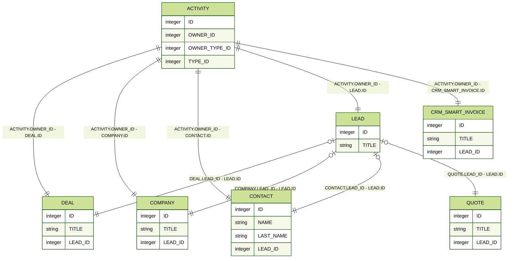
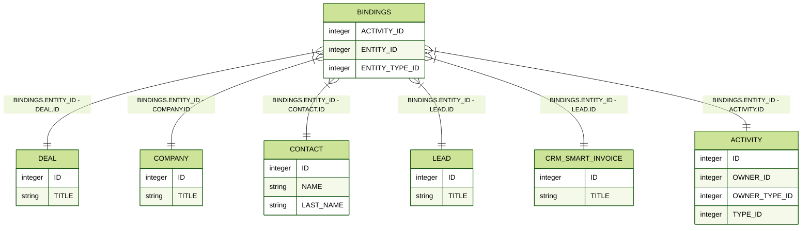

# Structure of CRM Object Relationships



Some data may be missing here — we will complete it soon.







- This section needs very thoughtful material to help understand the complexities of CRM.
- The first section is about basic objects. We discuss the relationships between them, related to the conversion from lead, as well as the relationship between them and deals one-to-many. It is noted that this is just a basic binding of deals; in reality, it is more complex and will be discussed below.
- The second section is about the relationships of deals and objects using the BINDINGS many-to-many table.
- The third section is about attributes. First, a general overview, then a more detailed scheme using a company as an example.





## Basic CRM Objects

## Multiple Relationships with Deals

