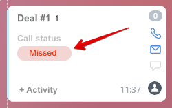

# About Badges



Some data may be missing here — we will complete it soon.







- edits needed for writing standards





> Scope: [`crm`](../../../../scopes/permissions.md)
>
> Who can execute the method: any user

A badge on the kanban is a field that has a special appearance and allows you to mark kanban items that require attention. If multiple badges are added to a single item, only the last one added will be displayed.



The product uses a number of standard badges for different scenarios.

You can add a configurable deal to deals and other CRM entities via Rest. If the **badgeCode** field of such a deal contains the code of one of the registered badges, that badge will be displayed on the kanban of the entity to which the deal is linked until the deal is closed.

## Badge Record Fields

#|
|| **Field** | **Description** ||
|| **code**
[`string`](../../../../data-types.md) | Badge code ||
|| **title**
[`string`\|`array`](../../../../data-types.md) | Badge title. Can be either a string or an array of strings for different languages. ||
|| **value**
[`string`\|`array`](../../../../data-types.md) | Badge value. Can be either a string or an array of strings for different languages. ||
|| **type**
[`string`](../../../../data-types.md) | Badge type ||
|#

If **title** or **value** contains an array, the keys in it should be language codes, and the values should be text in those languages, for example:

```json
{
    "en": "Alarm"
}
```

If a translation for the current language is not found, English will be used. If English is also not found, the first element of the array will be used.

The badge type can take the following values:

- **success** - Green background
- **failure** - Red background
- **warning** - Yellow background
- **primary** - Blue background
- **secondary** - Gray background