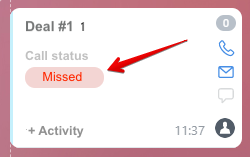

# Configurable Activity Badges: Overview of Methods



If you are developing integrations for Bitrix24 using AI tools (Codex, Claude Code, Cursor), connect to the [MCP server](../../../../../../ai-tools/mcp.md) so that the assistant can utilize the official REST documentation.



A badge is an icon on the card of a CRM object in the kanban. The badge helps highlight entities that require attention. If multiple badges are added to an entity, only the most recently added badge will be displayed.



> Quick navigation: [all methods](#all-methods)

## Link with a Configurable Activity

A badge is not linked to a CRM entity directly. First, the application registers the badge using the [crm.activity.badge.add](./crm-activity-badge-add.md) method, and then specifies its code in the `badgeCode` field of a [configurable activity](../index.md) when calling [crm.activity.configurable.add](../crm-activity-configurable-add.md) or [crm.activity.configurable.update](../crm-activity-configurable-update.md).

The badge is displayed on the kanban of the object to which the activity is linked until the activity is closed.

## Considerations Before Calling Methods

- The methods [crm.activity.badge.add](./crm-activity-badge-add.md) and [crm.activity.badge.delete](./crm-activity-badge-delete.md) can only be executed by a user with administrative access to the CRM section.
- The methods [crm.activity.badge.get](./crm-activity-badge-get.md) and [crm.activity.badge.list](./crm-activity-badge-list.md) are available to any user.
- The badge `code` must be unique. A badge with a code that is already taken cannot be added.
- A badge is retrieved and deleted by its code, not by its identifier.

## How to Work with Badges

1. Check the codes already in use with the [crm.activity.badge.list](./crm-activity-badge-list.md) method.
2. Register the badge with the [crm.activity.badge.add](./crm-activity-badge-add.md) method.
3. Check the badge by its code with the [crm.activity.badge.get](./crm-activity-badge-get.md) method.
4. Specify the badge code in the `badgeCode` field of the configurable activity.
5. Delete a badge you no longer need with the [crm.activity.badge.delete](./crm-activity-badge-delete.md) method.

## Badge Record Fields

#|
|| **Field** | **Description** ||
|| **code**
[`string`](../../../../../data-types.md) | Badge code, for example `missedCall`. The badge is specified in an activity, retrieved, and deleted by this code ||
|| **title**
[`string`\|`array`](../../../../data-types.md) | Name of the badge. Can be a string or an array of strings for different languages ||
|| **value**
[`string`\|`array`](../../../../data-types.md) | Text displayed inside the icon itself. It is shown in uppercase. Can be a string or an array of strings for different languages ||
|| **type**
[`string`](../../../../../data-types.md) | [Badge type](#badge-type), defines the color of the icon ||
|#

If **title** or **value** contains an array, the keys should be language codes, and the values should be text in those languages, for example:

```json
{
    "de": "Achtung",
    "en": "Alarm"
}
```

If a translation for the current language is not found, the English version will be used. If the English translation is also not found, the first element of the array will be used.

## Badge Type

In Bitrix24, there are several standard badges for different scenarios. The badge type can take the following values:

- **success** — green background
- **failure** — red background
- **warning** — yellow background
- **primary** — blue background
- **secondary** — gray background

## Overview of Methods {#all-methods}

> Scope: [`crm`](../../../../../scopes/permissions.md)
>
> Who can execute the method: a user with administrative access to the crm section — for [crm.activity.badge.add](./crm-activity-badge-add.md) and [crm.activity.badge.delete](./crm-activity-badge-delete.md), any user — for [crm.activity.badge.get](./crm-activity-badge-get.md) and [crm.activity.badge.list](./crm-activity-badge-list.md)

#|
|| **Method** | **Description** ||
|| [crm.activity.badge.add](./crm-activity-badge-add.md) | Adds a new badge ||
|| [crm.activity.badge.get](./crm-activity-badge-get.md) | Retrieves information about a badge ||
|| [crm.activity.badge.list](./crm-activity-badge-list.md) | Retrieves a list of badges ||
|| [crm.activity.badge.delete](./crm-activity-badge-delete.md) | Deletes a badge by code ||
|#

## Additional

- [{#T}](../crm-activity-configurable-add.md)
- [{#T}](../crm-activity-configurable-update.md)
- [{#T}](../crm-activity-configurable-get.md)