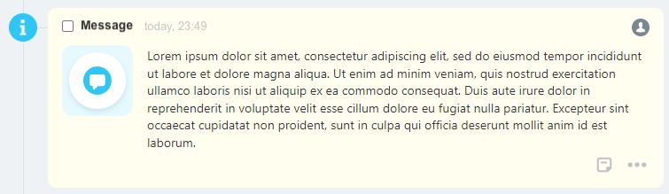
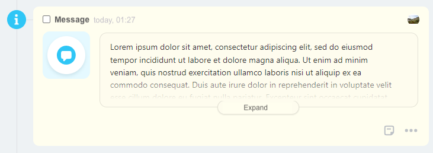
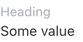
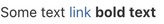
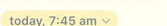

# Configurable Activity Content Block



If you are developing integrations for Bitrix24 using AI tools (Codex, Claude Code, Cursor), connect to the [MCP server](../../../../../../ai-tools/mcp.md) so that the assistant can utilize the official REST documentation.



Content blocks `ContentBlockDto` are the foundation of the content area of a timeline entry. By combining these blocks, you can flexibly assemble various interfaces.

This structure is used when creating [configurable activities](../../layout-blocks/index.md) and when enriching timeline entries with [content blocks](../../../layout-blocks/index.md).

## General Block Structure:

```json
{
    "type": "Block type",
    "properties": {
        ... some properties, different for each specific block
    }
}
```

## Content Block Types:

### Text

The simplest block `type = text`, which outputs certain formatted text.

#### Parameters



#|
|| **Field** | **Description** ||
|| **value^*^**
[`textWithTranslation`](./field-types.md) | Text to be displayed ||
|| **multiline**
[`boolean`](../../../../data-types.md) | Line break handling. If true, `\n` characters will be replaced with `<br>`. Default is `false` ||
|| **title**
[`textWithTranslation`](./field-types.md#textwithtranslation) | Title attribute ||
|| **bold**
[`boolean`](../../../../data-types.md) | Bold text. Default is `false` ||
|| **size**
[`string`](../../../../data-types.md) | Text size. Can take values `xs`, `sm`, `md` (default is `md`) ||
|| **color**
[`string`](../../../../data-types.md) | Text color. Can take values `base_50`, `base_60`, `base_70`, `base_90` ||
|| **scope**
[`string`](../../../../data-types.md) | [Visibility scope](./field-types.md#scope), for example `web` ||
|#

#### Example

```json
{
    "icon": {
        "code": "info"
    },
    "header": {
        "title": "Information message"
    },
    "body": {
        "logo": {
            "code": "notification"
        },
        "blocks": {
            "text": {
                "type": "text",
                "properties": {
                    "value": "Lorem ipsum dolor sit amet, consectetur adipiscing elit, sed do eiusmod tempor incididunt ut labore et dolore magna aliqua. Ut enim ad minim veniam, quis nostrud exercitation ullamco laboris nisi ut aliquip ex ea commodo consequat. Duis aute irure dolor in reprehenderit in voluptate velit esse cillum dolore eu fugiat nulla pariatur. Excepteur sint occaecat cupidatat non proident, sunt in culpa qui officia deserunt mollit anim id est laborum."
                }
            }
        }
    }
}
```



### Long Multiline Text

The `type = largeText` block allows displaying long multiline texts, which will be automatically collapsed into a preview.

#### Parameters



#|
|| **Field** | **Description** ||
|| **value^*^**
[`textWithTranslation`](./field-types.md#textwithtranslation) | Text to be displayed ||
|| **scope**
[`string`](../../../../data-types.md) | [Visibility scope](./field-types.md#scope), for example `web` ||
|#

#### Example

Long text hidden under "Show more".

```json
{
    "icon": {
        "code": "info"
    },
    "header": {
        "title": "Information message"
    },
    "body": {
        "logo": {
            "code": "notification"
        },
        "blocks": {
            "text": {
                "type": "largeText",
                "properties": {
                    "value": "Lorem ipsum dolor sit amet, consectetur adipiscing elit, sed do eiusmod tempor incididunt ut labore et dolore magna aliqua. Ut enim ad minim veniam, quis nostrud exercitation ullamco laboris nisi ut aliquip ex ea commodo consequat. Duis aute irure dolor in reprehenderit in voluptate velit esse cillum dolore eu fugiat nulla pariatur. Excepteur sint occaecat cupidatat non proident, sunt in culpa qui officia deserunt mollit anim id est laborum. Lorem ipsum dolor sit amet, consectetur adipiscing elit, sed do eiusmod tempor incididunt ut labore et dolore magna aliqua. Ut enim ad minim veniam, quis nostrud exercitation ullamco laboris nisi ut aliquip ex ea commodo consequat."
                }
            }
        }
    }
}
```



### Link

The `type = link` block outputs a link.

#### Parameters



#|
|| **Field** | **Description** ||
|| **text^*^**
[`textWithTranslation`](./field-types.md#textwithtranslation) | Text to be displayed. HTML tags are not supported ||
|| **action^*^**
[`ActionDto`](./action.md) | Action upon clicking the link ||
|| **bold**
[`boolean`](../../../../data-types.md) | Bold text. Default is `false` ||
|| **scope**
[`string`](../../../../data-types.md) | [Visibility scope](./field-types.md#scope), for example `web` ||
|#

#### Example

```json
{
    "type": "link",
    "properties": {
     "text": "Open deal",
     "action": {
        "type": "redirect",
        "uri": "/crm/deal/details/123/"
     },
     "bold": true
    }
}
```


### Block with Heading

The `type = withTitle` block outputs a name-value pair. Another content block can be used as the value.

#### Parameters



#|
|| **Field** | **Description** ||
|| **title^*^**
[`textWithTranslation`](./field-types.md#textwithtranslation) | Title text ||
|| **block^*^**
[`ContentBlockDto`](content-block.md) | Content block that serves as the value. Blocks of types `text`, `link`, `deadline` are supported ||
|| **inline**
[`boolean`](../../../../data-types.md) | Display title and value in one line. Default is `false` ||
|| **scope**
[`string`](../../../../data-types.md) | [Visibility scope](./field-types.md#scope), for example `web` ||
|#

#### Examples

```json
{
    "type": "withTitle",
    "properties": {
        "title": "Heading",
        "block": {
            "type": "text",
            "properties": {
                "value": "Some value"
            }
        }
    }
}
```



```json
{
    "type": "withTitle",
    "properties": {
        "title": "Heading 2",
        "block": {
            "type": "link",
            "properties": {
                "text": "Open deal",
                "action": {
                    "type": "redirect",
                    "uri": "/crm/deal/details/123/"
                }
            }
        },
        "inline": true
    }
}
```


### Multiple Content Blocks in One Line

The `type = lineOfBlocks` block outputs several text or link type content blocks in a single line. This allows displaying text with different formatting mixed with links in one line.

#### Parameters



#|
|| **Field** | **Description** ||
|| **blocks^*^**
[`ContentBlockDto[]`](content-block.md) | Associative array of content blocks. Blocks of types `text`, `link`, `deadline` are supported ||
|| **scope**
[`string`](../../../../data-types.md) | [Visibility scope](./field-types.md#scope), for example `web` ||
|#

#### Examples

```json
{
    "type": "lineOfBlocks",
    "properties": {
        "blocks": {
            "text": {
                "type": "text",
                "properties": {
                    "value": "Some text"
                }
            },
            "link": {
                "type": "link",
                "properties": {
                    "text": "link",
                    "action": {
                        "type": "redirect",
                        "uri": "/crm/deal/details/123/"
                    }
                }
            },
            "boldText": {
                "type": "text",
                "properties": {
                    "value": "bold text",
                    "bold": true
                }
            }
        }
    }
}
```



### Deadline Selection

The `type = deadline` block displays the current deadline value with the ability to change it quickly. The block will not be shown if it is added to an incoming activity or to an activity without a deadline.

#### Parameters



#|
|| **Field** | **Description** ||
|| **readonly**
[`boolean`](../../../../data-types.md) | Permission to change the deadline. By default `false`. If the user does not have access to edit the object to which the case belongs, or if the case is completed, then `readonly = true` regardless of the provided settings ||
|| **scope**
[`string`](../../../../data-types.md) | [Visibility scope](./field-types.md#scope), for example `web` ||
|#

#### Examples

```json
{
    "type": "deadline",
    "properties": {
        "readonly": false
    }
}
```



## Continue Learning

- [{#T}](../../layout-blocks/index.md)
- [{#T}](../../../layout-blocks/index.md)
- [{#T}](./layout.md)
- [{#T}](./icon.md)
- [{#T}](./header.md)
- [{#T}](./body.md)
- [{#T}](./footer.md)
- [{#T}](./menu-item.md)
- [{#T}](./action.md)
- [{#T}](./field-types.md)
- [{#T}](./rest-app-layout-dto.md)
- [{#T}](./examples.md)
