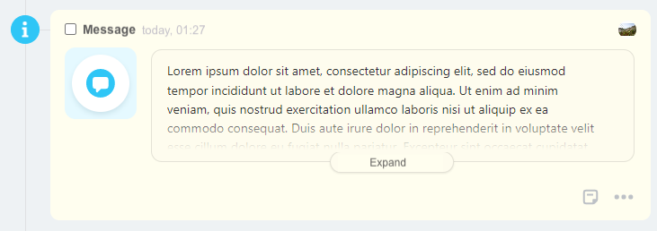

# Content Block of Configurable Deal

Content blocks `ContentBlockDto` are the foundation of the content area of the timeline entry. By combining these blocks, various interfaces can be flexibly assembled.

This structure is used when creating [configurable deals](../../layout-blocks/index.md) and when enriching timeline entries with [content blocks](../../../layout-blocks/index.md).

## General Structure of the Block:

```json
{
    "type": "Block Type",
    "properties": {
        ... some properties, varying for each specific block
    }
}
```

## Types of Content Blocks:

### Text

The simplest block `type = text`, which displays some formatted text.

#### Parameters



#|
|| **Field** | **Description** ||
|| **value^*^**
[`textWithTranslation`](./field-types.md) | Text to be displayed ||
|| **multiline**
[`boolean`](../../../../data-types.md) | Line break handling. If true, `\n` characters will be replaced with `<br>`. Default is `false` ||
|| **title**
[`textWithTranslation`](./field-types.md#textwithtranslation) | Title attribute ||
|| **bold**
[`boolean`](../../../../data-types.md) | Bold text. Default is `false` ||
|| **size**
[`string`](../../../../data-types.md) | Text size. Can take values `xs`, `sm`, `md` (default is `md`) ||
|| **color**
[`string`](../../../../data-types.md) | Text color. Can take values `base_50`, `base_60`, `base_70`, `base_90`, `green`, `purple` ||
|| **scope**
[`string`](../../../../data-types.md) | [Visibility](./field-types.md#scope), for example `web` ||
|#

#### Example

```json
{
    "icon": {
        "code": "info"
    },
    "header": {
        "title": "Information Message"
    },
    "body": {
        "logo": {
            "code": "notification"
        },
        "blocks": {
            "text": {
                "type": "text",
                "properties": {
                    "value": "Lorem ipsum dolor sit amet, consectetur adipiscing elit, sed do eiusmod tempor incididunt ut labore et dolore magna aliqua. Ut enim ad minim veniam, quis nostrud exercitation ullamco laboris nisi ut aliquip ex ea commodo consequat. Duis aute irure dolor in reprehenderit in voluptate velit esse cillum dolore eu fugiat nulla pariatur. Excepteur sint occaecat cupidatat non proident, sunt in culpa qui officia deserunt mollit anim id est laborum."
                }
            }
        }
    }
}
```


### Long Multiline Text

The block `type = largeText` allows displaying long multiline texts that will automatically collapse to a preview.

#### Parameters



#|
|| **Field** | **Description** ||
|| **value^*^**
[`textWithTranslation`](./field-types.md#textwithtranslation) | Text to be displayed ||
|| **scope**
[`string`](../../../../data-types.md) | [Visibility](./field-types.md#scope), for example `web` ||
|#

#### Example

Long text collapsed under "Show more".

```json
{
    "icon": {
        "code": "info"
    },
    "header": {
        "title": "Information Message"
    },
    "body": {
        "logo": {
            "code": "notification"
        },
        "blocks": {
            "text": {
                "type": "largeText",
                "properties": {
                    "value": "Lorem ipsum dolor sit amet, consectetur adipiscing elit, sed do eiusmod tempor incididunt ut labore et dolore magna aliqua. Ut enim ad minim veniam, quis nostrud exercitation ullamco laboris nisi ut aliquip ex ea commodo consequat. Duis aute irure dolor in reprehenderit in voluptate velit esse cillum dolore eu fugiat nulla pariatur. Excepteur sint occaecat cupidatat non proident, sunt in culpa qui officia deserunt mollit anim id est laborum. Lorem ipsum dolor sit amet, consectetur adipiscing elit, sed do eiusmod tempor incididunt ut labore et dolore magna aliqua. Ut enim ad minim veniam, quis nostrud exercitation ullamco laboris nisi ut aliquip ex ea commodo consequat."
                }
            }
        }
    }
}
```



### Link

The block `type = link` displays a link.

#### Parameters



#|
|| **Field** | **Description** ||
|| **text^*^**
[`textWithTranslation`](./field-types.md#textwithtranslation) | Text to be displayed. HTML tags are not supported ||
|| **action^*^**
[`ActionDto`](./action.md) | Action upon clicking the link ||
|| **bold**
[`boolean`](../../../../data-types.md) | Bold text. Default is `false` ||
|| **scope**
[`string`](../../../../data-types.md) | [Visibility](./field-types.md#scope), for example `web` ||
|#

#### Example

```json
{
    "type": "link",
    "properties": {
     "text": "Open Deal",
     "action": {
        "type": "redirect",
        "uri": "/crm/deal/details/123/"
     },
     "bold": true
    }
}
```

### Block with Title

The block `type = withTitle` displays a pair of title-value. Another content block can be used as the value.

#### Parameters



#|
|| **Field** | **Description** ||
|| **title^*^**
[`textWithTranslation`](./field-types.md#textwithtranslation) | Title text ||
|| **block^*^**
[`ContentBlockDto`](content-block.md) | Content block that serves as the value. Blocks of types `text`, `link`, `deadline` are supported ||
|| **inline**
[`boolean`](../../../../data-types.md) | Display title and value in one line. Default is `false` ||
|| **scope**
[`string`](../../../../data-types.md) | [Visibility](./field-types.md#scope), for example `web` ||
|#

#### Examples

```json
{
    "type": "withTitle",
    "properties": {
        "title": "Title",
        "block": {
            "type": "text",
            "properties": {
                "value": "Some value"
            }
        }
    }
}
```

```json
{
    "type": "withTitle",
    "properties": {
        "title": "Title 2",
        "block": {
            "type": "link",
            "properties": {
                "text": "Open Deal",
                "action": {
                    "type": "redirect",
                    "uri": "/crm/deal/details/123/"
                }
            }
        },
        "inline": true
    }
}
```

### Multiple Content Blocks in One Line

The block `type = lineOfBlocks` displays multiple content blocks of type text or link in one line. This allows displaying text with different formatting mixed with links in a single line.

#### Parameters



#|
|| **Field** | **Description** ||
|| **blocks^*^**
[`ContentBlockDto[]`](content-block.md) | Associative array of content blocks. Blocks of types `text`, `link`, `deadline` are supported ||
|| **scope**
[`string`](../../../../data-types.md) | [Visibility](./field-types.md#scope), for example `web` ||
|#

#### Examples

```json
{
    "type": "lineOfBlocks",
    "properties": {
        "blocks": {
            "text": {
                "type": "text",
                "properties": {
                    "value": "Some text"
                }
            },
            "link": {
                "type": "link",
                "properties": {
                    "text": "link",
                    "action": {
                        "type": "redirect",
                        "uri": "/crm/deal/details/123/"
                    }
                }
            },
            "boldText": {
                "type": "text",
                "properties": {
                    "value": "bold text",
                    "bold": true
                }
            }
        }
    }
}
```

### Deadline Selection

The block `type = deadline` displays the current deadline value with the ability to quickly change it. The block will not be shown if added to an incoming deal or a deal without a deadline.

#### Parameters



#|
|| **Field** | **Description** ||
|| **readonly**
[`boolean`](../../../../data-types.md) | Permission to change the deadline. Default is `false`. If the user does not have access to modify the entity to which the deal relates, or if the deal is completed, then `readonly = true` regardless of the provided settings ||
|| **scope**
[`string`](../../../../data-types.md) | [Visibility](./field-types.md#scope), for example `web` ||
|#

#### Examples

```json
{
    "type": "deadline",
    "properties": {
        "readonly": false
    }
}
```

## Continue Learning

- [{#T}](../../layout-blocks/index.md)
- [{#T}](../../../layout-blocks/index.md)
- [{#T}](./layout.md)
- [{#T}](./icon.md)
- [{#T}](./header.md)
- [{#T}](./body.md)
- [{#T}](./footer.md)
- [{#T}](./menu-item.md)
- [{#T}](./action.md)
- [{#T}](./field-types.md)
- [{#T}](./rest-app-layout-dto.md)
- [{#T}](./examples.md)