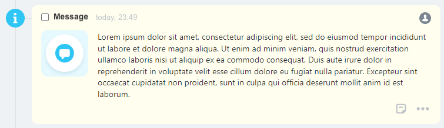
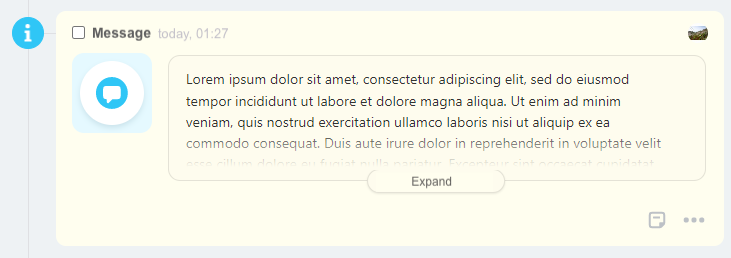
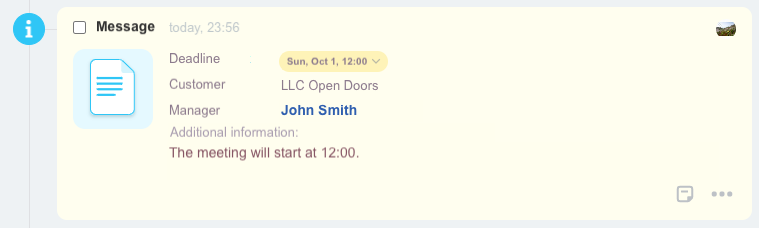
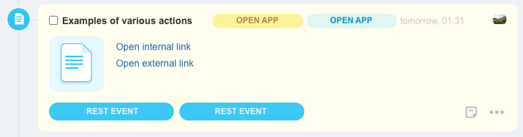
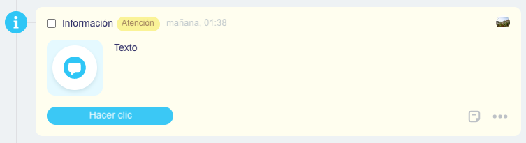

# Examples of Activity Configurations

Code examples for [custom activity types](../../types/index.md) and how they will look.

## Text

```json
{
    "icon": {
        "code": "info"
    },
    "header": {
        "title": "Information Message"
    },
    "body": {
        "logo": {
            "code": "notification"
        },
        "blocks": {
            "text": {
                "type": "text",
                "properties": {
                    "value": "Lorem ipsum dolor sit amet, consectetur adipiscing elit, sed do eiusmod tempor incididunt ut labore et dolore magna aliqua. Ut enim ad minim veniam, quis nostrud exercitation ullamco laboris nisi ut aliquip ex ea commodo consequat. Duis aute irure dolor in reprehenderit in voluptate velit esse cillum dolore eu fugiat nulla pariatur. Excepteur sint occaecat cupidatat non proident, sunt in culpa qui officia deserunt mollit anim id est laborum."
                }
            }
        }
    }
}
```



## Long Text

Long text hidden under "Show more".

```json
{
    "icon": {
        "code": "info"
    },
    "header": {
        "title": "Information Message"
    },
    "body": {
        "logo": {
            "code": "notification"
        },
        "blocks": {
            "text": {
                "type": "largeText",
                "properties": {
                    "value": "Lorem ipsum dolor sit amet, consectetur adipiscing elit, sed do eiusmod tempor incididunt ut labore et dolore magna aliqua. Ut enim ad minim veniam, quis nostrud exercitation ullamco laboris nisi ut aliquip ex ea commodo consequat. Duis aute irure dolor in reprehenderit in voluptate velit esse cillum dolore eu fugiat nulla pariatur. Excepteur sint occaecat cupidatat non proident, sunt in culpa qui officia deserunt mollit anim id est laborum. Lorem ipsum dolor sit amet, consectetur adipiscing elit, sed do eiusmod tempor incididunt ut labore et dolore magna aliqua. Ut enim ad minim veniam, quis nostrud exercitation ullamco laboris nisi ut aliquip ex ea commodo consequat."
                }
            }
        }
    }
}
```



## Fields

Fields with name-value pairs, changing the deadline.

```json
{
    "icon": {
        "code": "info"
    },
    "header": {
        "title": "Information Message"
    },
    "body": {
        "logo": {
            "code": "document"
        },
        "blocks": {
            "deadline": {
                "type": "withTitle",
                "properties": {
                    "title": "Deadline",
                    "inline": true,
                    "block": {
                        "type": "deadline"
                    }
                }
            },
            "client": {
                "type": "withTitle",
                "properties": {
                    "title": "Client",
                    "inline": true,
                    "block": {
                        "type": "text",
                        "properties": {
                            "value": "Ltd. Horns and Hooves"
                        }
                    }
                }
            },
            "manager": {
                "type": "withTitle",
                "properties": {
                    "title": "Manager",
                    "inline": true,
                    "block": {
                        "type": "link",
                        "properties": {
                            "text": "Sergey Vostrikov",
                            "bold": true,
                            "action": {
                                "type": "redirect",
                                "uri": "/company/personal/user/1/"
                            }
                        }
                    }
                }
            },
            "description": {
                "type": "withTitle",
                "properties": {
                    "title": "Additional Information in Large Volume",
                    "inline": false,
                    "block": {
                        "type": "text",
                        "properties": {
                            "multiline": true,
                            "value": "Arrive no earlier than noon. Entrance from the yard, gate password 555. Go up to the 5th floor, ask for Ivan Nikolaevich. Payment in cash, change from $5000."
                        }
                    }
                }
            }
        }
    }
}
```



## Action Types

Various types of actions.

```json
{
    "icon": {
        "code": "document"
    },
    "header": {
        "title": "Example of Different Action Types",
        "tags": {
            "tag1": {
                "type": "warning",
                "title": "Open Application",
                "action": {
                    "type": "openRestApp",
                    "actionParams": {
                        "myId": 123
                    }
                }
            },
            "tag2": {
                "type": "primary",
                "title": "Open Application",
                "action": {
                    "type": "openRestApp",
                    "actionParams": {
                        "someImportant": "qwerty"
                    }
                }
            }
        }
    },
    "body": {
        "logo": {
            "code": "document"
        },
        "blocks": {
            "link1": {
                "type": "link",
                "properties": {
                    "text": "Open Internal Link",
                    "action": {
                        "type": "redirect",
                        "uri": "/crm/deal/details/1/"
                    }
                }
            },
            "link2": {
                "type": "link",
                "properties": {
                    "text": "Open External Link",
                    "action": {
                        "type": "redirect",
                        "uri": "https://bitrix24.com"
                    }
                }
            }
        }
    },
    "footer": {
        "buttons": {
            "button1": {
                "title": "REST Event",
                "action": {
                    "type": "restEvent",
                    "id": "confirm",
                    "animationType": "loader",
                    "actionParams": {
                        "blockId": "time"
                    }
                },
                "type": "primary"
            },
            "button2": {
                "title": "REST Event",
                "action": {
                    "type": "restEvent",
                    "id": "confirm",
                    "animationType": "disable",
                    "actionParams": {
                        "blockId": "time"
                    }
                },
                "type": "primary"
            }
        }
    }
}
```



## Multilingual Support

Support for multilingualism.

```json
{
    "icon": {
        "code": "info"
    },
    "header": {
        "title": {"de": "Information", "en": "Information"},
        "tags": {
            "tag": {
                "type": "warning",
                "title": {
                    "de": "Achtung",
                    "en": "Warning"
                }
            }
        }
    },
    "body": {
        "logo": {
            "code": "notification"
        },
        "blocks": {
            "text": {
                "type": "text",
                "properties": {
                    "value": {"de": "Dieser Text wird in verschiedenen Sprachen unterschiedlich angezeigt", "en": "A text"}
                }
            }
        }
    },
    "footer": {
        "buttons": {
            "button1": {
                "title": {"de": "Drück mich", "en": "Push me"},
                "type": "primary",
                "action": {
                    "type": "redirect",
                    "uri": "https://bitrix24.com"
                }
            }
        }
    }
}
```

Result in English:

