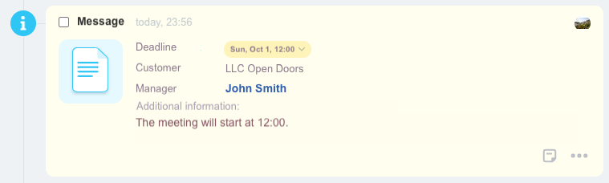
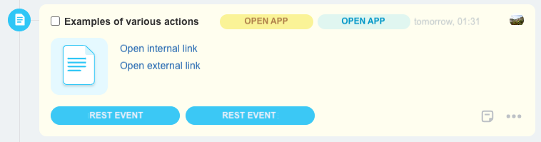
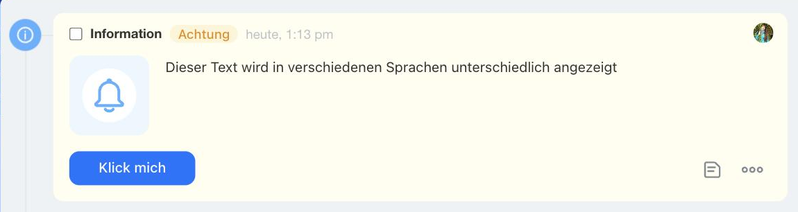
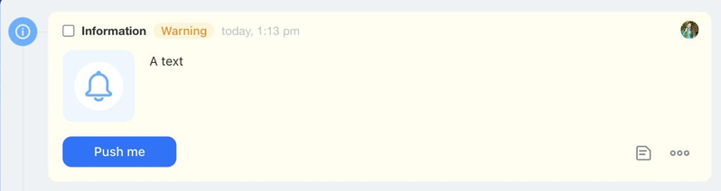

# Activity Configuration Examples



If you are developing integrations for Bitrix24 using AI tools (Codex, Claude Code, Cursor), connect to the [MCP server](../../../../../../ai-tools/mcp.md) so that the assistant can utilize the official REST documentation.



Ready-made examples of the [`LayoutDto`](./layout.md) object — the structure that describes the appearance of a timeline entry. This object is passed to the `layout` field of the [crm.activity.configurable.add](../crm-activity-configurable-add.md) and [crm.activity.configurable.update](../crm-activity-configurable-update.md) methods.

Each example shows a complete ready-made configuration and the resulting view the user will see in the timeline. Examples of individual [content blocks](./content-block.md) are collected on their description page.

Icon and logo codes in the examples are taken from the general timeline lists. You can retrieve the full lists using the [crm.timeline.icon.list](../../../logmessage/icons/crm-timeline-icon-list.md) and [crm.timeline.logo.list](../../../logmessage/logo/crm-timeline-logo-list.md) methods.

> Scope: [`crm`](../../../../../scopes/permissions.md)



The [crm.activity.configurable.add](../crm-activity-configurable-add.md) and [crm.activity.configurable.update](../crm-activity-configurable-update.md) methods work only within the context of an [app](../../../../../../settings/app-installation/index.md). Calling them via an incoming webhook will return error `ERROR_WRONG_CONTEXT`.



## Configuration Restrictions

The examples below are composed considering the structural restrictions:

- no more than two [tags](./header.md) in the entry heading
- no more than two [buttons](./footer.md) in the bottom part of the entry
- between one and 20 [content blocks](./body.md) in the main area
- keys in the associative arrays of the structure — `blocks`, `tags`, `buttons`, `items` — consist only of Latin letters, digits, hyphens, and underscores
- extra fields not present in the object description result in an error

Violating any of these rules returns a validation error. Error codes are listed on the [crm.activity.configurable.add](../crm-activity-configurable-add.md#errors) and [crm.activity.configurable.update](../crm-activity-configurable-update.md#errors) method pages.

## Card with a Set of Fields

An "Information Message" card with four name-value pairs: deadline, customer, manager, and additional information. Each pair is a `withTitle` block, which outputs a signature and a nested block with a value. A nested block can be of type `text`, `link`, or `deadline`.

The `inline` parameter controls the layout: with `true`, the signature and value are on the same line; with `false`, the value moves below the signature.

The `deadline` block inserts the activity deadline and allows it to be changed directly within the card. It is not displayed in an incoming activity or in an activity without a deadline. The conditions under which the deadline cannot be changed are listed in the [block description](./content-block.md).

The application generates the keys in the `blocks` array itself — they are not linked to block types. In the example, the key `deadline` matches the type name, but this is a coincidence rather than a requirement.

```json
{
    "icon": {
        "code": "info"
    },
    "header": {
        "title": "Information message"
    },
    "body": {
        "logo": {
            "code": "document"
        },
        "blocks": {
            "deadline": {
                "type": "withTitle",
                "properties": {
                    "title": "Deadline",
                    "inline": true,
                    "block": {
                        "type": "deadline"
                    }
                }
            },
            "client": {
                "type": "withTitle",
                "properties": {
                    "title": "Client",
                    "inline": true,
                    "block": {
                        "type": "text",
                        "properties": {
                            "value": "Müller GmbH"
                        }
                    }
                }
            },
            "manager": {
                "type": "withTitle",
                "properties": {
                    "title": "Manager",
                    "inline": true,
                    "block": {
                        "type": "link",
                        "properties": {
                            "text": "Klaus Weber",
                            "bold": true,
                            "action": {
                                "type": "redirect",
                                "uri": "/company/personal/user/1/"
                            }
                        }
                    }
                }
            },
            "description": {
                "type": "withTitle",
                "properties": {
                    "title": "Additional information in large quantities",
                    "inline": false,
                    "block": {
                        "type": "text",
                        "properties": {
                            "multiline": true,
                            "value": "Arrive no earlier than lunchtime. Entrance from the courtyard, gate password 555. Go up to the 5th floor, ask for Klaus Weber. Payment in cash, change from 5000 EUR."
                        }
                    }
                }
            }
        }
    }
}
```



## Card with Different Action Types

A configuration that gathers all types of [actions](./action.md): navigating via internal and external links, opening an app from a tag, and sending an event to an app upon a button click.

Both `link` blocks use the `redirect` action but behave differently. A relative link to a standard Bitrix24 object that supports opening in a slider will display it in a slider. An external link with a domain opens in a new browser tab.

Both tags open an app and differ in styling: `warning` provides a yellow background, while `primary` provides a blue one. Their `actionParams` sets are also different.

Both buttons send the same `confirm` event and differ only by the `animationType` value, so they look the same in the timeline — the difference is visible when clicked. A button with `loader` blocks the entire record and shows a loader on top of it, while a button with `disable` blocks only itself. The block is not released automatically: it persists until the app updates the activity using the [crm.activity.configurable.update](../crm-activity-configurable-update.md) method.

The content of `actionParams` is set arbitrarily by the app — Bitrix24 passes these values back in the event without parsing them. The `blockId` key in this example is created by the app and does not reference anything within the configuration itself: the app will decide how to interpret it.



The `openRestApp` action is not supported in the mobile app. If a scenario must work on mobile devices, use a different action type.



```json
{
    "icon": {
        "code": "document"
    },
    "header": {
        "title": "Example of different types of actions",
        "tags": {
            "tag1": {
                "type": "warning",
                "title": "open application",
                "action": {
                    "type": "openRestApp",
                    "actionParams": {
                        "myId": 123
                    }
                }
            },
            "tag2": {
                "type": "primary",
                "title": "open application",
                "action": {
                    "type": "openRestApp",
                    "actionParams": {
                        "someImportant": "qwerty"
                    }
                }
            }
        }
    },
    "body": {
        "logo": {
            "code": "document"
        },
        "blocks": {
            "link1": {
                "type": "link",
                "properties": {
                    "text": "Open internal link",
                    "action": {
                        "type": "redirect",
                        "uri": "/crm/deal/details/1/"
                    }
                }
            },
            "link2": {
                "type": "link",
                "properties": {
                    "text": "Open external link",
                    "action": {
                        "type": "redirect",
                        "uri": "https://bitrix24.com"
                    }
                }
            }
        }
    },
    "footer": {
        "buttons": {
            "button1": {
                "title": "rest event",
                "action": {
                    "type": "restEvent",
                    "id": "confirm",
                    "animationType": "loader",
                    "actionParams": {
                        "blockId": "time"
                    }
                },
                "type": "primary"
            },
            "button2": {
                "title": "rest event",
                "action": {
                    "type": "restEvent",
                    "id": "confirm",
                    "animationType": "disable",
                    "actionParams": {
                        "blockId": "time"
                    }
                },
                "type": "primary"
            }
        }
    }
}
```



## Multi-language Card

A configuration for an app used in different languages. Instead of a string, an associative array of translations is passed to the text field, where the key is the language code and the value is the text in that language. Fields capable of this have the [`textWithTranslation`](./field-types.md#textwithtranslation) type: these include the record heading, tag text, block content, and button labels.

Keys can only be languages installed on the portal. An unknown language code will result in a `WRONG_LANG` error.

Bitrix24 substitutes the version based on the user's interface language. If no translation exists for that language, English is used, and if that is also unavailable, the first value in the array is used.

```json
{
    "icon": {
        "code": "info"
    },
    "header": {
        "title": {"de": "Information", "en": "Information"},
        "tags": {
            "tag": {
                "type": "warning",
                "title": {
                    "de": "Attention",
                    "en": "Warning"
                }
            }
        }
    },
    "body": {
        "logo": {
            "code": "notification"
        },
        "blocks": {
            "text": {
                "type": "text",
                "properties": {
                    "value": {"de": "This text will be displayed differently in different languages", "en": "A text"}
                }
            }
        }
    },
    "footer": {
        "buttons": {
            "button1": {
                "title": {"de": "Click me", "en": "Push me"},
                "type": "primary",
                "action": {
                    "type": "redirect",
                    "uri": "https://bitrix24.com"
                }
            }
        }
    }
}
```

Result in Russian:



Result in English:



## Continue Learning

- [{#T}](./layout.md)
- [{#T}](./icon.md)
- [{#T}](./header.md)
- [{#T}](./body.md)
- [{#T}](./content-block.md)
- [{#T}](./footer.md)
- [{#T}](./menu-item.md)
- [{#T}](./action.md)
- [{#T}](./field-types.md)
- [{#T}](./rest-app-layout-dto.md)
- [{#T}](../crm-activity-configurable-add.md)
- [{#T}](../crm-activity-configurable-update.md)
- [{#T}](../index.md)
