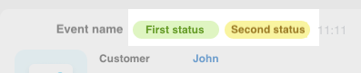
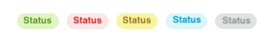

# Record Header

The header of the timeline record `HeaderDto`.

## Parameters of the `HeaderDto` Object



#| 
|| **Field** | **Description** ||
|| **title^*^**
[`textWithTranslation`](./field-types.md#textwithtranslation) | The title of the record ||
|| **titleAction**
[`ActionDto`](./action.md) | Action upon clicking the record title ||
|| **tags**
[`TagDto[]`](#obuekt) | Associative array of objects describing tags ||
|#

## `TagDto` Object

Tag in the timeline record header.



No more than two tags are allowed.





### Parameters of the `TagDto` Object



#| 
|| **Field** | **Description** ||
|| **title^*^**
[`textWithTranslation`](./field-types.md#textwithtranslation) | The text of the tag ||
|| **type^*^**
[`string`](../../../../data-types.md) | The type of the tag, for example `warning`. Defines its appearance ||
|| **action**
[`ActionDto`](./action.md) | Action upon clicking the tag ||
|| **scope**
[`string`](../../../../data-types.md) | [Scope](./field-types.md#scope), for example `web` ||
|| **hideIfReadonly**
[`boolean`](../../../../data-types.md) | Flag. Hides the tag if the user does not have edit access (default is `false`) ||
|#

Possible values for the **type** field:

- **warning** - Yellow background
- **success** - Green background
- **failure** - Red background
- **primary** - Blue background
- **secondary** - Gray background
- **lavender** - Light purple



## Example Object

```json
    "header": {
        "title": "Incoming Call",
        "titleAction": {
            "type": "redirect",
            "uri": "some.url"
        },
        "tags": {
            "status2": {
                "type": "warning",
                "title": "not deciphered"
            }
        }
    },
```

## Continue Learning

- [{#T}](./layout.md)
- [{#T}](./icon.md)
- [{#T}](./body.md)
- [{#T}](./content-block.md)
- [{#T}](./footer.md)
- [{#T}](./menu-item.md)
- [{#T}](./action.md)
- [{#T}](./field-types.md)
- [{#T}](./rest-app-layout-dto.md)
- [{#T}](./examples.md)