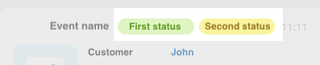
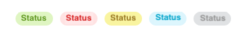

# Record Header



Choose a tool for developing with an AI agent:

- use [Alaio Vibecode](../../../../../../ai-tools/vibecode.md) to build an app for Bitrix24 from a task description without knowing any programming language. The agent writes the code and deploys the app to a server, with no manual hosting setup
- use the [MCP server](../../../../../../ai-tools/mcp.md) to develop a REST API integration in your own project. The agent refers to the official REST documentation



`HeaderDto` is the top line of the [timeline record](../index.md): the name of the record and the tag labels next to it. The header answers the question of what the record is about, while the tags show its state — for example, that a call has not been transcribed or that a request has already been confirmed.

The object is passed in the `header` field of the [configurable activity structure](./layout.md), and the structure itself is passed in the `layout` parameter of the [crm.activity.configurable.add](../crm-activity-configurable-add.md) and [crm.activity.configurable.update](../crm-activity-configurable-update.md) methods. The `header` field is required, and inside it only `title` is required. The calling conditions are described [on the structure page](./layout.md).

The header and the tag text accept the [`textWithTranslation`](./field-types.md#textwithtranslation) type: instead of a string you can pass an associative array of translations.

## Parameters of the `HeaderDto` Object



#|
|| **Field** | **Description** ||
|| **title^*^**
[`textWithTranslation`](./field-types.md#textwithtranslation) | Title of the record ||
|| **titleAction**
[`ActionDto`](./action.md) | Action upon clicking the record header ||
|| **tags**
[`object`](../../../../../data-types.md) | Header tags: the key is the tag identifier that the application sets itself, the value is a [TagDto](#tagdto) object ||
|#

## `TagDto` Object {#obuekt} {#tagdto}

Each tag is described by a `TagDto` object. The tag key allows Latin letters, digits, hyphens, and underscores, otherwise the method returns the `KEY_CONTAIN_WRONG_SYMBOLS` error.



No more than two tags are allowed. A third tag is rejected by the method with the `TOO_MANY_ITEMS` error.





### Parameters of the `TagDto` Object



#|
|| **Field** | **Description** ||
|| **title^*^**
[`textWithTranslation`](./field-types.md#textwithtranslation) | Tag text ||
|| **type^*^**
[`string`](../../../../../data-types.md) | Tag type, for example `warning`. Defines the color and styling ||
|| **action**
[`ActionDto`](./action.md) | Action upon clicking the tag ||
|#

The tag has no other fields. It does not accept the `scope` and `hideIfReadonly` fields that buttons and menu items have: the method rejects them with the `FIELD_IS_REDUNDANT` error.

Possible values for the **type** field:

#|
|| **Value** | **Styling** | **For Which State** ||
|| `success` | Green background | A successful outcome: a request confirmed, a payment went through ||
|| `failure` | Red background | An unsuccessful outcome: a call missed, a payment declined ||
|| `warning` | Yellow background | Needs attention: a call not transcribed, waiting for the customer's reply ||
|| `primary` | Blue background | An accent on a neutral status: new, in progress ||
|| `secondary` | Gray background | A secondary note: source, channel, request number ||
|#

Any other value is rejected by the method with the `ENUM_FIELD` error.





The image also shows a pale purple tag `lavender`. It is used in internal timeline records but is not supported in configurable activities: passing it via REST returns the `ENUM_FIELD` error.



## Example Object

The value of the `header` field: a heading with a link to a deal and a tag with the call transcription status.

```json
{
    "title": "Incoming call",
    "titleAction": {
        "type": "redirect",
        "uri": "/crm/deal/details/123/"
    },
    "tags": {
        "status2": {
            "type": "warning",
            "title": "not transcribed"
        }
    }
}
```

The heading and the tag with translations into two languages:

```json
{
    "title": {
        "de": "Eingehender Anruf",
        "en": "Incoming call"
    },
    "tags": {
        "status2": {
            "type": "warning",
            "title": {
                "de": "nicht transkribiert",
                "en": "not transcribed"
            }
        }
    }
}
```

Complete configurations with a heading and tags are collected in the [activity configuration examples](./examples.md).

## Continue Learning

- [{#T}](./layout.md)
- [{#T}](./icon.md)
- [{#T}](./body.md)
- [{#T}](./content-block.md)
- [{#T}](./footer.md)
- [{#T}](./menu-item.md)
- [{#T}](./action.md)
- [{#T}](./field-types.md)
- [{#T}](./rest-app-layout-dto.md)
- [{#T}](./examples.md)
