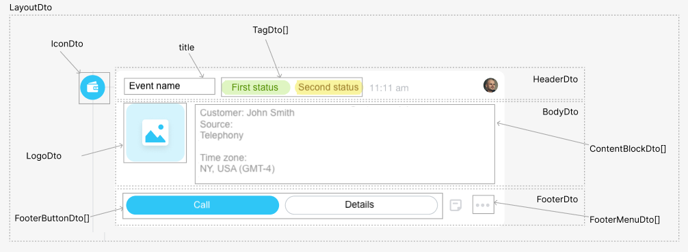

# Structure of Configurable Activity

The object that describes the appearance of the [timeline entry](../index.md) is a hierarchical structure of nested objects of various types.

Each of the nested objects has its own set of fields and is described below in the form of DTO (Data Transfer Object).

The top-level object of the timeline entry is `LayoutDto`.



## Parameters of the `LayoutDto` Object



#|
|| **Field** | **Description** ||
|| **icon^*^**
[`IconDto`](./icon.md) | Icon to the left of the entry ||
|| **header^*^**
[`HeaderDto`](./header.md) | Title of the entry ||
|| **body^*^**
[`BodyDto`](./body.md) | Main content area of the entry ||
|| **footer**
[`FooterDto`](./footer.md) | Bottom part of the entry with action block ||
|#

## Example Object

```json
{
    "icon": {
        "code": "call-completed"
    },
    "header": {
        "title": "Incoming Call",
        "tags": {
            "status2": {
                "type": "warning",
                "title": "not deciphered"
            }
        }
    },
    "body": {
        "logo": {
            "code": "call-incoming",
            "action": {
                "type": "redirect",
                "uri": "/crm/deal/details/123/"
            }
        },
        "blocks": {
            "client": {
                "type": "withTitle",
                "properties": {
                    "title": "Client",
                    "inline": true,
                    "block": {
                        "type": "text",
                        "properties": {
                            "value": "Ltd. Horns and Hooves"
                        }
                    }
                }
            },
            "responsible": {
                "type": "lineOfBlocks",
                "properties": {
                    "blocks": {
                        "client": {
                            "type": "link",
                            "properties": {
                                "text": "Sergey Vostrikov",
                                "bold": true,
                                "action": {
                                    "type": "redirect",
                                    "uri": "/crm/lead/details/789/"
                                }
                            }
                        },
                        "phone": {
                            "type": "text",
                            "properties": {
                                "value": "+1 999 888 7777"
                            }
                        }
                    }
                }
            }
        }
    },
    "footer": {
        "buttons": {
            "startCall": {
                "title": "About the Client",
                "action": {
                    "type": "openRestApp",
                    "actionParams": {
                        "clientId": 456
                    }
                },
                "type": "primary"
            }
        },
        "menu": {
            "showPostponeItem": "false",
            "items": {
                "confirm": {
                    "title": "Confirm Request",
                    "action": {
                        "type": "restEvent",
                        "id": "confirm",
                        "animationType": "loader"
                    }
                },
                "decline": {
                    "title": "Decline Request",
                    "action": {
                        "type": "restEvent",
                        "id": "decline",
                        "animationType": "loader"
                    }
                }
            }
        }
    }
}
```

## Continue Learning

- [{#T}](./icon.md)
- [{#T}](./header.md)
- [{#T}](./body.md)
- [{#T}](./content-block.md)
- [{#T}](./footer.md)
- [{#T}](./menu-item.md)
- [{#T}](./action.md)
- [{#T}](./field-types.md)
- [{#T}](./rest-app-layout-dto.md)
- [{#T}](./examples.md)