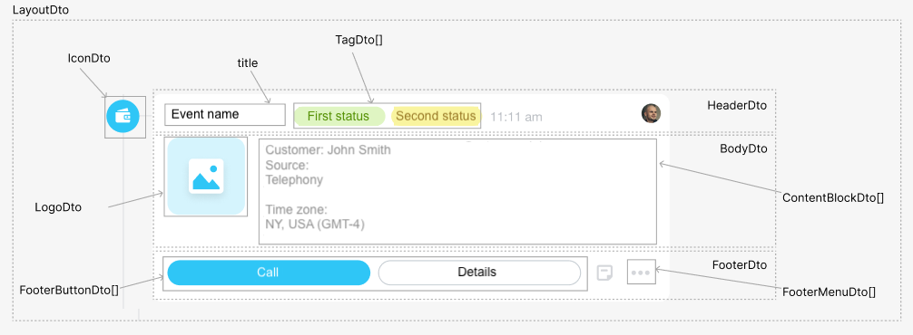

# Structure of Configurable Activity



If you are developing integrations for Bitrix24 using AI tools (Codex, Claude Code, Cursor), connect to the [MCP server](../../../../../../ai-tools/mcp.md) so that the assistant can utilize the official REST documentation.



The object describing the appearance of a [timeline entry](../index.md) is a hierarchical structure of nested objects of various types.

Each nested object has its own set of fields and is described below in the form of a DTO (Data Transfer Object).

The top-level object of the timeline entry is `LayoutDto`.



## Parameters of the `LayoutDto` Object



#|
|| **Field** | **Description** ||
|| **icon^*^**
[`IconDto`](./icon.md) | Icon to the left of the entry ||
|| **header^*^**
[`HeaderDto`](./header.md) | Title of the record ||
|| **body^*^**
[`BodyDto`](./body.md) | Main content area of the entry ||
|| **footer**
[`FooterDto`](./footer.md) | Bottom part of the entry with action block ||
|#

## Object Example {#primer}

```json
{
    "icon": {
        "code": "call-completed"
    },
    "header": {
        "title": "Incoming call",
        "tags": {
            "status2": {
                "type": "warning",
                "title": "not transcribed"
            }
        }
    },
    "body": {
        "logo": {
            "code": "call-incoming",
            "action": {
                "type": "redirect",
                "uri": "/crm/deal/details/123/"
            }
        },
        "blocks": {
            "client": {
                "type": "withTitle",
                "properties": {
                    "title": "Client",
                    "inline": true,
                    "block": {
                        "type": "text",
                        "properties": {
                            "value": "Müller GmbH"
                        }
                    }
                }
            },
            "responsible": {
                "type": "lineOfBlocks",
                "properties": {
                    "blocks": {
                        "client": {
                            "type": "link",
                            "properties": {
                                "text": "Klaus Weber",
                                "bold": true,
                                "action": {
                                    "type": "redirect",
                                    "uri": "/crm/lead/details/789/"
                                }
                            }
                        },
                        "phone": {
                            "type": "text",
                            "properties": {
                                "value": "+49 999 888 7777"
                            }
                        }
                    }
                }
            }
        }
    },
    "footer": {
        "buttons": {
            "startCall": {
                "title": "About client",
                "action": {
                    "type": "openRestApp",
                    "actionParams": {
                        "clientId": 456
                    }
                },
                "type": "primary"
            }
        },
        "menu": {
            "showPostponeItem": "false",
            "items": {
                "confirm": {
                    "title": "Confirm request",
                    "action": {
                        "type": "restEvent",
                        "id": "confirm",
                        "animationType": "loader"
                    }
                },
                "decline": {
                    "title": "Reject request",
                    "action": {
                        "type": "restEvent",
                        "id": "decline",
                        "animationType": "loader"
                    }
                }
            }
        }
    }
}
```

## Continue Learning

- [{#T}](./icon.md)
- [{#T}](./header.md)
- [{#T}](./body.md)
- [{#T}](./content-block.md)
- [{#T}](./footer.md)
- [{#T}](./menu-item.md)
- [{#T}](./action.md)
- [{#T}](./field-types.md)
- [{#T}](./rest-app-layout-dto.md)
- [{#T}](./examples.md)
