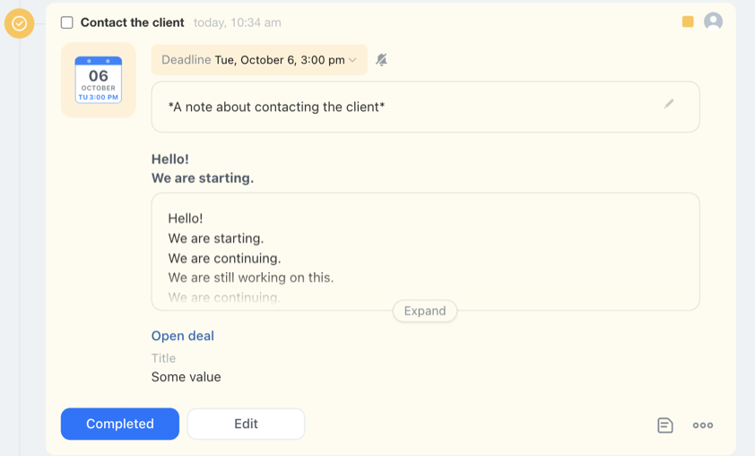

# Set a set of additional content blocks in the activity crm.activity.layout.blocks.set



Choose a tool for developing with an AI agent:

- use [Alaio Vibecode](../../../../../ai-tools/vibecode.md) to build an app for Bitrix24 from a task description without knowing any programming language. The agent writes the code and deploys the app to a server, with no manual hosting setup
- use the [MCP server](../../../../../ai-tools/mcp.md) to develop a REST API integration in your own project. The agent refers to the official REST documentation



> Scope: [`crm`](../../../../scopes/permissions.md)
>
> Who can execute the method: any user with permission to modify the CRM entity to which the activity is linked

The method `crm.activity.layout.blocks.set` installs a set of additional content blocks in an activity.

The method only works in the context of the [application](../../../../../settings/app-installation/index.md): when called via a webhook, it returns the `ERROR_WRONG_CONTEXT` error. The application modifies only the set of blocks that it installed itself. Calling the method again replaces this set entirely.

The method works only with activities. To install a set of blocks in a comment or another timeline entry, use [crm.timeline.layout.blocks.set](../../layout-blocks/crm-timeline-layout-blocks-set.md).

A set of blocks cannot be installed in a [configurable activity](../configurable/index.md) or in an activity of a deprecated type — the timeline does not render such an activity as a configurable entry. In these cases, the method returns the `UNSUITABLE_ACTIVITY_TYPE_ERROR` error. The suitability of an activity cannot be determined in advance from REST data, the only way to check is a trial call.

If the activity is linked to several CRM entities at once, the set of blocks remains a single one and is displayed in the timeline of every linked entity. The links are managed by the [crm.activity.binding.*](../binding/index.md) methods.

The order in which the methods are called and the general rules for working with block sets are described in the [section overview](./index.md).

## Method Parameters



#|
|| **Name**
`type` | **Description** ||
|| **entityTypeId***
[`integer`](../../../../data-types.md) | [Identifier of the CRM object type](../../../data-types.md#object_type) to which the activity is linked, for example `2` for a deal ||
|| **entityId***
[`integer`](../../../../data-types.md) | Identifier of the CRM object to which the activity is linked, for example the deal identifier ||
|| **activityId***
[`integer`](../../../../data-types.md) | Identifier of the activity. It is returned by the [crm.activity.add](../activity-base/crm-activity-add.md) and [crm.activity.list](../activity-base/crm-activity-list.md) methods ||
|| **layout***
[`RestAppLayoutDto`](../configurable/structure/rest-app-layout-dto.md) | Object describing the set of additional content blocks [(detailed description)](#layout) ||
|#

### Parameter layout {#layout}

#|
|| **Name**
`type` | **Description** ||
|| **blocks***
[`object`](../../../../data-types.md) | Associative array of [content blocks](../configurable/structure/content-block.md). The key is the block identifier, the value is the block description ||
|#

Limitations on `blocks`:

- the `blocks` field is required, otherwise the method returns the `FIELD_IS_REQUIRED` error
- a set can contain no more than 20 blocks, otherwise the method returns the `TOO_MANY_ITEMS` error
- a block key can contain only Latin letters, digits, hyphens, and underscores, otherwise the method returns the `KEY_CONTAIN_WRONG_SYMBOLS` error
- a block type must be on the list of allowed types, otherwise the method returns the `ENUM_FIELD` error

Each block is described by the `type` and `properties` fields. The composition of `properties` depends on the block type:

#|
|| **type** | **What It Displays** | **Required `properties` Fields** ||
|| `text` | A line of formatted text | `value` ||
|| `largeText` | Long text collapsed into a preview | `value` ||
|| `link` | A link with an action on click | `text`, `action` ||
|| `deadline` | The activity deadline, which can be changed right in the block | No required fields ||
|| `withTitle` | A title — value pair, where the value is a nested block of the `text`, `link`, or `deadline` type | `title`, `block` ||
|| `lineOfBlocks` | Several blocks of the `text`, `link`, or `deadline` type in a single line | `blocks` ||
|#

The full list of fields for each type, including the optional ones, is provided in the description of the [ContentBlockDto](../configurable/structure/content-block.md) structure.

## Display Features

If different applications have added their own sets of additional content blocks to an activity, the sets are displayed in the order they were added.

In the HTML markup, data attributes show which application added the set of additional content blocks:

- `data-app-name` — application name
- `data-rest-client-id` — application identifier

## Code Examples

Install a set of four additional content blocks in the activity with `id = 8`, linked to the deal with `id = 4`:

1. text
2. long multiline text
3. link
4. block with a title





- cURL (OAuth)

    ```bash
    curl -X POST \
    -H "Content-Type: application/json" \
    -H "Accept: application/json" \
    -d '{"entityTypeId":2,"entityId":4,"activityId":8,"layout":{"blocks":{"block_1":{"type":"text","properties":{"value":"Hello!\nWe are starting.","multiline":true,"bold":true,"color":"base_90"}},"block_2":{"type":"largeText","properties":{"value":"Hello!\nWe are starting.\nWe are continuing.\nWe are still working on this.\nWe are continuing.\nWe are close to the result.\nGoodbye."}},"block_3":{"type":"link","properties":{"text":"Open deal","bold":true,"action":{"type":"redirect","uri":"/crm/deal/details/123/"}}},"block_4":{"type":"withTitle","properties":{"title":"Title","block":{"type":"text","properties":{"value":"Some value"}}}}}},"auth":"**put_access_token_here**"}' \
    https://**put_your_bitrix24_address**/rest/crm.activity.layout.blocks.set
    ```

- JS (TS)

    ```ts
    // This snippet is an ES module: top-level await requires type="module" or a bundler.
    // $b24 is an already-initialized SDK instance (see the SDK "Get started" guide).
    import { Text } from '@bitrix24/b24jssdk'
    import type { B24Frame } from '@bitrix24/b24jssdk'

    declare const $b24: B24Frame

    // Shape of the payload returned in result (match the "response handling" section of the page)
    type SetLayoutBlocksResult = {
      success: boolean
    }

    try {
      const response = await $b24.actions.v2.call.make<SetLayoutBlocksResult>({
        method: 'crm.activity.layout.blocks.set',
        params: {
          entityTypeId: 2, // Deal
          entityId: 4,     // Deal ID
          activityId: 8,   // Activity ID linked to the deal
          layout: {
            blocks: {
              block_1: {
                type: 'text',
                properties: {
                  value: 'Hello!\nWe are starting.',
                  multiline: true,
                  bold: true,
                  color: 'base_90',
                },
              },
              block_2: {
                type: 'largeText',
                properties: {
                  value: 'Hello!\nWe are starting.\nWe are continuing.\nWe are still working on this.\nWe are continuing.\nWe are close to the result.\nGoodbye.',
                },
              },
              block_3: {
                type: 'link',
                properties: {
                  text: 'Open deal',
                  bold: true,
                  action: {
                    type: 'redirect',
                    uri: '/crm/deal/details/123/',
                  },
                },
              },
              block_4: {
                type: 'withTitle',
                properties: {
                  title: 'Header',
                  block: {
                    type: 'text',
                    properties: {
                      value: 'Some value',
                    },
                  },
                },
              },
            },
          },
        },
        requestId: Text.getUuidRfc4122()
      })

      // The payload is available only on a successful response
      if (!response.isSuccess) {
        console.error(response.getErrorMessages().join('; '))
      } else {
        const result = response.getData()!.result
        console.info('Layout blocks set successfully:', result.success)
      }
    } catch (error) {
      // Thrown on transport or SDK failures (AjaxError, SdkError, etc.)
      console.error(error)
    }
    ```

- JS (UMD)

    ```html
    <!-- Load the SDK (UMD build); it is exposed as the global B24Js -->
    <script src="https://unpkg.com/@bitrix24/b24jssdk@1/dist/umd/index.min.js"></script>
    <script>
      async function setActivityLayoutBlocks() {
        try {
          // Initialize the SDK inside a Bitrix24 frame
          const $b24 = await B24Js.initializeB24Frame()

          const response = await $b24.actions.v2.call.make({
            method: 'crm.activity.layout.blocks.set',
            params: {
              entityTypeId: 2, // Deal
              entityId: 4,     // Deal ID
              activityId: 8,   // Activity ID linked to the deal
              layout: {
                blocks: {
                  block_1: {
                    type: 'text',
                    properties: {
                      value: 'Hello!\nWe are starting.',
                      multiline: true,
                      bold: true,
                      color: 'base_90',
                    },
                  },
                  block_2: {
                    type: 'largeText',
                    properties: {
                      value: 'Hello!\nWe are starting.\nWe are continuing.\nWe are still working on this.\nWe are continuing.\nWe are close to the result.\nGoodbye.',
                    },
                  },
                  block_3: {
                    type: 'link',
                    properties: {
                      text: 'Open deal',
                      bold: true,
                      action: {
                        type: 'redirect',
                        uri: '/crm/deal/details/123/',
                      },
                    },
                  },
                  block_4: {
                    type: 'withTitle',
                    properties: {
                      title: 'Header',
                      block: {
                        type: 'text',
                        properties: {
                          value: 'Some value',
                        },
                      },
                    },
                  },
                },
              },
            },
            requestId: B24Js.Text.getUuidRfc4122()
          })

          // The payload is available only on a successful response
          if (!response.isSuccess) {
            console.error(response.getErrorMessages().join('; '))
            return
          }

          const result = response.getData().result
          console.info('Layout blocks set successfully:', result.success)
        } catch (error) {
          // Thrown on transport or SDK failures (AjaxError, SdkError, etc.)
          console.error(error)
        }
      }

      document.addEventListener('DOMContentLoaded', setActivityLayoutBlocks)
    </script>
    ```

- Python

    ```python

    from b24pysdk.errors import BitrixAPIError, BitrixSDKException

    try:
        bitrix_response = client.crm.activity.layout.blocks.set(
            entity_type_id=2,
            entity_id=4,
            activity_id=8,
            layout={
                "blocks": {
                    "block_1": {
                        "type": "text",
                        "properties": {
                            "value": "Hello!\nWe are starting.",
                            "multiline": True,
                            "bold": True,
                            "color": "base_90",
                        },
                    },
                    "block_2": {
                        "type": "largeText",
                        "properties": {
                            "value": "Hello!\nWe are starting.\nWe are continuing.\nWe are still working on this.\nWe are continuing.\nWe are close to the result.\nGoodbye.",
                        },
                    },
                    "block_3": {
                        "type": "link",
                        "properties": {
                            "text": "Open deal",
                            "bold": True,
                            "action": {
                                "type": "redirect",
                                "uri": "/crm/deal/details/123/",
                            },
                        },
                    },
                    "block_4": {
                        "type": "withTitle",
                        "properties": {
                            "title": "Title",
                            "block": {
                                "type": "text",
                                "properties": {
                                    "value": "Some value",
                                },
                            },
                        },
                    },
                },
            },
        ).response
        result = bitrix_response.result
        print(result)
    except BitrixAPIError as error:
        print(
            "Bitrix API error",
            f"error: {error.error}",
            f"error_description: {error.error_description}",
            sep="\n",
        )
    except BitrixSDKException as error:
        print(f"Bitrix SDK error: {error.message}")
    except Exception as error:
        print(f"Unexpected error: {error}")
    ```

- PHP

    ```php
    try {
        $response = $b24Service
            ->core
            ->call(
                'crm.activity.layout.blocks.set',
                [
                    'entityTypeId' => 2, // Deal
                    'entityId'     => 4, // Deal ID
                    'activityId'   => 8, // ID of the deal linked to this deal
                    'layout'       => [
                        'blocks' => [
                            'block_1' => [
                                'type'       => "text",
                                'properties' => [
                                    'value'     => "Hello!\nWe are starting.",
                                    'multiline' => true,
                                    'bold'      => true,
                                    'color'     => "base_90",
                                ],
                            ],
                            'block_2' => [
                                'type'       => "largeText",
                                'properties' => [
                                    'value' => "Hello!\nWe are starting.\nWe are continuing.\nWe are still working on this.\nWe are continuing.\nWe are close to the result.\nGoodbye.",
                                ],
                            ],
                            'block_3' => [
                                'type'       => "link",
                                'properties' => [
                                    'text'     => "Open deal",
                                    'bold'     => true,
                                    'action'   => [
                                        'type' => "redirect",
                                        'uri'  => "/crm/deal/details/123/",
                                    ],
                                ],
                            ],
                            'block_4' => [
                                'type'       => "withTitle",
                                'properties' => [
                                    'title'  => "Title",
                                    'block'  => [
                                        'type'       => "text",
                                        'properties' => [
                                            'value' => "Some value",
                                        ],
                                    ],
                                ],
                            ],
                        ],
                    ],
                ]
            );

        $result = $response
            ->getResponseData()
            ->getResult();

        echo 'Success: ' . print_r($result, true);

    } catch (Throwable $e) {
        error_log($e->getMessage());
        echo 'Error setting activity layout blocks: ' . $e->getMessage();
    }
    ```

- BX24.js

    ```js
    const layout = {
        blocks: {
            'block_1': {
                type: "text",
                properties: {
                    value: "Hello!\nWe are starting.",
                    multiline: true,
                    bold: true,
                    color: "base_90"
                }
            },
            'block_2': {
                type: "largeText",
                properties: {
                    value: "Hello!\nWe are starting.\nWe are continuing.\nWe are still working on this.\nWe are continuing.\nWe are close to the result.\nGoodbye."
                }
            },
            'block_3': {
                type: "link",
                properties: {
                    text: "Open deal",
                    bold: true,
                    action: {
                        type: "redirect",
                        uri: "/crm/deal/details/123/"
                    }
                }
            },
            'block_4': {
                type: "withTitle",
                properties: {
                    title: "Title",
                    block: {
                        type: "text",
                        properties: {
                            value: "Some value"
                        }
                    }
                }
            }
        }
    };
    BX24.callMethod(
        'crm.activity.layout.blocks.set',
        {
            entityTypeId: 2, // Deal
            entityId: 4,     // Deal ID
            activityId: 8,   // ID of the activity linked to this deal
            layout: layout,  // Object describing the set of additional content blocks
        },
        (result) => {
            if (result.error()) {
                console.error(result.error());
            } else {
                console.info(result.data());
            }
        },
    );
    ```

- PHP CRest

    ```php
    require_once('crest.php');
    $result = CRest::call(
        'crm.activity.layout.blocks.set',
        [
            'entityTypeId' => 2,
            'entityId' => 4,
            'activityId' => 8,
            'layout' => [
                'blocks' => [
                    'block_1' => [
                        'type' => "text",
                        'properties' => [
                            'value' => "Hello!\nWe are starting.",
                            'multiline' => true,
                            'bold' => true,
                            'color' => "base_90"
                        ]
                    ],
                    'block_2' => [
                        'type' => "largeText",
                        'properties' => [
                            'value' => "Hello!\nWe are starting.\nWe are continuing.\nWe are still working on this.\nWe are continuing.\nWe are close to the result.\nGoodbye."
                        ]
                    ],
                    'block_3' => [
                        'type' => "link",
                        'properties' => [
                            'text' => "Open deal",
                            'bold' => true,
                            'action' => [
                                'type' => "redirect",
                                'uri' => "/crm/deal/details/123/"
                            ]
                        ]
                    ],
                    'block_4' => [
                        'type' => "withTitle",
                        'properties' => [
                            'title' => "Title",
                            'block' => [
                                'type' => "text",
                                'properties' => [
                                    'value' => "Some value"
                                ]
                            ]
                        ]
                    ]
                ]
            ]
        ]
    );
    echo '';
    print_r($result);
    echo '';
    ```

- Go

    ```go
    // client and ctx are already created — see the Go SDK section
    res, err := client.Core().Call(ctx, "crm.activity.layout.blocks.set", b24.Params{
    	"entityTypeId": 2,
    	"entityId":     4,
    	"activityId":   8,
    	"layout": b24.Params{
    		"blocks": b24.Params{
    			"block_1": b24.Params{
    				"type": "text",
    				"properties": b24.Params{
    					"value":     "Hello!\nWe are starting.",
    					"multiline": true,
    					"bold":      true,
    					"color":     "base_90",
    				},
    			},
    			"block_2": b24.Params{
    				"type": "largeText",
    				"properties": b24.Params{
    					"value": "Hello!\nWe are starting.\nWe are continuing.\nWe are still working on this.\nWe are continuing.\nWe are close to the result.\nGoodbye.",
    				},
    			},
    			"block_3": b24.Params{
    				"type": "link",
    				"properties": b24.Params{
    					"text": "Open deal",
    					"bold": true,
    					"action": b24.Params{
    						"type": "redirect",
    						"uri":  "/crm/deal/details/123/",
    					},
    				},
    			},
    			"block_4": b24.Params{
    				"type": "withTitle",
    				"properties": b24.Params{
    					"title": "Title",
    					"block": b24.Params{
    						"type": "text",
    						"properties": b24.Params{
    							"value": "Some value",
    						},
    					},
    				},
    			},
    		},
    	},
    })
    if err != nil {
    	return fmt.Errorf("crm.activity.layout.blocks.set: %w", err)
    }

    // The response arrives as json.RawMessage — unmarshal it
    // into a struct matching the response shape shown below on this page.
    fmt.Printf("%s\n", res.Result)
    ```



## Response Handling

HTTP status: **200**

```json
{
    "result": {
        "success": true
    },
    "time": {
        "start": 1753341040.475739,
        "finish": 1753341040.582705,
        "duration": 0.10696601867675781,
        "processing": 0.04708504676818848,
        "date_start": "2025-07-24T17:57:20+00:00",
        "date_finish": "2025-07-24T17:57:20+00:00",
        "operating": 0
    }
}
```

### Returned Data

#|
|| **Name**
`type` | **Description** ||
|| **result**
[`object`](../../../../data-types.md) | Root element of the response [(detailed description)](#result). If the set of blocks could not be installed, the method returns an `error` object instead of `result` — see the "Error Handling" section ||
|| **time**
[`time`](../../../../data-types.md#time) | Information about the request execution time ||
|#

#### Object result {#result}

#|
|| **Name**
`type` | **Description** ||
|| **success**
[`boolean`](../../../../data-types.md) | Result of installing the set of additional content blocks. The field is returned when the method completes successfully and has the value `true` ||
|#

The method does not return the installed set of blocks itself in the response. To read the stored set, call [crm.activity.layout.blocks.get](./crm-activity-layout-blocks-get.md).

After the call from the example above, the activity looks like this:



## Error Handling

HTTP status: **400**

```json
{
    "error": "ERROR_WRONG_CONTEXT",
    "error_description": "The method call is only possible in the context of a REST application"
}
```



### Possible Error Codes

#|
|| **Code** | **Description** ||
|| `ERROR_WRONG_CONTEXT` | The method can only be called in the context of a REST application. The method was called via a webhook ||
|| `OWNER_NOT_FOUND` | The element to which the activity is linked was not found. An unknown `entityTypeId` was passed, or the activity is not linked to the element with the specified `entityId` ||
|| `NOT_FOUND` | The activity with the specified `activityId` was not found ||
|| `ACCESS_DENIED` | The user has no permission to modify the CRM entity to which the activity is linked ||
|| `UNSUITABLE_ACTIVITY_TYPE_ERROR` | The activity type is not suitable for adding a set of additional content blocks ||
|| `FIELD_IS_REQUIRED` | A required field of the structure was not passed: `blocks` in `RestAppLayoutDto`, or a `properties` field of a block, for example `value` for a block of the `text` type ||
|| `FIELD_IS_REDUNDANT` | The structure object contains a field that is not in its description ||
|| `TOO_MANY_ITEMS` | More than 20 blocks were passed in `blocks` ||
|| `KEY_CONTAIN_WRONG_SYMBOLS` | A block key in `blocks` contains invalid characters ||
|| `WRONG_FIELD_VALUE` | The field value does not match the expected type, for example a block was passed as something other than an object ||
|| `ENUM_FIELD` | The `type` field of a block contains a value that is not on the list of allowed types ||
|#

The error text specifies which field and which structure object caused it.



## Continue Learning

- [{#T}](./index.md)
- [{#T}](./crm-activity-layout-blocks-get.md)
- [{#T}](./crm-activity-layout-blocks-delete.md)
- [{#T}](../configurable/structure/content-block.md)
- [{#T}](../../layout-blocks/content-blocks-test-app.md)