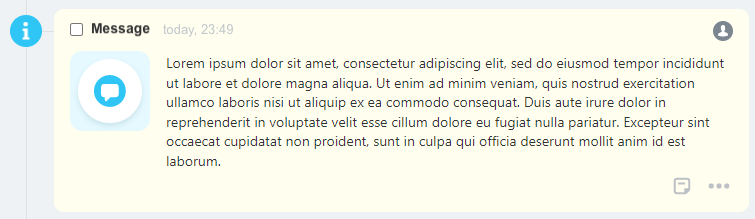
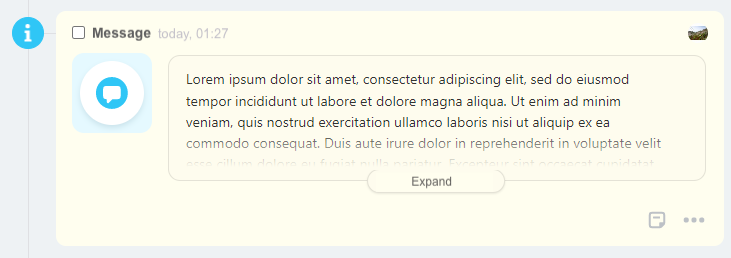
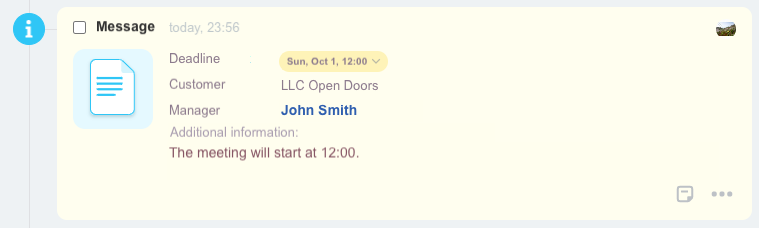
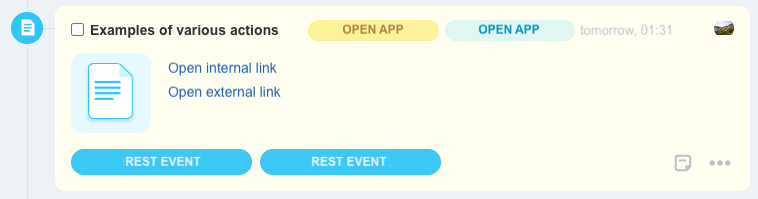
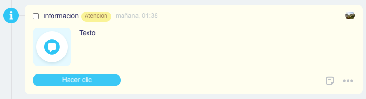

# Examples



Some data may be missing — we will fill it in shortly.



## Text

```json
{
    "icon": {
        "code": "info"
    },
    "header": {
        "title": "Info message"
    },
    "body": {
        "logo": {
            "code": "notification"
        },
        "blocks": {
            "text": {
                "type": "text",
                "properties": {
                    "value": "Lorem ipsum dolor sit amet, consectetur adipiscing elit, sed do eiusmod tempor incididunt ut labore et dolore magna aliqua. Ut enim ad minim veniam, quis nostrud exercitation ullamco laboris nisi ut aliquip ex ea commodo consequat. Duis aute irure dolor in reprehenderit in voluptate velit esse cillum dolore eu fugiat nulla pariatur. Excepteur sint occaecat cupidatat non proident, sunt in culpa qui officia deserunt mollit anim id est laborum."
                }
            }
        }
    }
}
```



## Long Text

Long text hidden under "Show more".

```json
{
    "icon": {
        "code": "info"
    },
    "header": {
        "title": "Info message"
    },
    "body": {
        "logo": {
            "code": "notification"
        },
        "blocks": {
            "text": {
                "type": "largeText",
                "properties": {
                    "value": "Lorem ipsum dolor sit amet, consectetur adipiscing elit, sed do eiusmod tempor incididunt ut labore et dolore magna aliqua. Ut enim ad minim veniam, quis nostrud exercitation ullamco laboris nisi ut aliquip ex ea commodo consequat. Duis aute irure dolor in reprehenderit in voluptate velit esse cillum dolore eu fugiat nulla pariatur. Excepteur sint occaecat cupidatat non proident, sunt in culpa qui officia deserunt mollit anim id est laborum. Lorem ipsum dolor sit amet, consectetur adipiscing elit, sed do eiusmod tempor incididunt ut labore et dolore magna aliqua. Ut enim ad minim veniam, quis nostrud exercitation ullamco laboris nisi ut aliquip ex ea commodo consequat."
                }
            }
        }
    }
}
```



## Fields

Field name-value pairs, deadline change.

```json
{
    "icon": {
        "code": "info"
    },
    "header": {
        "title": "Info message"
    },
    "body": {
        "logo": {
            "code": "document"
        },
        "blocks": {
            "deadline": {
                "type": "withTitle",
                "properties": {
                    "title": "Deadline",
                    "inline": true,
                    "block": {
                        "type": "deadline"
                    }
                }
            },
            "client": {
                "type": "withTitle",
                "properties": {
                    "title": "Customer",
                    "inline": true,
                    "block": {
                        "type": "text",
                        "properties": {
                            "value": "LLC Open Doors"
                        }
                    }
                }
            },
            "manager": {
                "type": "withTitle",
                "properties": {
                    "title": "Manager",
                    "inline": true,
                    "block": {
                        "type": "link",
                        "properties": {
                            "text": "John Smith",
                            "bold": true,
                            "action": {
                                "type": "redirect",
                                "uri": "/company/personal/user/1/"
                            }
                        }
                    }
                }
            },
            "description": {
                "type": "withTitle",
                "properties": {
                    "title": "Additional info",
                    "inline": false,
                    "block": {
                        "type": "text",
                        "properties": {
                            "multiline": true,
                            "value": "The noon will start at 12:00."
                        }
                    }
                }
            }
        }
    }
}
```



## Action Types

Various types of actions.

```json
{
    "icon": {
        "code": "document"
    },
    "header": {
        "title": "Example of Different Action Types",
        "tags": {
            "tag1": {
                "type": "warning",
                "title": "Open Application",
                "action": {
                    "type": "openRestApp",
                    "actionParams": {
                        "myId": 123
                    }
                }
            },
            "tag2": {
                "type": "primary",
                "title": "open app",
                "action": {
                    "type": "openRestApp",
                    "actionParams": {
                        "someImportant": "qwerty"
                    }
                }
            }
        }
    },
    "body": {
        "logo": {
            "code": "document"
        },
        "blocks": {
            "link1": {
                "type": "link",
                "properties": {
                    "text": "Open Internal Link",
                    "action": {
                        "type": "redirect",
                        "uri": "/crm/deal/details/1/"
                    }
                }
            },
            "link2": {
                "type": "link",
                "properties": {
                    "text": "Open External Link",
                    "action": {
                        "type": "redirect",
                        "uri": "https://bitrix24.com"
                    }
                }
            }
        }
    },
    "footer": {
        "buttons": {
            "button1": {
                "title": "REST Event",
                "action": {
                    "type": "restEvent",
                    "id": "confirm",
                    "animationType": "loader",
                    "actionParams": {
                        "blockId": "time"
                    }
                },
                "type": "primary"
            },
            "button2": {
                "title": "REST Event",
                "action": {
                    "type": "restEvent",
                    "id": "confirm",
                    "animationType": "disable",
                    "actionParams": {
                        "blockId": "time"
                    }
                },
                "type": "primary"
            }
        }
    }
}
```



## Multilingual Support

Support for multilingualism.

```json
{
    "icon": {
        "code": "info"
    },
    "header": {
        "title": {"en": "Información"},
        "tags": {
            "tag": {
                "type": "warning",
                "title": {
                    "es": "Atención"
                }
            }
        }
    },
    "body": {
        "logo": {
            "code": "notification"
        },
        "blocks": {
            "text": {
                "type": "text",
                "properties": {
                    "value": {"es": "This text will be display in Spanish, "es": "Texto"}
                }
            }
        }
    },
    "footer": {
        "buttons": {
            "button1": {
                "title": {"es": "Hacer clic"},
                "type": "primary",
                "action": {
                    "type": "redirect",
                    "uri": "https://bitrix24.com"
                }
            }
        }
    }
}
```

Result in Spanish:

