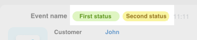
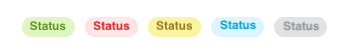

# Record Header



Some data may be missing — we will complete it soon.







- edits needed for writing standards
- are the types other than standard specified correctly?





## HeaderDto

The header of the timeline record.

#|
|| **Field** | **Description** ||
|| **title^*^**
[textWithTranslation](./field-types.md) | The title of the record ||
|| **titleAction**
[ActionDto](./action.md) | Action when the record title is clicked ||
|| **tags**
[TagDto](#tagdto) | No more than two tags are allowed ||
|#



## TagDto

A tag in the timeline record header.



#|
|| **Field** | **Description** ||
|| **title^*^**
[textWithTranslation](./field-types.md) | The text of the tag ||
|| **type^*^**
[`string`](../../../../data-types.md) | The type of the tag. Determines its appearance. ||
|| **action**
[ActionDto](./action.md) | Action when the tag is clicked ||
|| **scope**
[`string`](../../../../data-types.md) | Where to display it. ||
|| **hideIfReadonly**
[`boolean`](../../../../data-types.md) | Hide the tag if the user does not have edit access. Defaults to `=false`. ||
|#



Possible values for the **type** field:



- **success** - Green background
- **failure** - Red background
- **warning** - Yellow background
- **primary** - Blue background
- **secondary** - Gray background

### Example

```json
{
    "title": "Attention! Important!",
    "type": "warning"
}
```