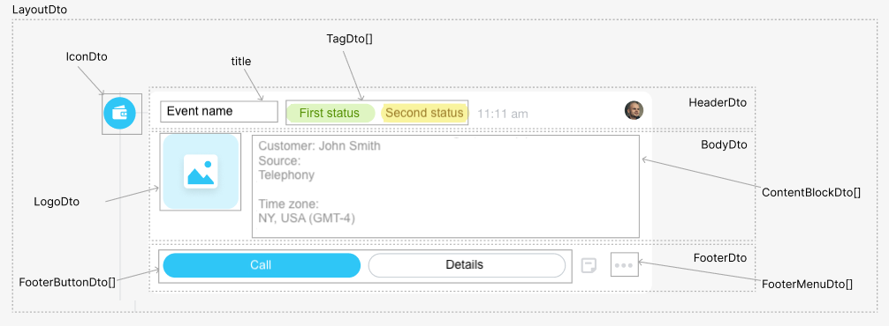

# Top-Level Object and Icon



Some data may be missing — we will complete it soon.







- edits needed for writing standards
- are the types other than standard specified correctly?





## Top-Level Object

The top-level object `LayoutDto` of the timeline entry.



#|
|| **Field** | **Description** ||
|| **icon^*^**
[`IconDto`](#icon) |  | Icon to the left of the entry ||
|| **header^*^**
[HeaderDto](./header.md) |  | Title of the entry ||
|| **body^*^**
[BodyDto](./body.md) |  | Main content area of the entry ||
|| **footer**
[FooterDto](./footer.md) |  | Bottom part of the entry with action block | ||
|#



### Example

```json
{
    "icon": {
        "code": "call-completed"
    },
    "header": {
        "title": "Incoming Call",
        "tags": {
            "status2": {
                "type": "warning",
                "title": "not deciphered"
            }
        }
    },
    "body": {
        "logo": {
            "code": "call-incoming",
            "action": {
                "type": "redirect",
                "uri": "/crm/deal/details/123/"
            }
        },
        "blocks": {
            "client": {
                "type": "withTitle",
                "properties": {
                    "title": "Client",
                    "inline": true,
                    "block": {
                        "type": "text",
                        "properties": {
                            "value": "LLC Hoofs and Horns"
                        }
                    }
                }
            },
            "responsible": {
                "type": "lineOfBlocks",
                "properties": {
                    "blocks": {
                        "client": {
                            "type": "link",
                            "properties": {
                                "text": "Sergey Vostrikov",
                                "bold": true,
                                "action": {
                                    "type": "redirect",
                                    "uri": "/crm/lead/details/789/"
                                }
                            }
                        },
                        "phone": {
                            "type": "text",
                            "properties": {
                                "value": "+1 999 888 7777"
                            }
                        }
                    }
                }
            }
        }
    },
    "footer": {
        "buttons": {
            "startCall": {
                "title": "About the Client",
                "action": {
                    "type": "openRestApp",
                    "actionParams": {
                        "clientId": 456
                    }
                },
                "type": "primary"
            }
        },
        "menu": {
            "showPostponeItem": "false",
            "items": {
                "confirm": {
                    "title": "Confirm Request",
                    "action": {
                        "type": "restEvent",
                        "id": "confirm",
                        "animationType": "loader"
                    }
                },
                "decline": {
                    "title": "Decline Request",
                    "action": {
                        "type": "restEvent",
                        "id": "decline",
                        "animationType": "loader"
                    }
                }
            }
        }
    }
}
```

## Icon

The icon `IconDto` of the timeline entry.

#|
|| **Field** | **Description** | **Additional** ||
|| **code^*^**
[`string`](../../../../data-types.md) | Icon code | A list of available codes can be obtained using the method [crm.timeline.icon.list](.) ||
|#

