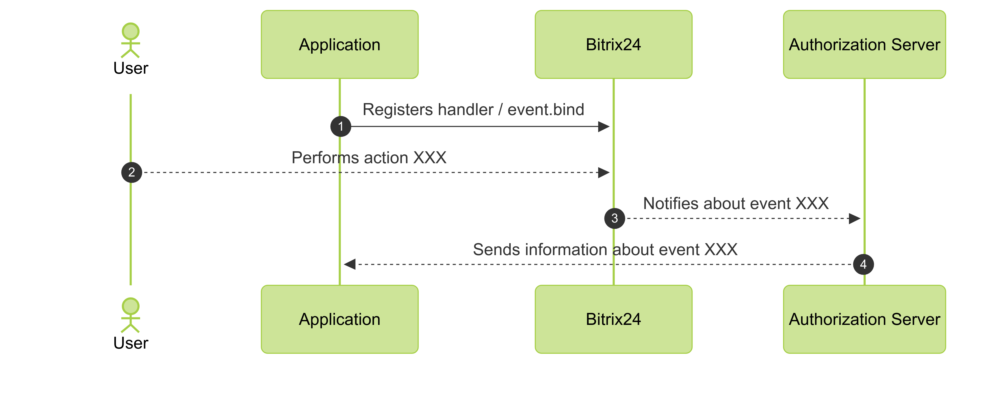

# Event Handler

> Quick navigation: [all methods and events](#all-methods) 

Events in Bitrix24 are notifications about data changes, such as the creation of a deal or the deletion of a product. When an application or webhook subscribes to an event, the system starts generating these notifications for it. To receive events, set up a handler.

An event handler is an external URL to which Bitrix24 sends a POST request with data about the change. The handler allows you to:

- synchronize data with an external system,
- trigger automation scenarios,
- validate data according to business logic rules.



The handler URL must be accessible from the external network. Do not use addresses on localhost or in a local network. Check the availability of your URL using public services.



## How Events Work

1. The application registers a handler for the desired event using the [event.bind](./event-bind.md) method.
2. The user performs an action in Bitrix24, such as modifying a task.
3. Bitrix24 sends a notification to the application via the queue server.



### Features of Operation

Events are not processed directly. First, Bitrix24 places the event in a queue on a special server. From there, a POST request is sent to your handler. As a result, the request may arrive with a slight delay.

The server checks the response speed of the handler. If the handler responds slowly, the server reduces the frequency of calls. The intervals between requests increase.

Current [queue server addresses](../../settings/cloud-and-on-premise/network-access.md).

## What Comes to the Handler

The system sends a request in JSON format. The main keys are:

-  `event` — the name of the event,
-  `ts` — a timestamp in Unix timestamp format,
-  `data` — event data, such as the identifier of the modified element,
-  `auth` — authorization parameters, including [OAuth 2.0 tokens](../../settings/oauth/index.md).

Example request:

```php
array(
    'event' => 'ONAPPINSTALL',
    'data' => array(
        'VERSION' => '1',
        'LANGUAGE_ID' => 'de',
    ),
    'ts' => '1466439714',
    'auth' => array(
        'access_token' => 's6p6eclrvim6da22ft9ch94ekreb52lv',
        'expires_in' => '3600',
        'scope' => 'entity,im',
        'domain' => 'portal.bitrix24.com',
        'server_endpoint' => 'https://oauth.bitrix24.tech/rest/',
        'status' => 'F',
        'client_endpoint' => 'https://portal.bitrix24.com/rest/',
        'member_id' => 'a223c6b3710f85df22e9377d6c4f7553',
        'refresh_token' => '4s386p3q0tr8dy89xvmt96234v3dljg8',
        'application_token' => '51856fefc120afa4b628cc82d3935cce',
    ),
)
```

### Authorization Tokens

OAuth 2.0 tokens in the request are tied to the user who performed the action. If the event is triggered automatically, for example, by an automation rule or workflow, the user ID will be `0`. In this case, tokens are not passed to the handler.

To ensure that the application can always make callbacks to Bitrix24, save the tokens of the user who installed the application. Use these tokens for any subsequent requests on behalf of the application.

## How to Subscribe to an Event via Webhook

1. In Bitrix24, open the *Developer resources > Other > Outgoing Webhook* section.
2. Specify the handler URL.
3. Select one or more events from the list, such as `OnCrmDealAdd`.
4. Save the webhook. The Application Token field will be generated automatically.

Example request:

```json
{
    "event": "ONCRMDEALADD",
    "event_handler_id": "975",
    "data": {
        "FIELDS": {
        "ID": "7405"
        }
    },
    "ts": "1766047124",
    "auth": {
        "domain": "portal.bitrix24.com",
        "client_endpoint": "https://portal.bitrix24.com/rest/",
        "server_endpoint": "https://oauth.bitrix24.tech/rest/",
        "member_id": "d897063e1ce7c5eb9f04b9751eef5915",
        "application_token": "jvh9y1ulvt2m6k5or90v9mg8nn32ozas"
    }
}
```
Note that the request from the outgoing webhook does not include user OAuth 2.0 tokens.

## Event Limitations

Events have two main limitations:

1. **Load cannot be regulated**. During mass data changes, you will receive many consecutive calls. If a thousand deals are changed simultaneously in Bitrix24, the handler will receive a thousand calls.
2. **No retries**. If your server did not respond or returned an error, the Bitrix24 queue server will log the failure but will not resend the event.

If it is important to process all events without loss, use [offline events](./offline-events.md). They allow you to retrieve events from the queue manually.

## Overview of Methods and Events {#all-methods}



- Methods

    #| 
    || **Method** | **Description** ||
    || [event.bind](./event-bind.md) | Registers a new event handler ||
    || [event.get](./event-get.md) | Retrieves a list of registered event handlers ||
    || [event.offline.clear](./event-offline-clear.md) | Clears records in the offline events queue ||
    || [event.offline.error](./event-offline-error.md) | Registers errors in processing the offline events queue ||
    || [event.offline.get](./event-offline-get.md) | Retrieves a list of offline events with "clearing" ||
    || [event.offline.list](./event-offline-list.md) | Retrieves a list of offline events ||
    || [event.unbind](./event-unbind.md) | Unregisters a registered event handler ||
    || [events](./events.md) | Retrieves a list of available events ||
    |#

- Events

    #| 
    || **Event** | **Description** ||
    || [onOfflineEvent](./on-offline-event.md) | When the offline events queue changes ||
    |#



## Continue Learning

- [Security in Handlers](./safe-event-handlers.md)
- [Offline Events](./offline-events.md)
- [Required Network Access](../../settings/cloud-and-on-premise/network-access.md)