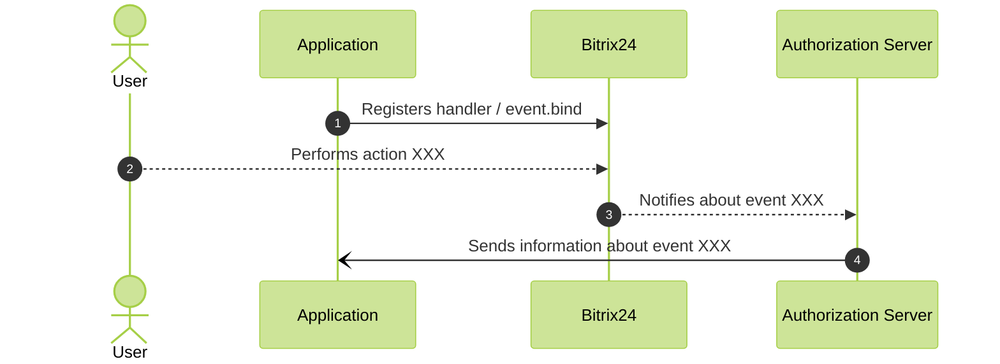

# Concept and Benefits of Event Processing

How can you be notified about data changes in Bitrix24? For instance, when a new deal is created? An obvious method is to make a request that returns all deals created after a specified date.

However, this method of data retrieval requires developing a mechanism on the application side that will poll Bitrix24 at a specified interval. In the case of a mass-market solution that operates with multiple accounts, this task can become non-trivial and resource-intensive, particularly because it will create an increased load on the polled Bitrix24.

But the Bitrix24 REST API offers an excellent alternative. Data changes such as adding a new deal, modifying a task, deleting a product, and many others trigger REST events. You can add your own **event handlers** to quickly learn about and respond to such changes in order to:

- Synchronize external system data with changes in Bitrix24
- Trigger automatic data processing in Bitrix24
- Validate data in Bitrix24 according to your business logic rules
- And much more!

An event handler is a URL that will be called after a user performs the requested action in Bitrix24.



Since requests will come from Bitrix servers, the handler URL must be accessible for GET/POST requests from the outside.

Scripts hosted on localhost or servers accessible only within a specific local network cannot be used for event processing. Always check the availability of your handlers using public "website availability" services.



It is important to note that Bitrix24 does not call your handlers in real-time; instead, it first forms a separate event queue on a special server and subsequently processes that queue.

There may be situations where the handler is called only a few seconds after the actual event in Bitrix24.

The Bitrix24 queue server also monitors how quickly your handlers respond. If they respond slowly, subsequent calls may be executed with lower priority, resulting in longer delays.

Current [queue server addresses](../cloud-and-on-premise/network-access.md).

## How Events Work

First, the application uses the [event.bind](event-bind.md) method to set up the handler for the desired event.

Then, when a user performs the corresponding action (creates a task, modifies a task, etc.), Bitrix24 automatically notifies the application through the queue server:



## What Bitrix24 Sends to the Handler

Depending on the specific event, Bitrix24 will pass a different set of data in the `data` key to the handler. Most often, this is the identifier of the object that was modified in Bitrix24.

Additionally, the handler usually receives authorization parameters in the `auth` key, particularly [OAuth 2.0 tokens](../oauth/index.md):

```php
array(
    'event' => 'ONAPPINSTALL',
    'data' => array(
        'VERSION' => '1',
        'LANGUAGE_ID' => 'en',
    ),
    'ts' => '1466439714',
    'auth' => array(
        'access_token' => 's6p6eclrvim6da22ft9ch94ekreb52lv',
        'expires_in' => '3600',
        'scope' => 'entity,im',
        'domain' => 'portal.bitrix24.com',
        'server_endpoint' => 'https://oauth.bitrix.info/rest/',
        'status' => 'F',
        'client_endpoint' => 'https://portal.bitrix24.com/rest/',
        'member_id' => 'a223c6b3710f85df22e9377d6c4f7553',
        'refresh_token' => '4s386p3q0tr8dy89xvmt96234v3dljg8',
        'application_token' => '51856fefc120afa4b628cc82d3935cce',
    ),
)
```

### Authorization Tokens Are Not Always Available

There may be situations where the event handler does not receive authorization tokens. This is because OAuth 2.0 tokens always "belong" to a [specific user](../oauth/index.md) in Bitrix24. If the data change that triggered the event occurred without an authorized user, Bitrix24 cannot "understand" whose tokens to send to the event handler.

To ensure that your application continues to function even in such cases, it is recommended to save the tokens of the user who installed your application during the installation process in Bitrix24 and use them.

## Outgoing Webhooks

In addition to setting up event handlers in applications using the `event.bind` method, there is a simpler way - [outgoing webhooks](../../local-integrations/local-webhooks.md). Essentially, this is the same event mechanism, but the handler can be set up through the interface in the Developer resources section.

## Offline Events

Despite the obvious advantages of the event mechanism, this approach also has several drawbacks.

First, you cannot regulate the incoming load on your event handlers.

If you subscribe to deal changes and suddenly a thousand deals are modified on the account, you will receive a thousand hits to your handler from Bitrix24 in a fairly intense manner.

Moreover, if the same deal is modified consecutively a thousand times for some reason, you will receive a thousand hits to your handler.

You may not be able to handle the load.

This leads to the second drawback – if your server crashes and fails to process all events, Bitrix24 will not resend anything. The queue server will log on its side that the application handler returned an error or did not respond, and that will be it. No second chances.

If it is vital for your business logic to process all events, [offline events](offline-events.md) come to the rescue.

## Continue Learning

- [Security](safe-event-handlers.md)
- [Offline Events](offline-events.md)