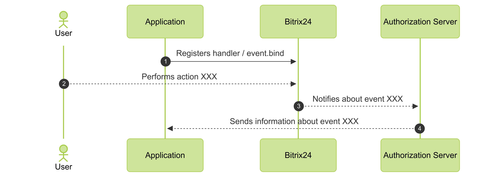

# Events: Overview of Methods and Events



If you are developing integrations for Bitrix24 using AI tools (Codex, Claude Code, Cursor), connect to the [MCP server](../../ai-tools/mcp.md) so that the assistant can utilize the official REST documentation.



Events in Bitrix24 are notifications about data changes, such as the creation of a deal or the deletion of a product. When an application or webhook subscribes to an event, Bitrix24 starts sending such notifications to it. To receive events, set up a handler.

An event handler is an external URL to which Bitrix24 sends a POST request containing data about the change. The handler allows you to:

- synchronize data with an external system
- trigger automated scenarios
- validate data according to business logic rules



The handler URL must be accessible from the external network. Do not use addresses on localhost or in a local network. Check the availability of your URL using public services.





Events will not be sent to the application until the installation is complete. [Check the application installation](../../settings/app-installation/installation-finish.md)



> Quick navigation: [All Methods and Events](#all-methods)

## How Events Work

1. The application registers a handler for the desired event using the [event.bind](./event-bind.md) method, while an outgoing webhook is registered in the Bitrix24 interface.
2. The user performs an action in Bitrix24, such as modifying a task.
3. Bitrix24 sends a notification to the handler URL via the queue server.



### Features of Operation

Bitrix24 does not call the handler directly. First, the event goes into a queue on a special server. From there, a POST request is sent to your handler. As a result, the request may arrive with a slight delay.

The server monitors the response speed of the handler. If the handler responds slowly, the server reduces the frequency of calls. The intervals between requests increase.

Current [Queue Server Addresses](../../settings/cloud-and-on-premise/network-access.md).

## How to Subscribe to an Event

There are two ways to subscribe to an event.

#|
|| **Subscription Method** | **How to Subscribe** | **Available Events** ||
|| [Application](../../settings/app-installation/index.md) | The [event.bind](./event-bind.md) method in the application code | All events, including [offline events](./offline-events.md) ||
|| [Outgoing webhook](../../local-integrations/local-webhooks.md) | The list of events in the Bitrix24 interface | Only online events available in the webhook list ||
|#

The `event.bind` method works only in the context of application authorization. The list of events available to the application is returned by the [events](./events.md) method.

### Subscribing via an Outgoing Webhook

1. In Bitrix24, go to *Developer resources > Other > Outgoing webhook*.
2. Specify the handler URL.
3. Select one or more events from the list, such as `OnCrmDealAdd`.
4. Save the webhook. The *Application Token* field will be generated automatically.

To check that events reach your handler, see the article [{#T}](./test-handler.md).

## What Comes to the Handler

Bitrix24 sends a request with content-type `application/x-www-form-urlencoded`. In the examples below, the structure is shown in JSON format.



- Event Sent to an Application

    ```json
    {
        "event": "ONCRMDEALADD",
        "event_handler_id": "185",
        "data": {
            "FIELDS": {
                "ID": "7405"
            }
        },
        "ts": "1766047124",
        "auth": {
            "access_token": "s6p6eclrvim6da22ft9ch94ekreb52lv",
            "expires_in": "3600",
            "scope": "crm",
            "domain": "some-domain.bitrix24.com",
            "server_endpoint": "https://oauth.bitrix.info/rest/",
            "status": "L",
            "client_endpoint": "https://some-domain.bitrix24.com/rest/",
            "member_id": "d897063e1ce7c5eb9f04b9751eef5915",
            "application_token": "51856fefc120afa4b628cc82d3935cce"
        }
    }
    ```

- Event Sent to an Outgoing Webhook

    ```json
    {
        "event": "ONCRMDEALADD",
        "event_handler_id": "975",
        "data": {
            "FIELDS": {
                "ID": "7405"
            }
        },
        "ts": "1766047124",
        "auth": {
            "domain": "some-domain.bitrix24.com",
            "client_endpoint": "https://some-domain.bitrix24.com/rest/",
            "server_endpoint": "https://oauth.bitrix.info/rest/",
            "member_id": "d897063e1ce7c5eb9f04b9751eef5915",
            "application_token": "jvh9y1ulvt2m6k5or90v9mg8nn32ozas"
        }
    }
    ```



The set of top-level keys is the same for all events.

#|
|| **Parameter**
`type` | **Description** ||
|| **event**
[`string`](../data-types.md) | Symbolic code of the event in uppercase, such as `ONCRMDEALADD` ||
|| **event_handler_id**
[`integer`](../data-types.md) | Identifier of the registered event handler ||
|| **data**
[`object`](../data-types.md) | Event data. The set of keys depends on the event: for most events, it is the `FIELDS` key with the identifier of the modified object.

The composition of `data` is described on the page of the specific event ||
|| **ts**
[`timestamp`](../data-types.md) | Date and time of the event sent from the queue ||
|| **auth**
[`object`](../data-types.md) | Authorization parameters and information about the Bitrix24 account where the event occurred.

The structure is described [below](#auth) ||
|#

An event reports only the fact of a change. To retrieve the object data itself, call the read method for that object, such as [crm.deal.get](../crm/deals/crm-deal-get.md).

### Parameter auth {#auth}

OAuth 2.0 tokens are tied to the user whose action triggered the event and inherit that user's permissions. A different user can be set in the `auth_type` parameter of the [event.bind](./event-bind.md) method.

The set of `auth` keys depends on the subscription method. An outgoing webhook receives only `domain`, `client_endpoint`, `server_endpoint`, `member_id`, and `application_token` — OAuth 2.0 tokens and application data are not passed to a webhook.

Tokens are also not passed to an application if the action was performed not by a user but by an automation rule, workflow, or agent. In this case, Bitrix24 cannot determine on whose behalf to issue a token.

The `refresh_token` token does not come with every event. It is passed only with events that require long-term access to Bitrix24, such as [OnAppInstall](../common/events/on-app-install.md) and [onOfflineEvent](./on-offline-event.md). To ensure that the application can always make requests to Bitrix24, retain the tokens of the user who installed the application and use them for subsequent requests.

The `application_token` key is the main way to make sure that the request came from Bitrix24. How to verify it in the handler code is described in the article [{#T}](./safe-event-handlers.md).



## Event Limitations

Events have two main limitations:

1. **Load cannot be regulated**. When mass data changes occur, you will receive many consecutive calls. If a thousand deals are changed simultaneously in Bitrix24, the handler will receive a thousand calls.
2. **No retries**. If your server does not respond or returns an error, the Bitrix24 queue server will log the failure but will not resend the event.

If it is important to process all events without loss, use [Offline Events](./offline-events.md). They allow you to retrieve events from the queue manually.

## Access Permissions

A regular user can register, retrieve, and delete their own online event handlers using the [event.bind](./event-bind.md), [event.get](./event-get.md), and [event.unbind](./event-unbind.md) methods. If you specify the `auth_type` of another user in `event.bind` or `event.unbind`, the method will return an access error.

Only an administrator can work with the offline event queue. This restriction applies to the [event.offline.get](./event-offline-get.md), [event.offline.list](./event-offline-list.md), [event.offline.clear](./event-offline-clear.md), and [event.offline.error](./event-offline-error.md) methods.

## Overview of Methods and Events {#all-methods}

> Scope: [`basic`](../scopes/permissions.md)
>
> Who can execute the method: depends on the method



- Methods

    #|
    || **Method** | **Description** ||
    || [event.bind](./event-bind.md) | Registers a new event handler ||
    || [event.get](./event-get.md) | Gets a list of registered event handlers ||
    || [event.offline.clear](./event-offline-clear.md) | Clears records in the offline event queue ||
    || [event.offline.error](./event-offline-error.md) | Registers errors in the offline event queue processing ||
    || [event.offline.get](./event-offline-get.md) | Gets a list of offline events with "cleanup" ||
    || [event.offline.list](./event-offline-list.md) | Gets a list of offline events ||
    || [event.unbind](./event-unbind.md) | Unregisters an event handler ||
    || [events](./events.md) | Gets a list of available events ||
    |#

- Events

    #|
    || **Event** | **Triggered** ||
    || [onOfflineEvent](./on-offline-event.md) | When new records appear in the offline event queue ||
    |#



## Continue Learning

- [{#T}](./test-handler.md)
- [{#T}](./safe-event-handlers.md)
- [{#T}](./offline-events.md)
- [{#T}](../../settings/cloud-and-on-premise/network-access.md)
