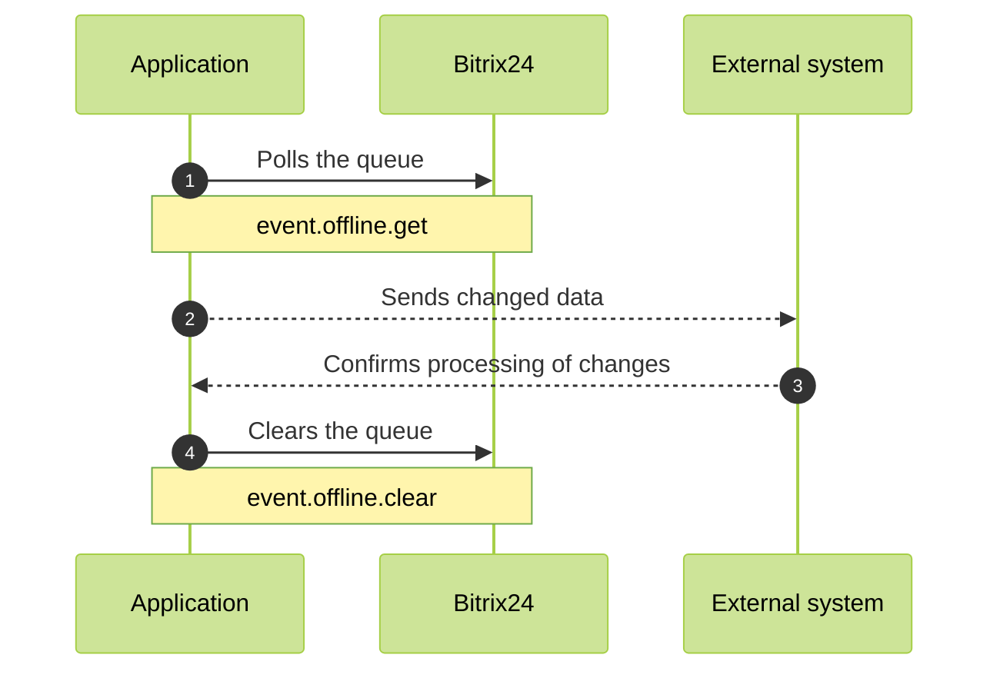
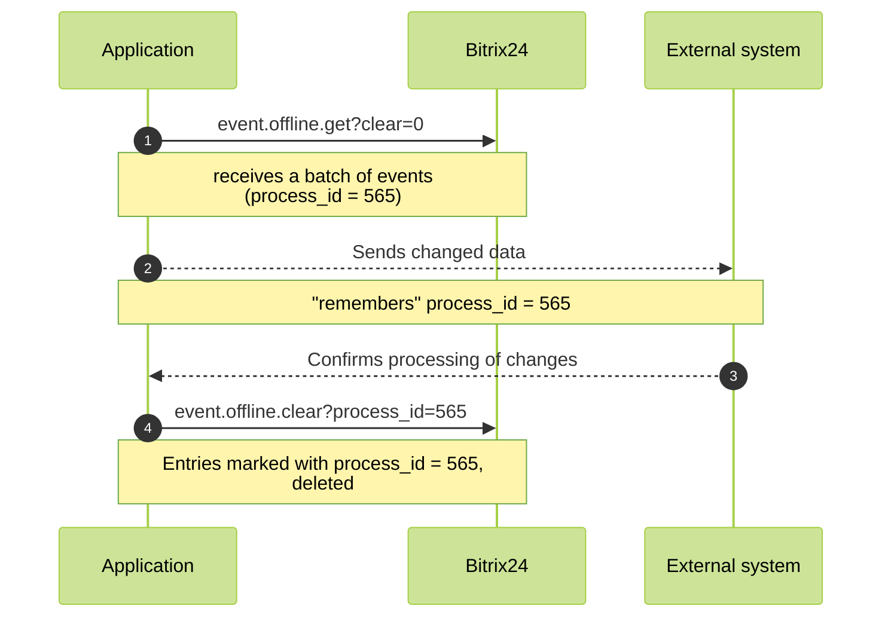
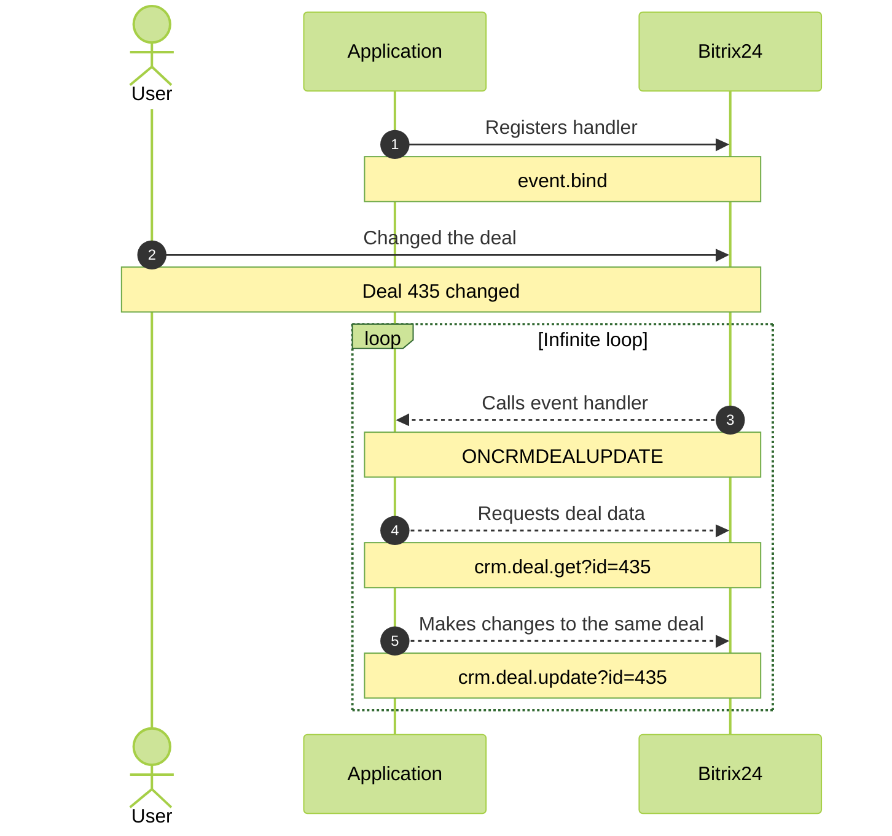
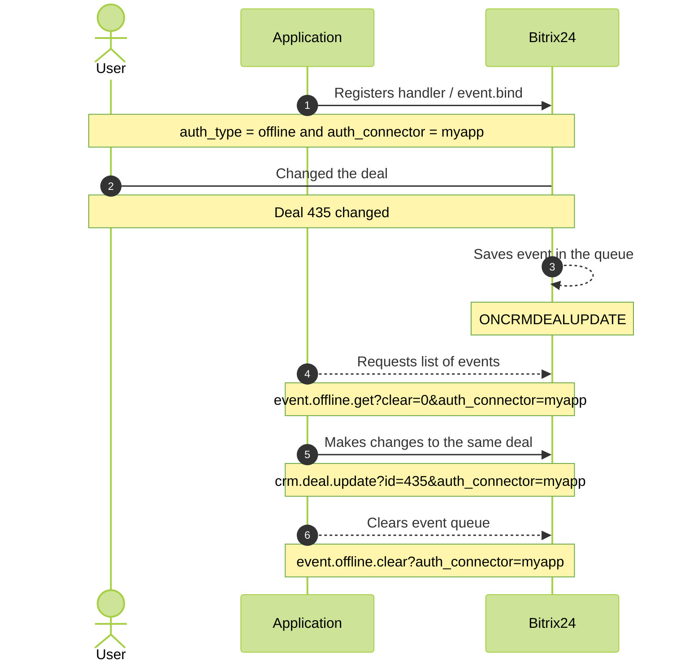

# Features, Advantages, and Disadvantages of Offline Events

You can register an offline event handler using the same method [`event.bind`](event-bind.md). However, the parameters will differ slightly:

#|
|| **Parameter**
`type` | **Description** ||
|| **event**
`string` | Event name ||
|| **event_type**
`string` | Must be `offline` ||
|| **auth_connector**
`string` | Source key. Allows you to [exclude false triggers](#how-to-avoid-cycles) ||
|| **options**
`array` | Additional settings for the registered event. Possible values depend on the specific event ||
|#

First, you need to set the `event_type` parameter to `offline`.

Secondly, there is no longer a need to specify the `handler` parameter, as it will not be Bitrix24 calling your handler; instead, the application will need to call Bitrix24 to get information about the events that occurred.

## How Offline Events Work

Unlike regular events, offline events do not trigger external application handlers but log the changes that occurred.

The application can retrieve data from this log using the [event.offline.list](event-offline-list.md) and [event.offline.get](event-offline-get.md) methods.

In the case of multiple changes to the same object, for example, when a user edits a single deal, the log will contain only one entry for that. The entry will be marked with the date and time of the most recent change.

No matter how many times we change the same deal, it will not add new offline events one after another; instead, it will update the existing information. If the same deal is updated 1000 times, there will be only one entry in the offline events indicating which deal was changed.

## Why Offline Events Are Needed

The purpose of offline events is primarily for synchronizing data between Bitrix24 and an external system.

Such tasks often do not require real-time responses. For these tasks, it is not necessary to react immediately to every change.

It is important that when your application queries Bitrix24, you are fully aware of which Bitrix24 objects have been changed, added, or deleted since the last time the application accessed Bitrix24.

Even if the same deal has been changed a hundred times, to synchronize this deal with an external system, it is sufficient to take only the current state of the deal at the time of synchronization.

That is why Bitrix24 does not log every change of the same object in the offline events. This significantly simplifies application development for you.

## How to Build Work with Offline Events

At regular intervals, your application should request a list of occurred events.

Then, using standard REST API methods, the application should retrieve the current information about the changed objects and send the updated data to the external system, etc.

Most importantly, in the final step, the application must inform Bitrix24 that these events have been processed by the application and that there is no need to retain information about them.

If this is not done, each time you access the list of offline events, you will receive more and more accumulated events.

### Method event.offline.get

Using `event.offline.get`, you can parse all accumulated events, retrieving them in batches of 50.

The method is optimized for asynchronous use. This means that each parallel call to `event.offline.get` will reliably receive its events, without overlapping with other events, regardless of how intensively you request this data.

Moreover, each call to the `event.offline.get` method with default parameters will not only retrieve the next 50 log entries but will also delete those entries.

Consequently, there may be a situation where your application made a request to `event.offline.get`, but for some reason (due to memory overflow, network issues, etc.) did not process those events. However, on the Bitrix24 side, the information about those events has already been deleted and cannot be restored.

To ensure the processing of all offline events, you can call the `event.offline.get` method with the parameter `clear = 0`. In this case, the batch of returned events will not be deleted in Bitrix24. Instead, it will be marked with a unique identifier `process_id` and "hidden."

After processing the received events, the application must inform Bitrix24 that these events can be deleted.

To do this, the application should call the [method `event.offline.clear`](event-offline-clear.md), specifying the `process_id` parameter — the unique identifier obtained when calling the `event.offline.get` method, and optionally specifying the `message_id` parameter as an array of identifiers for specific events that need to be deleted.

## How to Avoid Cycles in Processing {#how-to-avoid-cycles}

Imagine a situation where your application receives an event about a deal change.

Then it requests the current information about the deal using the corresponding REST API method. After that, it wants to change the same deal in Bitrix24 based on its business logic. For this, the application calls the `crm.deal.update` method.

In the case of regular events, as soon as the application calls the `crm.deal.update` method, Bitrix24 immediately sends the `ONCRMDEALUPDATE` event to the handler registered by the application.

This creates a closed loop where changing the deal on the Bitrix24 side triggers the handler in the application, which changes the deal data in Bitrix24, which triggers the handler in the application, which… and so on.

Handling such a situation requires certain conditions in the application.

In the case of offline events, such a cycle can be avoided. To do this, when registering the offline event handler, you need to specify the `auth_connector` parameter.

This creates a separate queue of offline events tied to a specific data exchange channel between Bitrix24 and the application.

Then, you need to use this same parameter when you call `crm.deal.update` if you want to change data in Bitrix24 without triggering a repeated offline event.

The entire scheme using the `auth_connector` parameter is designed so that when the application modifies data, it informs Bitrix24: do not notify me about changes that I initiated myself.

The conclusion is that if you are using the offline event mechanism in Bitrix24, all modifying requests from your application should be executed with the `auth_connector` parameter to avoid unnecessary events. This will greatly simplify your life.

It is worth noting that this parameter is currently supported in Bitrix24 on the Pro plan and above. Keep this in mind during development.

## Disadvantages of the Offline Event Mechanism

The offline event mechanism has its advantages, but you should also understand the downsides of this approach.

First, unlike regular events, where Bitrix24 calls your handlers, with offline events, you will need to create some mechanism that periodically queries Bitrix24. This is especially non-trivial for [mass-market applications](../../market/index.md) that may be installed on hundreds or thousands of different Bitrix24 instances.

Secondly, since your application will be querying Bitrix24 for new events via the REST API, the usual rate limits on requests per second and total execution time for requests will apply. You can learn more about the limits from the [relevant article](../../limits.md).

The main takeaway is that retrieving offline events may take longer than it would for regular online events.

## "Tricks" for Using Offline Events

However, there is a clever possibility that somewhat combines the advantages of online and offline events.

Namely, the [special event](on-offline-event.md) `ONOFFLINEEVENT`. By subscribing to it in the usual way, that is, by specifying your handler on the application side, you will receive calls to this handler if new entries appear in the offline events queue.

In the `minTimeout` parameter, you can specify a timeout in seconds. In this case, your handler will only be called if the specified number of seconds has passed since the last call.

This setting is very convenient if you do not want your application to receive signals too frequently when there may be too few offline events accumulated.

Thus, your application, on one hand, automatically receives a signal from Bitrix24 that it is time to fetch offline events. This means you do not need to devise a scheme for periodic polling of Bitrix24.

On the other hand, you can independently retrieve the events that interest you from the offline events queue with all the advantages of this mechanism.

## Continue Your Learning

- [{#T}](./events.md)
- [{#T}](./event-bind.md)
- [{#T}](./event-get.md)
- [{#T}](./event-unbind.md)
- [{#T}](./safe-event-handlers.md)
- [{#T}](./event-offline-list.md)
- [{#T}](./event-offline-get.md)
- [{#T}](./event-offline-clear.md)
- [{#T}](./event-offline-error.md)
- [{#T}](./on-offline-event.md)