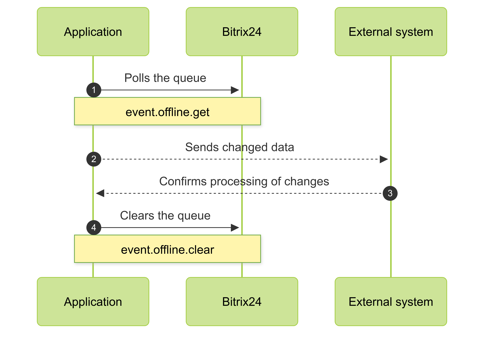
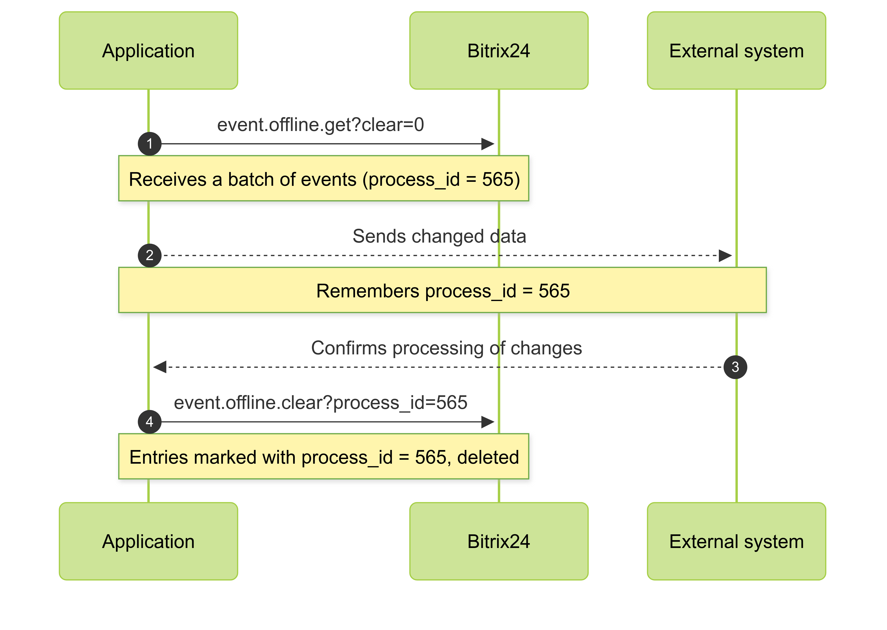
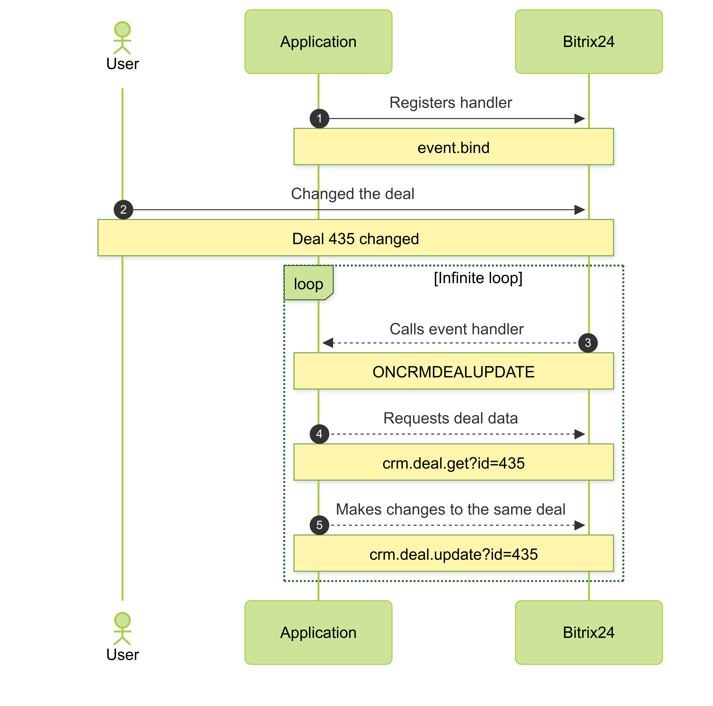
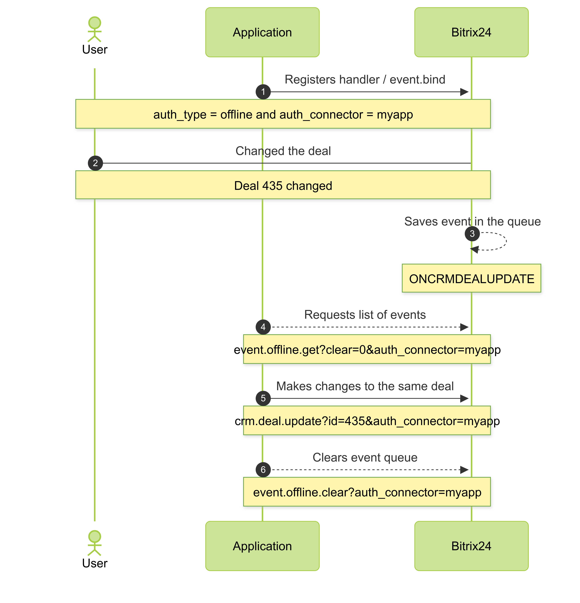

# Offline Events



If you are developing integrations for Bitrix24 using AI tools (Codex, Claude Code, Cursor), connect to the [MCP server](../../ai-tools/mcp.md) so that the assistant can utilize the official REST documentation.



Offline events are a mechanism for receiving events where Bitrix24 does not call the application handler but saves changes in a queue on the Bitrix24 side. The application retrieves accumulated events using the `event.offline.*` methods.

This mechanism is suitable for applications that cannot accept incoming calls: they operate behind a firewall, on an internal network, or are temporarily unavailable.

## How Offline Events Work

A regular event triggers an external application handler via a URL. An offline event, instead of triggering, records the change in a queue on the Bitrix24 side.

The queue does not store the history of all changes but rather the current state of the object. If the same deal is modified 1000 times, only one record with the timestamp of the last change will remain in the queue. This record contains the event name and the identifiers of the modified object—the application retrieves the current data using object retrieval methods.

## Why Offline Events Are Needed

Offline events are used for synchronizing Bitrix24 data with an external system when real-time response is not required.

For synchronization, it is important to know which objects have changed since the last request, rather than every individual change. Therefore, the queue only retains the latest state of the object.

## Working with Offline Events



1. Register the offline event handler using the [event.bind](./event-bind.md) method with the parameter `event_type = offline`.
2. Retrieve events from the queue at the desired frequency using the [event.offline.get](./event-offline-get.md) method or read the queue without changes using the [event.offline.list](./event-offline-list.md) method.
3. Obtain the current data of the modified objects using their retrieval methods and pass it to the external system.
4. Confirm processing—remove events from the queue to avoid receiving them again on the next request.

### Availability Check

The confirmation processing mode is available on certain plans. Check availability using the [feature.get](../common/system/feature-get.md) method with the code `rest_offline_extended`.





- cURL (OAuth)

    ```bash
    curl -X POST \
    -H "Content-Type: application/json" \
    -H "Accept: application/json" \
    -d '{"CODE":"rest_offline_extended","auth":"**put_access_token_here**"}' \
    https://**put_your_bitrix24_address**/rest/feature.get
    ```

- JS

    ```js
    try
    {
        const response = await $b24.callMethod(
            'feature.get',
            {
                CODE: 'rest_offline_extended'
            }
        );

        console.log(response.getData().result);
    }
    catch( error )
    {
        console.error('Error:', error);
    }
    ```

- PHP

    ```php
    try {
        $response = $b24Service
            ->core
            ->call(
                'feature.get',
                [
                    'CODE' => 'rest_offline_extended'
                ]
            );

        $result = $response
            ->getResponseData()
            ->getResult();

        echo 'Success: ' . print_r($result, true);

    } catch (Throwable $e) {
        error_log($e->getMessage());
        echo 'Error: ' . $e->getMessage();
    }
    ```

- BX24.js

    ```js
    BX24.callMethod(
        "feature.get",
        {
            "CODE": "rest_offline_extended"
        },
        function(result)
        {
            if(result.error())
                console.error(result.error());
            else
                console.dir(result.data());
        }
    );
    ```

- PHP CRest

    ```php
    require_once('crest.php');

    $result = CRest::call(
        'feature.get',
        [
            'CODE' => 'rest_offline_extended'
        ]
    );

    echo '<PRE>';
    print_r($result);
    echo '</PRE>';
    ```



### Registering the Handler

Register the offline handler using the [event.bind](./event-bind.md) method. Specify `event_type = offline` and do not provide `handler`—the handler URL is not needed.



- cURL (OAuth)

    ```bash
    curl -X POST \
    -H "Content-Type: application/json" \
    -H "Accept: application/json" \
    -d '{"event":"ONCRMDEALUPDATE","event_type":"offline","auth":"**put_access_token_here**"}' \
    https://**put_your_bitrix24_address**/rest/event.bind
    ```

- JS

    ```js
    try
    {
        const response = await $b24.callMethod(
            'event.bind',
            {
                event: 'ONCRMDEALUPDATE',
                event_type: 'offline'
            }
        );

        console.log(response.getData().result);
    }
    catch( error )
    {
        console.error('Error:', error);
    }
    ```

- PHP

    ```php
    try {
        $response = $b24Service
            ->core
            ->call(
                'event.bind',
                [
                    'event' => 'ONCRMDEALUPDATE',
                    'event_type' => 'offline'
                ]
            );

        $result = $response
            ->getResponseData()
            ->getResult();

        echo 'Success: ' . print_r($result, true);

    } catch (Throwable $e) {
        error_log($e->getMessage());
        echo 'Error: ' . $e->getMessage();
    }
    ```

- BX24.js

    ```js
    BX24.callMethod(
        "event.bind",
        {
            "event": "ONCRMDEALUPDATE",
            "event_type": "offline"
        },
        function(result)
        {
            if(result.error())
                console.error(result.error());
            else
                console.dir(result.data());
        }
    );
    ```

- PHP CRest

    ```php
    require_once('crest.php');

    $result = CRest::call(
        'event.bind',
        [
            'event' => 'ONCRMDEALUPDATE',
            'event_type' => 'offline'
        ]
    );

    echo '<PRE>';
    print_r($result);
    echo '</PRE>';
    ```



### Retrieving and Processing Events

The queue can be retrieved in two ways.

#### Retrieval with Deletion

The [event.offline.get](./event-offline-get.md) method returns the first records from the queue and immediately deletes them. The batch size is set by the `limit` parameter, defaulting to 50.



- cURL (OAuth)

    ```bash
    curl -X POST \
    -H "Content-Type: application/json" \
    -H "Accept: application/json" \
    -d '{"limit":50,"auth":"**put_access_token_here**"}' \
    https://**put_your_bitrix24_address**/rest/event.offline.get
    ```

- JS

    ```js
    try
    {
        const response = await $b24.callMethod(
            'event.offline.get',
            {
                limit: 50
            }
        );

        const events = response.getData().result.events;
        for (const event of events) {
            console.log(event.EVENT_NAME, event.MESSAGE_ID);
        }
    }
    catch( error )
    {
        console.error('Error:', error);
    }
    ```

- PHP

    ```php
    try {
        $response = $b24Service
            ->core
            ->call(
                'event.offline.get',
                [
                    'limit' => 50
                ]
            );

        $result = $response
            ->getResponseData()
            ->getResult();

        foreach ($result['events'] as $event) {
            echo $event['EVENT_NAME'] . ' ' . $event['MESSAGE_ID'] . PHP_EOL;
        }

    } catch (Throwable $e) {
        error_log($e->getMessage());
        echo 'Error: ' . $e->getMessage();
    }
    ```

- BX24.js

    ```js
    BX24.callMethod(
        "event.offline.get",
        {
            "limit": 50
        },
        function(result)
        {
            if(result.error())
            {
                console.error(result.error());
                return;
            }

            result.data().events.forEach(function(event)
            {
                console.log(event.EVENT_NAME, event.MESSAGE_ID);
            });
        }
    );
    ```

- PHP CRest

    ```php
    require_once('crest.php');

    $result = CRest::call(
        'event.offline.get',
        [
            'limit' => 50
        ]
    );

    foreach ($result['result']['events'] as $event) {
        echo $event['EVENT_NAME'] . ' ' . $event['MESSAGE_ID'] . PHP_EOL;
    }
    ```



In this case, deleted events cannot be restored. If the application retrieves events but fails to process them due to an error, the data will be lost.

#### Retrieval with Reservation

To avoid losing events during a failure, separate retrieval and confirmation.



1. Call [event.offline.get](./event-offline-get.md) with the parameter `clear = 0`. The method does not delete events but marks the batch with the identifier `process_id` and hides it from other requests. The identifier is returned in the response.
2. Process the retrieved events.
3. Confirm processing using the [event.offline.clear](./event-offline-clear.md) method, passing `process_id`. To delete only part of the records from the batch, additionally pass `message_id`.

The reserved batch is stored for up to 30 days and is then automatically deleted.



- cURL (OAuth)

    ```bash
    # Step 1. Reserve the batch
    curl -X POST \
    -H "Content-Type: application/json" \
    -H "Accept: application/json" \
    -d '{"clear":0,"limit":50,"auth":"**put_access_token_here**"}' \
    https://**put_your_bitrix24_address**/rest/event.offline.get

    # Step 2. Confirm processing
    curl -X POST \
    -H "Content-Type: application/json" \
    -H "Accept: application/json" \
    -d '{"process_id":"**put_process_id_here**","auth":"**put_access_token_here**"}' \
    https://**put_your_bitrix24_address**/rest/event.offline.clear
    ```

- JS

    ```js
    try
    {
        // Step 1. Reserve the batch
        const response = await $b24.callMethod(
            'event.offline.get',
            {
                clear: 0,
                limit: 50
            }
        );

        const { process_id, events } = response.getData().result;

        // Step 2. Process events
        for (const event of events) {
            console.log(event.EVENT_NAME, event.MESSAGE_ID);
        }

        // Step 3. Confirm processing
        await $b24.callMethod(
            'event.offline.clear',
            {
                process_id: process_id
            }
        );
    }
    catch( error )
    {
        console.error('Error:', error);
    }
    ```

- PHP

    ```php
    try {
        // Step 1. Reserve the batch
        $response = $b24Service
            ->core
            ->call(
                'event.offline.get',
                [
                    'clear' => 0,
                    'limit' => 50
                ]
            );

        $result = $response
            ->getResponseData()
            ->getResult();

        $processId = $result['process_id'];

        // Step 2. Process events
        foreach ($result['events'] as $event) {
            echo $event['EVENT_NAME'] . ' ' . $event['MESSAGE_ID'] . PHP_EOL;
        }

        // Step 3. Confirm processing
        $b24Service
            ->core
            ->call(
                'event.offline.clear',
                [
                    'process_id' => $processId
                ]
            );

    } catch (Throwable $e) {
        error_log($e->getMessage());
        echo 'Error: ' . $e->getMessage();
    }
    ```

- BX24.js

    ```js
    // Step 1. Reserve the batch
    BX24.callMethod(
        "event.offline.get",
        {
            "clear": 0,
            "limit": 50
        },
        function(result)
        {
            if(result.error())
            {
                console.error(result.error());
                return;
            }

            var data = result.data();

            // Step 2. Process events
            data.events.forEach(function(event)
            {
                console.log(event.EVENT_NAME, event.MESSAGE_ID);
            });

            // Step 3. Confirm processing
            BX24.callMethod(
                "event.offline.clear",
                {
                    "process_id": data.process_id
                },
                function(clearResult)
                {
                    if(clearResult.error())
                        console.error(clearResult.error());
                    else
                        console.dir(clearResult.data());
                }
            );
        }
    );
    ```

- PHP CRest

    ```php
    require_once('crest.php');

    // Step 1. Reserve the batch
    $response = CRest::call(
        'event.offline.get',
        [
            'clear' => 0,
            'limit' => 50
        ]
    );

    $processId = $response['result']['process_id'];

    // Step 2. Process events
    foreach ($response['result']['events'] as $event) {
        echo $event['EVENT_NAME'] . ' ' . $event['MESSAGE_ID'] . PHP_EOL;
    }

    // Step 3. Confirm processing
    CRest::call(
        'event.offline.clear',
        [
            'process_id' => $processId
        ]
    );
    ```



The `event.offline.get` method supports parallel requests: each will receive its own set of records that do not overlap with others.

### Error Registration

If events fail to process, mark them using the [event.offline.error](./event-offline-error.md) method. Pass `process_id` and an array of `message_id` for the erroneous records.



- cURL (OAuth)

    ```bash
    curl -X POST \
    -H "Content-Type: application/json" \
    -H "Accept: application/json" \
    -d '{"process_id":"**put_process_id_here**","message_id":["**put_message_id_here**"],"auth":"**put_access_token_here**"}' \
    https://**put_your_bitrix24_address**/rest/event.offline.error
    ```

- JS

    ```js
    try
    {
        const response = await $b24.callMethod(
            'event.offline.error',
            {
                process_id: processId,
                message_id: [messageId]
            }
        );

        console.log(response.getData().result);
    }
    catch( error )
    {
        console.error('Error:', error);
    }
    ```

- PHP

    ```php
    try {
        $response = $b24Service
            ->core
            ->call(
                'event.offline.error',
                [
                    'process_id' => $processId,
                    'message_id' => [$messageId]
                ]
            );

        $result = $response
            ->getResponseData()
            ->getResult();

        echo 'Success: ' . print_r($result, true);

    } catch (Throwable $e) {
        error_log($e->getMessage());
        echo 'Error: ' . $e->getMessage();
    }
    ```

- BX24.js

    ```js
    BX24.callMethod(
        "event.offline.error",
        {
            "process_id": processId,
            "message_id": [messageId]
        },
        function(result)
        {
            if(result.error())
                console.error(result.error());
            else
                console.dir(result.data());
        }
    );
    ```

- PHP CRest

    ```php
    require_once('crest.php');

    $result = CRest::call(
        'event.offline.error',
        [
            'process_id' => $processId,
            'message_id' => [$messageId]
        ]
    );

    echo '<PRE>';
    print_r($result);
    echo '</PRE>';
    ```



## How to Avoid Cycles {#how-to-avoid-cycles}

The application receives an event about a deal change, requests the current data, and modifies the same deal using the `crm.deal.update` method. Calling `crm.deal.update` adds an event back to the queue—this creates a cycle.



To break the cycle, use the `auth_connector` parameter—a source key. It creates a separate queue tied to the exchange channel between Bitrix24 and the application.

Specify `auth_connector` when registering the handler:



- cURL (OAuth)

    ```bash
    curl -X POST \
    -H "Content-Type: application/json" \
    -H "Accept: application/json" \
    -d '{"event":"ONCRMDEALUPDATE","event_type":"offline","auth_connector":"my_connector","auth":"**put_access_token_here**"}' \
    https://**put_your_bitrix24_address**/rest/event.bind
    ```

- JS

    ```js
    try
    {
        const response = await $b24.callMethod(
            'event.bind',
            {
                event: 'ONCRMDEALUPDATE',
                event_type: 'offline',
                auth_connector: 'my_connector'
            }
        );

        console.log(response.getData().result);
    }
    catch( error )
    {
        console.error('Error:', error);
    }
    ```

- PHP

    ```php
    try {
        $response = $b24Service
            ->core
            ->call(
                'event.bind',
                [
                    'event' => 'ONCRMDEALUPDATE',
                    'event_type' => 'offline',
                    'auth_connector' => 'my_connector'
                ]
            );

        $result = $response
            ->getResponseData()
            ->getResult();

        echo 'Success: ' . print_r($result, true);

    } catch (Throwable $e) {
        error_log($e->getMessage());
        echo 'Error: ' . $e->getMessage();
    }
    ```

- BX24.js

    ```js
    BX24.callMethod(
        "event.bind",
        {
            "event": "ONCRMDEALUPDATE",
            "event_type": "offline",
            "auth_connector": "my_connector"
        },
        function(result)
        {
            if(result.error())
                console.error(result.error());
            else
                console.dir(result.data());
        }
    );
    ```

- PHP CRest

    ```php
    require_once('crest.php');

    $result = CRest::call(
        'event.bind',
        [
            'event' => 'ONCRMDEALUPDATE',
            'event_type' => 'offline',
            'auth_connector' => 'my_connector'
        ]
    );

    echo '<PRE>';
    print_r($result);
    echo '</PRE>';
    ```



Pass the same `auth_connector` in modifying calls. Then Bitrix24 will not record in the queue the change initiated by the application itself.





- cURL (OAuth)

    ```bash
    curl -X POST \
    -H "Content-Type: application/json" \
    -H "Accept: application/json" \
    -d '{"id":1,"fields":{"TITLE":"New Title"},"auth_connector":"my_connector","auth":"**put_access_token_here**"}' \
    https://**put_your_bitrix24_address**/rest/crm.deal.update
    ```

- JS

    ```js
    try
    {
        const response = await $b24.callMethod(
            'crm.deal.update',
            {
                id: 1,
                fields: {
                    TITLE: 'New Title'
                },
                auth_connector: 'my_connector'
            }
        );

        console.log(response.getData().result);
    }
    catch( error )
    {
        console.error('Error:', error);
    }
    ```

- PHP

    ```php
    try {
        $response = $b24Service
            ->core
            ->call(
                'crm.deal.update',
                [
                    'id' => 1,
                    'fields' => [
                        'TITLE' => 'New Title'
                    ],
                    'auth_connector' => 'my_connector'
                ]
            );

        $result = $response
            ->getResponseData()
            ->getResult();

        echo 'Success: ' . print_r($result, true);

    } catch (Throwable $e) {
        error_log($e->getMessage());
        echo 'Error: ' . $e->getMessage();
    }
    ```

- BX24.js

    ```js
    BX24.callMethod(
        "crm.deal.update",
        {
            "id": 1,
            "fields": {
                "TITLE": "New Title"
            },
            "auth_connector": "my_connector"
        },
        function(result)
        {
            if(result.error())
                console.error(result.error());
            else
                console.dir(result.data());
        }
    );
    ```

- PHP CRest

    ```php
    require_once('crest.php');

    $result = CRest::call(
        'crm.deal.update',
        [
            'id' => 1,
            'fields' => [
                'TITLE' => 'New Title'
            ],
            'auth_connector' => 'my_connector'
        ]
    );

    echo '<PRE>';
    print_r($result);
    echo '</PRE>';
    ```



To retrieve events from this queue, pass the same `auth_connector` in the [event.offline.get](./event-offline-get.md) and [event.offline.list](./event-offline-list.md) methods. Without a matching value, the methods will only return events without a source.

The `auth_connector` parameter is available on the Professional plan and above.

## Notification Instead of Periodic Polling

To avoid polling the queue on a timer, subscribe to the [onOfflineEvent](./on-offline-event.md) event in the usual way—by specifying the handler URL. Bitrix24 will call the handler when new records appear in the queue.

The event itself does not pass data—it is a signal to retrieve events from the queue using the `event.offline.*` methods. The minimum interval between notifications is set by the `minTimeout` parameter. More details in the article [{#T}](./on-offline-event.md).

## Mechanism Limitations

- The application polls Bitrix24 at a specified frequency. For [mass-market applications](../../market/index.md) installed on multiple Bitrix24 instances, this is a separate engineering task.
- Requests to the queue are subject to [limits](../../limits.md) on the number of requests per second and total execution time.
- Retrieving events via REST takes longer than calling a handler for a regular event.

## Continue Learning

- [{#T}](./events.md)
- [{#T}](./event-bind.md)
- [{#T}](./event-get.md)
- [{#T}](./event-unbind.md)
- [{#T}](./safe-event-handlers.md)
- [{#T}](./event-offline-list.md)
- [{#T}](./event-offline-get.md)
- [{#T}](./event-offline-clear.md)
- [{#T}](./event-offline-error.md)
- [{#T}](./on-offline-event.md)