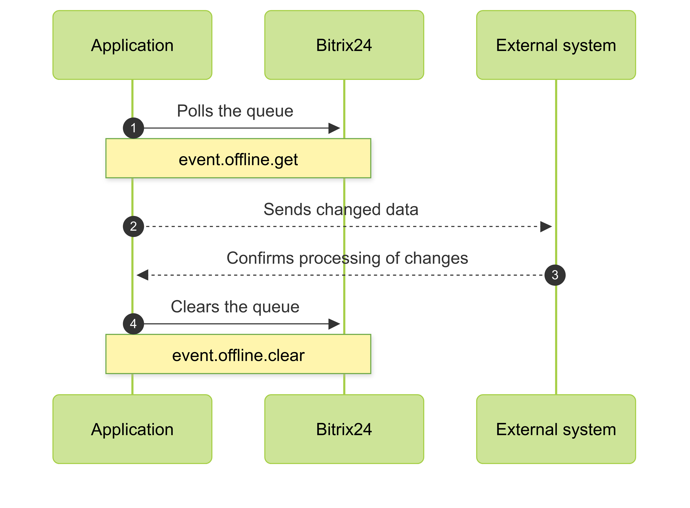
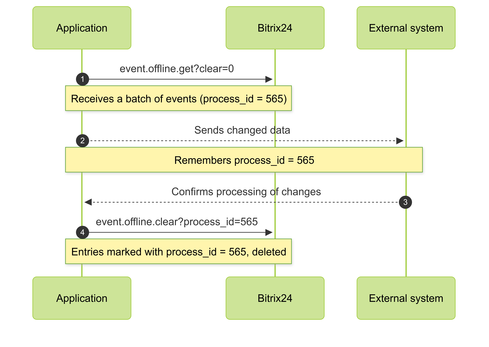
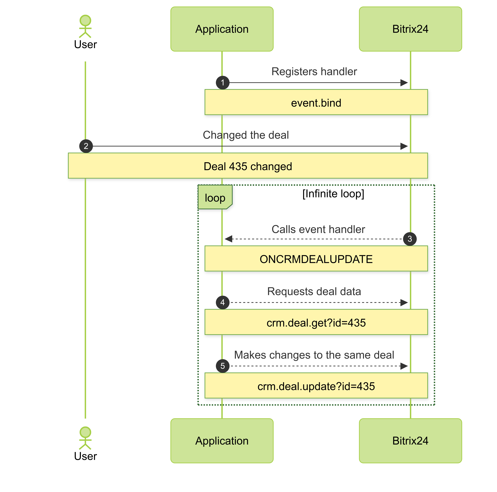
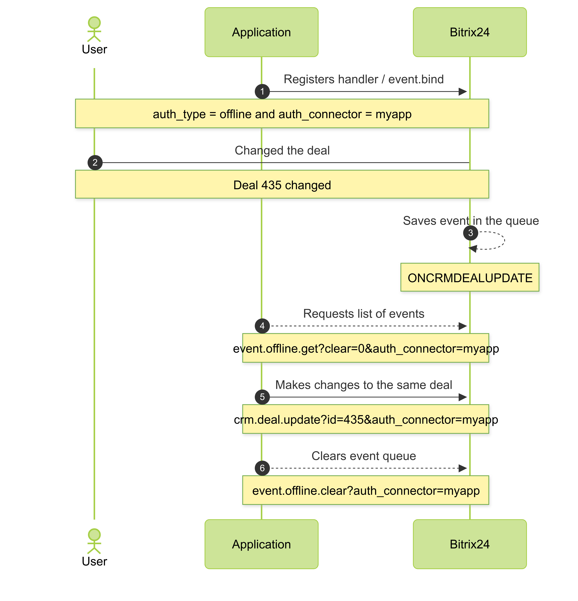

# Offline Events



Choose a tool for developing with an AI agent:

- use [Alaio Vibecode](../../ai-tools/vibecode.md) to build an app for Bitrix24 from a task description without knowing any programming language. The agent writes the code and deploys the app to a server, with no manual hosting setup
- use the [MCP server](../../ai-tools/mcp.md) to develop a REST API integration in your own project. The agent refers to the official REST documentation



Offline events are a mechanism for receiving events where Bitrix24 does not call the application handler but saves changes in a queue on the Bitrix24 side. The application retrieves accumulated events using the `event.offline.*` methods.

This mechanism is suitable for applications that cannot accept incoming calls: they operate behind a firewall, on an internal network, or are temporarily unavailable.



Offline events are available only to applications: registration with `event_type = offline` and the `event.offline.*` methods work in the context of an [application](../../settings/app-installation/index.md) and require administrator permissions



## How Offline Events Work

A regular event triggers an external application handler via a URL. An offline event, instead of triggering, records the change in a queue on the Bitrix24 side.

The queue does not store the history of all changes but rather the current state of the object. If the same deal is modified 1000 times, only one record with the timestamp of the last change will remain in the queue. This record contains the event name and the identifiers of the modified object—the application retrieves the current data using object retrieval methods.

## Queue Record

The method [event.offline.get](./event-offline-get.md) returns queue records in the `events` array, and the method [event.offline.list](./event-offline-list.md) returns them directly in `result`, with the additional fields `PROCESS_ID` and `ERROR`. The record structure is the same for all events.

#|
|| **Field**
`type` | **Description** ||
|| **ID**
[`string`](../data-types.md) | Identifier of the record in the queue ||
|| **TIMESTAMP_X**
[`datetime`](../data-types.md) | Time of the last change of the object ||
|| **EVENT_NAME**
[`string`](../data-types.md) | Event name, for example `ONCRMDEALUPDATE` ||
|| **EVENT_DATA**
[`object`](../data-types.md) or [`boolean`](../data-types.md) | Event data — the same as passed to the handler of a regular event. For CRM events, this is the object identifier in `FIELDS.ID`. If the event has no data, the field is `false` ||
|| **EVENT_ADDITIONAL**
[`object`](../data-types.md) or [`boolean`](../data-types.md) | Event authorization data. If the change was made by a user, their identifier is passed in the `user_id` field; otherwise the field is `false` ||
|| **MESSAGE_ID**
[`string`](../data-types.md) | Record key — a hash of the event name and data. A repeated event with the same key updates the record instead of adding a new one, so the queue keeps one record per object. The value is passed in `message_id` of the methods [event.offline.clear](./event-offline-clear.md) and [event.offline.error](./event-offline-error.md) ||
|| **PROCESS_ID**
[`string`](../data-types.md) | Only in the `event.offline.list` response. Identifier of the batch that reserved the record via `event.offline.get` with `clear = 0`; empty until the record is reserved ||
|| **ERROR**
[`string`](../data-types.md) | Only in the `event.offline.list` response. `1` — the record is marked as erroneous by the `event.offline.error` method, `0` — it is not ||
|#

An example of an [event.offline.get](./event-offline-get.md) response with batch reservation — one record about a deal change:

```json
{
    "result": {
        "process_id": "a1b2c3d4e5f6a7b8c9d0e1f2a3b4c5d6",
        "events": [
            {
                "ID": "1",
                "TIMESTAMP_X": "2026-09-17T12:32:31+02:00",
                "EVENT_NAME": "ONCRMDEALUPDATE",
                "EVENT_DATA": {
                    "FIELDS": {
                        "ID": "123"
                    }
                },
                "EVENT_ADDITIONAL": {
                    "user_id": "1"
                },
                "MESSAGE_ID": "b0c7f7c2a3f1e4d5c6b7a8f9e0d1c2b3"
            }
        ]
    },
    "time": {
        "start": 1789646720.388504,
        "finish": 1789646720.509809,
        "duration": 0.1213,
        "processing": 0.0082,
        "date_start": "2026-09-17T12:48:40+02:00",
        "date_finish": "2026-09-17T12:48:40+02:00",
        "operating": 0
    }
}
```

The `process_id` field is populated only when the method is called with `clear = 0` or with a passed `process_id`. The full description of parameters and errors is on the method pages.

## Why Offline Events Are Needed

Offline events are used for synchronizing Bitrix24 data with an external system when real-time response is not required.

For synchronization, it is important to know which objects have changed since the last request, rather than every individual change. Therefore, the queue only retains the latest state of the object.

## Working with Offline Events



1. Register the offline event handler using the [event.bind](./event-bind.md) method with the parameter `event_type = offline`.
2. Retrieve events from the queue at the desired frequency using the [event.offline.get](./event-offline-get.md) method or read the queue without changes using the [event.offline.list](./event-offline-list.md) method.
3. Obtain the current data of the modified objects using their retrieval methods and pass it to the external system.
4. Confirm processing—remove events from the queue to avoid receiving them again on the next request.

In the main scenario, the queue is controlled by six parameters. Filters, sorting, and pagination are described on the method pages.

#|
|| **Parameter** | **Method** | **What it does** ||
|| `limit` | [event.offline.get](./event-offline-get.md) | Size of the record batch. Default `50` ||
|| `clear` | [event.offline.get](./event-offline-get.md) | `1` — delete the records right after they are returned, the default. `0` — only mark the batch and return `process_id`; works only in the extended mode ||
|| `process_id` | [event.offline.get](./event-offline-get.md), [event.offline.clear](./event-offline-clear.md), [event.offline.error](./event-offline-error.md) | Identifier of the reserved batch: retrieve it again, confirm it, or mark it as erroneous ||
|| `message_id` | [event.offline.clear](./event-offline-clear.md), [event.offline.error](./event-offline-error.md) | Array of `MESSAGE_ID` keys to process part of the batch rather than the whole batch ||
|| `auth_connector` | [event.bind](./event-bind.md), [event.offline.get](./event-offline-get.md), [event.offline.list](./event-offline-list.md) | Source key — a separate queue that does not receive changes made by the application itself ||
|| `error` | [event.offline.get](./event-offline-get.md) | `1` — return the records marked as erroneous by the `event.offline.error` method. Default `0` — only unprocessed records ||
|#

### Availability Check

The confirmation processing mode is available on certain plans. Check availability using the [feature.get](../common/system/feature-get.md) method with the code `rest_offline_extended`.





- cURL (OAuth)

    ```bash
    curl -X POST \
    -H "Content-Type: application/json" \
    -H "Accept: application/json" \
    -d '{"CODE":"rest_offline_extended","auth":"**put_access_token_here**"}' \
    https://**put_your_bitrix24_address**/rest/feature.get
    ```

- JS (TS)

    ```ts
    // This snippet is an ES module: top-level await requires type="module" or a bundler.
    // $b24 is an already-initialized SDK instance (see the SDK "Get started" guide).
    import { Text } from '@bitrix24/b24jssdk'
    import type { B24Frame } from '@bitrix24/b24jssdk'

    declare const $b24: B24Frame

    try {
      const response = await $b24.actions.v2.call.make<boolean>({
        method: 'feature.get',
        params: {
          CODE: 'rest_offline_extended',
        },
        requestId: Text.getUuidRfc4122()
      })

      // The payload is available only on a successful response
      if (!response.isSuccess) {
        console.error(response.getErrorMessages().join('; '))
      } else {
        const result = response.getData()!.result
        console.info('Feature available:', result)
      }
    } catch (error) {
      // Thrown on transport or SDK failures (AjaxError, SdkError, etc.)
      console.error(error)
    }
    ```

- JS (UMD)

    ```html
    <!-- Load the SDK (UMD build); it is exposed as the global B24Js -->
    <script src="https://unpkg.com/@bitrix24/b24jssdk@1/dist/umd/index.min.js"></script>
    <script>
      async function checkFeature() {
        try {
          // Initialize the SDK inside a Bitrix24 frame
          const $b24 = await B24Js.initializeB24Frame()

          const response = await $b24.actions.v2.call.make({
            method: 'feature.get',
            params: {
              CODE: 'rest_offline_extended',
            },
            requestId: B24Js.Text.getUuidRfc4122()
          })

          // The payload is available only on a successful response
          if (!response.isSuccess) {
            console.error(response.getErrorMessages().join('; '))
            return
          }

          const result = response.getData().result
          console.info('Feature available:', result)
        } catch (error) {
          // Thrown on transport or SDK failures (AjaxError, SdkError, etc.)
          console.error(error)
        }
      }

      document.addEventListener('DOMContentLoaded', checkFeature)
    </script>
    ```

- Python

    ```python
    from b24pysdk.errors import BitrixAPIError, BitrixSDKException

    try:
        bitrix_response = client.feature.get(
            code="rest_offline_extended",
        ).response
        result = bitrix_response.result
        print(result)
    except BitrixAPIError as error:
        print(
            "Bitrix API error",
            f"error: {error.error}",
            f"error_description: {error.error_description}",
            sep="\n",
        )
    except BitrixSDKException as error:
        print(f"Bitrix SDK error: {error.message}")
    except Exception as error:
        print(f"Unexpected error: {error}")
    ```

- PHP

    ```php
    try {
        $response = $b24Service
            ->core
            ->call(
                'feature.get',
                [
                    'CODE' => 'rest_offline_extended'
                ]
            );

        $result = $response
            ->getResponseData()
            ->getResult();

        echo 'Success: ' . print_r($result, true);

    } catch (Throwable $e) {
        error_log($e->getMessage());
        echo 'Error: ' . $e->getMessage();
    }
    ```

- BX24.js

    ```js
    BX24.callMethod(
        "feature.get",
        {
            "CODE": "rest_offline_extended"
        },
        function(result)
        {
            if(result.error())
                console.error(result.error());
            else
                console.dir(result.data());
        }
    );
    ```

- PHP CRest

    ```php
    require_once('crest.php');

    $result = CRest::call(
        'feature.get',
        [
            'CODE' => 'rest_offline_extended'
        ]
    );

    echo '<PRE>';
    print_r($result);
    echo '</PRE>';
    ```

- Go

    ```go
    // client and ctx are already created — see the Go SDK section
    res, err := client.Core().Call(ctx, "feature.get", b24.Params{
    	"CODE": "rest_offline_extended",
    }, b24.WithIdempotent())
    if err != nil {
    	return fmt.Errorf("feature.get: %w", err)
    }

    // The response arrives as json.RawMessage — unmarshal it
    // into a struct matching the response shape from the method page.
    fmt.Printf("%s\n", res.Result)
    ```



### Registering the Handler

Register the offline handler using the [event.bind](./event-bind.md) method. Specify `event_type = offline` and do not provide `handler`—the handler URL is not needed.



- cURL (OAuth)

    ```bash
    curl -X POST \
    -H "Content-Type: application/json" \
    -H "Accept: application/json" \
    -d '{"event":"ONCRMDEALUPDATE","event_type":"offline","auth":"**put_access_token_here**"}' \
    https://**put_your_bitrix24_address**/rest/event.bind
    ```

- JS (TS)

    ```ts
    // This snippet is an ES module: top-level await requires type="module" or a bundler.
    // $b24 is an already-initialized SDK instance (see the SDK "Get started" guide).
    import { Text } from '@bitrix24/b24jssdk'
    import type { B24Frame } from '@bitrix24/b24jssdk'

    declare const $b24: B24Frame

    try {
      const response = await $b24.actions.v2.call.make<boolean>({
        method: 'event.bind',
        params: {
          event: 'ONCRMDEALUPDATE',
          event_type: 'offline',
        },
        requestId: Text.getUuidRfc4122()
      })

      // The payload is available only on a successful response
      if (!response.isSuccess) {
        console.error(response.getErrorMessages().join('; '))
      } else {
        const result = response.getData()!.result
        console.info('Event handler registered:', result)
      }
    } catch (error) {
      // Thrown on transport or SDK failures (AjaxError, SdkError, etc.)
      console.error(error)
    }
    ```

- JS (UMD)

    ```html
    <!-- Load the SDK (UMD build); it is exposed as the global B24Js -->
    <script src="https://unpkg.com/@bitrix24/b24jssdk@1/dist/umd/index.min.js"></script>
    <script>
      async function bindOfflineEvent() {
        try {
          // Initialize the SDK inside a Bitrix24 frame
          const $b24 = await B24Js.initializeB24Frame()

          const response = await $b24.actions.v2.call.make({
            method: 'event.bind',
            params: {
              event: 'ONCRMDEALUPDATE',
              event_type: 'offline',
            },
            requestId: B24Js.Text.getUuidRfc4122()
          })

          // The payload is available only on a successful response
          if (!response.isSuccess) {
            console.error(response.getErrorMessages().join('; '))
            return
          }

          const result = response.getData().result
          console.info('Event handler registered:', result)
        } catch (error) {
          // Thrown on transport or SDK failures (AjaxError, SdkError, etc.)
          console.error(error)
        }
      }

      document.addEventListener('DOMContentLoaded', bindOfflineEvent)
    </script>
    ```

- Python

    ```python
    from b24pysdk.errors import BitrixAPIError, BitrixSDKException

    try:
        bitrix_response = client.event.bind(
            event="ONCRMDEALUPDATE",
            event_type="offline",
        ).response
        result = bitrix_response.result
        print(result)
    except BitrixAPIError as error:
        print(
            "Bitrix API error",
            f"error: {error.error}",
            f"error_description: {error.error_description}",
            sep="\n",
        )
    except BitrixSDKException as error:
        print(f"Bitrix SDK error: {error.message}")
    except Exception as error:
        print(f"Unexpected error: {error}")
    ```

- PHP

    ```php
    try {
        $response = $b24Service
            ->core
            ->call(
                'event.bind',
                [
                    'event' => 'ONCRMDEALUPDATE',
                    'event_type' => 'offline'
                ]
            );

        $result = $response
            ->getResponseData()
            ->getResult();

        echo 'Success: ' . print_r($result, true);

    } catch (Throwable $e) {
        error_log($e->getMessage());
        echo 'Error: ' . $e->getMessage();
    }
    ```

- BX24.js

    ```js
    BX24.callMethod(
        "event.bind",
        {
            "event": "ONCRMDEALUPDATE",
            "event_type": "offline"
        },
        function(result)
        {
            if(result.error())
                console.error(result.error());
            else
                console.dir(result.data());
        }
    );
    ```

- PHP CRest

    ```php
    require_once('crest.php');

    $result = CRest::call(
        'event.bind',
        [
            'event' => 'ONCRMDEALUPDATE',
            'event_type' => 'offline'
        ]
    );

    echo '<PRE>';
    print_r($result);
    echo '</PRE>';
    ```

- Go

    ```go
    // client and ctx are already created — see the Go SDK section
    res, err := client.Core().Call(ctx, "event.bind", b24.Params{
    	"event":      "ONCRMDEALUPDATE",
    	"event_type": "offline",
    })
    if err != nil {
    	return fmt.Errorf("event.bind: %w", err)
    }

    // The response arrives as json.RawMessage — unmarshal it
    // into a struct matching the response shape from the method page.
    fmt.Printf("%s\n", res.Result)
    ```



### Retrieving and Processing Events

The queue can be retrieved in two ways.

#### Retrieval with Deletion

The [event.offline.get](./event-offline-get.md) method returns the first records from the queue and immediately deletes them. The batch size is set by the `limit` parameter, defaulting to 50.



- cURL (OAuth)

    ```bash
    curl -X POST \
    -H "Content-Type: application/json" \
    -H "Accept: application/json" \
    -d '{"limit":50,"auth":"**put_access_token_here**"}' \
    https://**put_your_bitrix24_address**/rest/event.offline.get
    ```

- JS (TS)

    ```ts
    // This snippet is an ES module: top-level await requires type="module" or a bundler.
    // $b24 is an already-initialized SDK instance (see the SDK "Get started" guide).
    import { Text } from '@bitrix24/b24jssdk'
    import type { B24Frame } from '@bitrix24/b24jssdk'

    declare const $b24: B24Frame

    // Shape of the payload returned in result (match the "response handling" section of the page)
    type OfflineGetResult = {
      events: {
        EVENT_NAME: string
        MESSAGE_ID: string
      }[]
    }

    try {
      const response = await $b24.actions.v2.call.make<OfflineGetResult>({
        method: 'event.offline.get',
        params: {
          limit: 50,
        },
        requestId: Text.getUuidRfc4122()
      })

      // The payload is available only on a successful response
      if (!response.isSuccess) {
        console.error(response.getErrorMessages().join('; '))
      } else {
        const result = response.getData()!.result
        console.info('Events received:', result.events.length)
        for (const event of result.events) {
          console.info(event.EVENT_NAME, event.MESSAGE_ID)
        }
      }
    } catch (error) {
      // Thrown on transport or SDK failures (AjaxError, SdkError, etc.)
      console.error(error)
    }
    ```

- JS (UMD)

    ```html
    <!-- Load the SDK (UMD build); it is exposed as the global B24Js -->
    <script src="https://unpkg.com/@bitrix24/b24jssdk@1/dist/umd/index.min.js"></script>
    <script>
      async function getOfflineEvents() {
        try {
          // Initialize the SDK inside a Bitrix24 frame
          const $b24 = await B24Js.initializeB24Frame()

          const response = await $b24.actions.v2.call.make({
            method: 'event.offline.get',
            params: {
              limit: 50,
            },
            requestId: B24Js.Text.getUuidRfc4122()
          })

          // The payload is available only on a successful response
          if (!response.isSuccess) {
            console.error(response.getErrorMessages().join('; '))
            return
          }

          const result = response.getData().result
          console.info('Events received:', result.events.length)
          for (const event of result.events) {
            console.info(event.EVENT_NAME, event.MESSAGE_ID)
          }
        } catch (error) {
          // Thrown on transport or SDK failures (AjaxError, SdkError, etc.)
          console.error(error)
        }
      }

      document.addEventListener('DOMContentLoaded', getOfflineEvents)
    </script>
    ```

- Python

    ```python
    from b24pysdk.errors import BitrixAPIError, BitrixSDKException

    try:
        bitrix_response = client.event.offline.get(
            limit=50,
        ).response
        result = bitrix_response.result

        for event in result["events"]:
            print(event["EVENT_NAME"], event["MESSAGE_ID"])
    except BitrixAPIError as error:
        print(
            "Bitrix API error",
            f"error: {error.error}",
            f"error_description: {error.error_description}",
            sep="\n",
        )
    except BitrixSDKException as error:
        print(f"Bitrix SDK error: {error.message}")
    except Exception as error:
        print(f"Unexpected error: {error}")
    ```

- PHP

    ```php
    try {
        $response = $b24Service
            ->core
            ->call(
                'event.offline.get',
                [
                    'limit' => 50
                ]
            );

        $result = $response
            ->getResponseData()
            ->getResult();

        foreach ($result['events'] as $event) {
            echo $event['EVENT_NAME'] . ' ' . $event['MESSAGE_ID'] . PHP_EOL;
        }

    } catch (Throwable $e) {
        error_log($e->getMessage());
        echo 'Error: ' . $e->getMessage();
    }
    ```

- BX24.js

    ```js
    BX24.callMethod(
        "event.offline.get",
        {
            "limit": 50
        },
        function(result)
        {
            if(result.error())
            {
                console.error(result.error());
                return;
            }

            result.data().events.forEach(function(event)
            {
                console.log(event.EVENT_NAME, event.MESSAGE_ID);
            });
        }
    );
    ```

- PHP CRest

    ```php
    require_once('crest.php');

    $result = CRest::call(
        'event.offline.get',
        [
            'limit' => 50
        ]
    );

    foreach ($result['result']['events'] as $event) {
        echo $event['EVENT_NAME'] . ' ' . $event['MESSAGE_ID'] . PHP_EOL;
    }
    ```

- Go

    ```go
    // client and ctx are already created — see the Go SDK section
    res, err := client.Core().Call(ctx, "event.offline.get", b24.Params{
    	"limit": 50,
    }, b24.WithIdempotent())
    if err != nil {
    	return fmt.Errorf("event.offline.get: %w", err)
    }

    // The response arrives as json.RawMessage — unmarshal it
    // into a struct matching the response shape from the method page.
    fmt.Printf("%s\n", res.Result)
    ```



In this case, deleted events cannot be restored. If the application retrieves events but fails to process them due to an error, the data will be lost.

#### Retrieval with Reservation

To avoid losing events during a failure, separate retrieval and confirmation.



1. Call [event.offline.get](./event-offline-get.md) with the parameter `clear = 0`. The method does not delete events but marks the batch with the identifier `process_id` and hides it from other requests. The identifier is returned in the response.
2. Process the retrieved events.
3. Confirm processing using the [event.offline.clear](./event-offline-clear.md) method, passing `process_id`. To delete only part of the records from the batch, additionally pass `message_id`.

The reserved batch is stored for up to 30 days and is then automatically deleted.



- cURL (OAuth)

    ```bash
    # Step 1. Reserve the batch
    curl -X POST \
    -H "Content-Type: application/json" \
    -H "Accept: application/json" \
    -d '{"clear":0,"limit":50,"auth":"**put_access_token_here**"}' \
    https://**put_your_bitrix24_address**/rest/event.offline.get

    # Step 2. Confirm processing
    curl -X POST \
    -H "Content-Type: application/json" \
    -H "Accept: application/json" \
    -d '{"process_id":"**put_process_id_here**","auth":"**put_access_token_here**"}' \
    https://**put_your_bitrix24_address**/rest/event.offline.clear
    ```

- JS (TS)

    ```ts
    // This snippet is an ES module: top-level await requires type="module" or a bundler.
    // $b24 is an already-initialized SDK instance (see the SDK "Get started" guide).
    import { Text } from '@bitrix24/b24jssdk'
    import type { B24Frame } from '@bitrix24/b24jssdk'

    declare const $b24: B24Frame

    // Shape of the payload returned in result (match the "response handling" section of the page)
    type OfflineGetResult = {
      process_id: string
      events: {
        EVENT_NAME: string
        MESSAGE_ID: string
      }[]
    }

    try {
      // Step 1. Reserve the batch
      const getResponse = await $b24.actions.v2.call.make<OfflineGetResult>({
        method: 'event.offline.get',
        params: {
          clear: 0,
          limit: 50,
        },
        requestId: Text.getUuidRfc4122()
      })

      // The payload is available only on a successful response
      if (!getResponse.isSuccess) {
        console.error(getResponse.getErrorMessages().join('; '))
      } else {
        const result = getResponse.getData()!.result
        const { process_id, events } = result

        // Step 2. Process events
        for (const event of events) {
          console.info(event.EVENT_NAME, event.MESSAGE_ID)
        }

        // Step 3. Confirm processing
        const clearResponse = await $b24.actions.v2.call.make<boolean>({
          method: 'event.offline.clear',
          params: {
            process_id,
          },
          requestId: Text.getUuidRfc4122()
        })

        if (!clearResponse.isSuccess) {
          console.error(clearResponse.getErrorMessages().join('; '))
        } else {
          console.info('Batch cleared:', clearResponse.getData()!.result)
        }
      }
    } catch (error) {
      // Thrown on transport or SDK failures (AjaxError, SdkError, etc.)
      console.error(error)
    }
    ```

- JS (UMD)

    ```html
    <!-- Load the SDK (UMD build); it is exposed as the global B24Js -->
    <script src="https://unpkg.com/@bitrix24/b24jssdk@1/dist/umd/index.min.js"></script>
    <script>
      async function processOfflineEvents() {
        try {
          // Initialize the SDK inside a Bitrix24 frame
          const $b24 = await B24Js.initializeB24Frame()

          // Step 1. Reserve the batch
          const getResponse = await $b24.actions.v2.call.make({
            method: 'event.offline.get',
            params: {
              clear: 0,
              limit: 50,
            },
            requestId: B24Js.Text.getUuidRfc4122()
          })

          // The payload is available only on a successful response
          if (!getResponse.isSuccess) {
            console.error(getResponse.getErrorMessages().join('; '))
            return
          }

          const result = getResponse.getData().result
          const { process_id, events } = result

          // Step 2. Process events
          for (const event of events) {
            console.info(event.EVENT_NAME, event.MESSAGE_ID)
          }

          // Step 3. Confirm processing
          const clearResponse = await $b24.actions.v2.call.make({
            method: 'event.offline.clear',
            params: {
              process_id,
            },
            requestId: B24Js.Text.getUuidRfc4122()
          })

          if (!clearResponse.isSuccess) {
            console.error(clearResponse.getErrorMessages().join('; '))
            return
          }

          console.info('Batch cleared:', clearResponse.getData().result)
        } catch (error) {
          // Thrown on transport or SDK failures (AjaxError, SdkError, etc.)
          console.error(error)
        }
      }

      document.addEventListener('DOMContentLoaded', processOfflineEvents)
    </script>
    ```

- Python

    ```python
    from b24pysdk.errors import BitrixAPIError, BitrixSDKException

    try:
        bitrix_response = client.event.offline.get(
            clear=False,
            limit=50,
        ).response
        result = bitrix_response.result
        process_id = result["process_id"]

        for event in result["events"]:
            print(event["EVENT_NAME"], event["MESSAGE_ID"])

        client.event.offline.clear(
            process_id=process_id,
        ).response
    except BitrixAPIError as error:
        print(
            "Bitrix API error",
            f"error: {error.error}",
            f"error_description: {error.error_description}",
            sep="\n",
        )
    except BitrixSDKException as error:
        print(f"Bitrix SDK error: {error.message}")
    except Exception as error:
        print(f"Unexpected error: {error}")
    ```

- PHP

    ```php
    try {
        // Step 1. Reserve the batch
        $response = $b24Service
            ->core
            ->call(
                'event.offline.get',
                [
                    'clear' => 0,
                    'limit' => 50
                ]
            );

        $result = $response
            ->getResponseData()
            ->getResult();

        $processId = $result['process_id'];

        // Step 2. Process events
        foreach ($result['events'] as $event) {
            echo $event['EVENT_NAME'] . ' ' . $event['MESSAGE_ID'] . PHP_EOL;
        }

        // Step 3. Confirm processing
        $b24Service
            ->core
            ->call(
                'event.offline.clear',
                [
                    'process_id' => $processId
                ]
            );

    } catch (Throwable $e) {
        error_log($e->getMessage());
        echo 'Error: ' . $e->getMessage();
    }
    ```

- BX24.js

    ```js
    // Step 1. Reserve the batch
    BX24.callMethod(
        "event.offline.get",
        {
            "clear": 0,
            "limit": 50
        },
        function(result)
        {
            if(result.error())
            {
                console.error(result.error());
                return;
            }

            var data = result.data();

            // Step 2. Process events
            data.events.forEach(function(event)
            {
                console.log(event.EVENT_NAME, event.MESSAGE_ID);
            });

            // Step 3. Confirm processing
            BX24.callMethod(
                "event.offline.clear",
                {
                    "process_id": data.process_id
                },
                function(clearResult)
                {
                    if(clearResult.error())
                        console.error(clearResult.error());
                    else
                        console.dir(clearResult.data());
                }
            );
        }
    );
    ```

- PHP CRest

    ```php
    require_once('crest.php');

    // Step 1. Reserve the batch
    $response = CRest::call(
        'event.offline.get',
        [
            'clear' => 0,
            'limit' => 50
        ]
    );

    $processId = $response['result']['process_id'];

    // Step 2. Process events
    foreach ($response['result']['events'] as $event) {
        echo $event['EVENT_NAME'] . ' ' . $event['MESSAGE_ID'] . PHP_EOL;
    }

    // Step 3. Confirm processing
    CRest::call(
        'event.offline.clear',
        [
            'process_id' => $processId
        ]
    );
    ```



The [event.offline.get](./event-offline-get.md) method supports parallel requests: each will receive its own set of records that do not overlap with others.

### Error Registration

If events fail to process, mark them using the [event.offline.error](./event-offline-error.md) method. Pass `process_id` and an array of `message_id` for the erroneous records. Marked records are excluded from the normal results: to retrieve them again, call [event.offline.get](./event-offline-get.md) with the parameter `error = 1`.



- cURL (OAuth)

    ```bash
    curl -X POST \
    -H "Content-Type: application/json" \
    -H "Accept: application/json" \
    -d '{"process_id":"**put_process_id_here**","message_id":["**put_message_id_here**"],"auth":"**put_access_token_here**"}' \
    https://**put_your_bitrix24_address**/rest/event.offline.error
    ```

- JS (TS)

    ```ts
    // This snippet is an ES module: top-level await requires type="module" or a bundler.
    // $b24 is an already-initialized SDK instance (see the SDK "Get started" guide).
    import { Text } from '@bitrix24/b24jssdk'
    import type { B24Frame } from '@bitrix24/b24jssdk'

    declare const $b24: B24Frame
    declare const processId: string
    declare const messageId: string

    try {
      const response = await $b24.actions.v2.call.make<boolean>({
        method: 'event.offline.error',
        params: {
          process_id: processId,
          message_id: [messageId],
        },
        requestId: Text.getUuidRfc4122()
      })

      // The payload is available only on a successful response
      if (!response.isSuccess) {
        console.error(response.getErrorMessages().join('; '))
      } else {
        const result = response.getData()!.result
        console.info('Errors marked:', result)
      }
    } catch (error) {
      // Thrown on transport or SDK failures (AjaxError, SdkError, etc.)
      console.error(error)
    }
    ```

- JS (UMD)

    ```html
    <!-- Load the SDK (UMD build); it is exposed as the global B24Js -->
    <script src="https://unpkg.com/@bitrix24/b24jssdk@1/dist/umd/index.min.js"></script>
    <script>
      async function markOfflineErrors() {
        try {
          // Initialize the SDK inside a Bitrix24 frame
          const $b24 = await B24Js.initializeB24Frame()

          const response = await $b24.actions.v2.call.make({
            method: 'event.offline.error',
            params: {
              process_id: processId,
              message_id: [messageId],
            },
            requestId: B24Js.Text.getUuidRfc4122()
          })

          // The payload is available only on a successful response
          if (!response.isSuccess) {
            console.error(response.getErrorMessages().join('; '))
            return
          }

          const result = response.getData().result
          console.info('Errors marked:', result)
        } catch (error) {
          // Thrown on transport or SDK failures (AjaxError, SdkError, etc.)
          console.error(error)
        }
      }

      document.addEventListener('DOMContentLoaded', markOfflineErrors)
    </script>
    ```

- Python

    ```python
    from b24pysdk.errors import BitrixAPIError, BitrixSDKException

    try:
        bitrix_response = client.event.offline.error(
            process_id=process_id,
            message_id=[
                message_id,
            ],
        ).response
        result = bitrix_response.result
        print(result)
    except BitrixAPIError as error:
        print(
            "Bitrix API error",
            f"error: {error.error}",
            f"error_description: {error.error_description}",
            sep="\n",
        )
    except BitrixSDKException as error:
        print(f"Bitrix SDK error: {error.message}")
    except Exception as error:
        print(f"Unexpected error: {error}")
    ```

- PHP

    ```php
    try {
        $response = $b24Service
            ->core
            ->call(
                'event.offline.error',
                [
                    'process_id' => $processId,
                    'message_id' => [$messageId]
                ]
            );

        $result = $response
            ->getResponseData()
            ->getResult();

        echo 'Success: ' . print_r($result, true);

    } catch (Throwable $e) {
        error_log($e->getMessage());
        echo 'Error: ' . $e->getMessage();
    }
    ```

- BX24.js

    ```js
    BX24.callMethod(
        "event.offline.error",
        {
            "process_id": processId,
            "message_id": [messageId]
        },
        function(result)
        {
            if(result.error())
                console.error(result.error());
            else
                console.dir(result.data());
        }
    );
    ```

- PHP CRest

    ```php
    require_once('crest.php');

    $result = CRest::call(
        'event.offline.error',
        [
            'process_id' => $processId,
            'message_id' => [$messageId]
        ]
    );

    echo '<PRE>';
    print_r($result);
    echo '</PRE>';
    ```

- Go

    ```go
    // client and ctx are already created — see the Go SDK section
    res, err := client.Core().Call(ctx, "event.offline.error", b24.Params{
    	"process_id": "**put_process_id_here**",
    	"message_id": []string{"**put_message_id_here**"},
    })
    if err != nil {
    	return fmt.Errorf("event.offline.error: %w", err)
    }

    // The response arrives as json.RawMessage — unmarshal it
    // into a struct matching the response shape from the method page.
    fmt.Printf("%s\n", res.Result)
    ```



## How to Avoid Cycles {#how-to-avoid-cycles}

The application receives an event about a deal change, requests the current data, and modifies the same deal using the `crm.deal.update` method. Calling `crm.deal.update` adds an event back to the queue—this creates a cycle.



To break the cycle, use the `auth_connector` parameter—a source key. It creates a separate queue tied to the exchange channel between Bitrix24 and the application.

Specify `auth_connector` when registering the handler:



- cURL (OAuth)

    ```bash
    curl -X POST \
    -H "Content-Type: application/json" \
    -H "Accept: application/json" \
    -d '{"event":"ONCRMDEALUPDATE","event_type":"offline","auth_connector":"my_connector","auth":"**put_access_token_here**"}' \
    https://**put_your_bitrix24_address**/rest/event.bind
    ```

- JS (TS)

    ```ts
    // This snippet is an ES module: top-level await requires type="module" or a bundler.
    // $b24 is an already-initialized SDK instance (see the SDK "Get started" guide).
    import { Text } from '@bitrix24/b24jssdk'
    import type { B24Frame } from '@bitrix24/b24jssdk'

    declare const $b24: B24Frame

    try {
      const response = await $b24.actions.v2.call.make<boolean>({
        method: 'event.bind',
        params: {
          event: 'ONCRMDEALUPDATE',
          event_type: 'offline',
          auth_connector: 'my_connector',
        },
        requestId: Text.getUuidRfc4122()
      })

      // The payload is available only on a successful response
      if (!response.isSuccess) {
        console.error(response.getErrorMessages().join('; '))
      } else {
        const result = response.getData()!.result
        console.info('Event handler with connector registered:', result)
      }
    } catch (error) {
      // Thrown on transport or SDK failures (AjaxError, SdkError, etc.)
      console.error(error)
    }
    ```

- JS (UMD)

    ```html
    <!-- Load the SDK (UMD build); it is exposed as the global B24Js -->
    <script src="https://unpkg.com/@bitrix24/b24jssdk@1/dist/umd/index.min.js"></script>
    <script>
      async function bindOfflineEventWithConnector() {
        try {
          // Initialize the SDK inside a Bitrix24 frame
          const $b24 = await B24Js.initializeB24Frame()

          const response = await $b24.actions.v2.call.make({
            method: 'event.bind',
            params: {
              event: 'ONCRMDEALUPDATE',
              event_type: 'offline',
              auth_connector: 'my_connector',
            },
            requestId: B24Js.Text.getUuidRfc4122()
          })

          // The payload is available only on a successful response
          if (!response.isSuccess) {
            console.error(response.getErrorMessages().join('; '))
            return
          }

          const result = response.getData().result
          console.info('Event handler with connector registered:', result)
        } catch (error) {
          // Thrown on transport or SDK failures (AjaxError, SdkError, etc.)
          console.error(error)
        }
      }

      document.addEventListener('DOMContentLoaded', bindOfflineEventWithConnector)
    </script>
    ```

- Python

    ```python
    from b24pysdk.errors import BitrixAPIError, BitrixSDKException

    try:
        bitrix_response = client.event.bind(
            event="ONCRMDEALUPDATE",
            event_type="offline",
            auth_connector="my_connector",
        ).response
        result = bitrix_response.result
        print(result)
    except BitrixAPIError as error:
        print(
            "Bitrix API error",
            f"error: {error.error}",
            f"error_description: {error.error_description}",
            sep="\n",
        )
    except BitrixSDKException as error:
        print(f"Bitrix SDK error: {error.message}")
    except Exception as error:
        print(f"Unexpected error: {error}")
    ```
- PHP

    ```php
    try {
        $response = $b24Service
            ->core
            ->call(
                'event.bind',
                [
                    'event' => 'ONCRMDEALUPDATE',
                    'event_type' => 'offline',
                    'auth_connector' => 'my_connector'
                ]
            );

        $result = $response
            ->getResponseData()
            ->getResult();

        echo 'Success: ' . print_r($result, true);

    } catch (Throwable $e) {
        error_log($e->getMessage());
        echo 'Error: ' . $e->getMessage();
    }
    ```

- BX24.js

    ```js
    BX24.callMethod(
        "event.bind",
        {
            "event": "ONCRMDEALUPDATE",
            "event_type": "offline",
            "auth_connector": "my_connector"
        },
        function(result)
        {
            if(result.error())
                console.error(result.error());
            else
                console.dir(result.data());
        }
    );
    ```

- PHP CRest

    ```php
    require_once('crest.php');

    $result = CRest::call(
        'event.bind',
        [
            'event' => 'ONCRMDEALUPDATE',
            'event_type' => 'offline',
            'auth_connector' => 'my_connector'
        ]
    );

    echo '<PRE>';
    print_r($result);
    echo '</PRE>';
    ```

- Go

    ```go
    // client and ctx are already created — see the Go SDK section
    res, err := client.Core().Call(ctx, "event.bind", b24.Params{
    	"event":          "ONCRMDEALUPDATE",
    	"event_type":     "offline",
    	"auth_connector": "my_connector",
    })
    if err != nil {
    	return fmt.Errorf("event.bind: %w", err)
    }

    // The response arrives as json.RawMessage — unmarshal it
    // into a struct matching the response shape from the method page.
    fmt.Printf("%s\n", res.Result)
    ```



Pass the same `auth_connector` in modifying calls. Then Bitrix24 will not record in the queue the change initiated by the application itself.





- cURL (OAuth)

    ```bash
    curl -X POST \
    -H "Content-Type: application/json" \
    -H "Accept: application/json" \
    -d '{"id":1,"fields":{"TITLE":"New Title"},"auth_connector":"my_connector","auth":"**put_access_token_here**"}' \
    https://**put_your_bitrix24_address**/rest/crm.deal.update
    ```

- JS (TS)

    ```ts
    // This snippet is an ES module: top-level await requires type="module" or a bundler.
    // $b24 is an already-initialized SDK instance (see the SDK "Get started" guide).
    import { Text } from '@bitrix24/b24jssdk'
    import type { B24Frame } from '@bitrix24/b24jssdk'

    declare const $b24: B24Frame

    try {
      const response = await $b24.actions.v2.call.make<boolean>({
        method: 'crm.deal.update',
        params: {
          id: 1,
          fields: {
            TITLE: 'New title',
          },
          auth_connector: 'my_connector',
        },
        requestId: Text.getUuidRfc4122()
      })

      // The payload is available only on a successful response
      if (!response.isSuccess) {
        console.error(response.getErrorMessages().join('; '))
      } else {
        const result = response.getData()!.result
        console.info('Deal updated:', result)
      }
    } catch (error) {
      // Thrown on transport or SDK failures (AjaxError, SdkError, etc.)
      console.error(error)
    }
    ```

- JS (UMD)

    ```html
    <!-- Load the SDK (UMD build); it is exposed as the global B24Js -->
    <script src="https://unpkg.com/@bitrix24/b24jssdk@1/dist/umd/index.min.js"></script>
    <script>
      async function updateDeal() {
        try {
          // Initialize the SDK inside a Bitrix24 frame
          const $b24 = await B24Js.initializeB24Frame()

          const response = await $b24.actions.v2.call.make({
            method: 'crm.deal.update',
            params: {
              id: 1,
              fields: {
                TITLE: 'New title',
              },
              auth_connector: 'my_connector',
            },
            requestId: B24Js.Text.getUuidRfc4122()
          })

          // The payload is available only on a successful response
          if (!response.isSuccess) {
            console.error(response.getErrorMessages().join('; '))
            return
          }

          const result = response.getData().result
          console.info('Deal updated:', result)
        } catch (error) {
          // Thrown on transport or SDK failures (AjaxError, SdkError, etc.)
          console.error(error)
        }
      }

      document.addEventListener('DOMContentLoaded', updateDeal)
    </script>
    ```

- Python

    ```python
    from b24pysdk.errors import BitrixAPIError, BitrixSDKException

    try:
        bitrix_response = client.crm.deal.update(
            bitrix_id=1,
            fields={
                "TITLE": "New title",
            },
            auth_connector="my_connector",
        ).response
        result = bitrix_response.result
        print(result)
    except BitrixAPIError as error:
        print(
            "Bitrix API error",
            f"error: {error.error}",
            f"error_description: {error.error_description}",
            sep="\n",
        )
    except BitrixSDKException as error:
        print(f"Bitrix SDK error: {error.message}")
    except Exception as error:
        print(f"Unexpected error: {error}")
    ```
- PHP

    ```php
    try {
        $response = $b24Service
            ->core
            ->call(
                'crm.deal.update',
                [
                    'id' => 1,
                    'fields' => [
                        'TITLE' => 'New Title'
                    ],
                    'auth_connector' => 'my_connector'
                ]
            );

        $result = $response
            ->getResponseData()
            ->getResult();

        echo 'Success: ' . print_r($result, true);

    } catch (Throwable $e) {
        error_log($e->getMessage());
        echo 'Error: ' . $e->getMessage();
    }
    ```

- BX24.js

    ```js
    BX24.callMethod(
        "crm.deal.update",
        {
            "id": 1,
            "fields": {
                "TITLE": "New Title"
            },
            "auth_connector": "my_connector"
        },
        function(result)
        {
            if(result.error())
                console.error(result.error());
            else
                console.dir(result.data());
        }
    );
    ```

- PHP CRest

    ```php
    require_once('crest.php');

    $result = CRest::call(
        'crm.deal.update',
        [
            'id' => 1,
            'fields' => [
                'TITLE' => 'New Title'
            ],
            'auth_connector' => 'my_connector'
        ]
    );

    echo '<PRE>';
    print_r($result);
    echo '</PRE>';
    ```

- Go

    ```go
    // client and ctx are already created — see the Go SDK section
    res, err := client.Core().Call(ctx, "crm.deal.update", b24.Params{
    	"id": 1,
    	"fields": b24.Params{
    		"TITLE": "New Title",
    	},
    	"auth_connector": "my_connector",
    })
    if err != nil {
    	return fmt.Errorf("crm.deal.update: %w", err)
    }

    // The response arrives as json.RawMessage — unmarshal it
    // into a struct matching the response shape from the method page.
    fmt.Printf("%s\n", res.Result)
    ```



To retrieve events from this queue, pass the same `auth_connector` in the [event.offline.get](./event-offline-get.md) and [event.offline.list](./event-offline-list.md) methods. Without a matching value, the methods will only return events without a source.

The `auth_connector` parameter is available on the Professional plan and above.

## Notification Instead of Periodic Polling

To avoid polling the queue on a timer, subscribe to the [onOfflineEvent](./on-offline-event.md) event in the usual way—by specifying the handler URL. Bitrix24 will call the handler when new records appear in the queue.

The event itself does not pass data—it is a signal to retrieve events from the queue using the `event.offline.*` methods. The minimum interval between notifications is set by the `minTimeout` parameter. More details in the article [{#T}](./on-offline-event.md).

## Mechanism Limitations

- The application polls Bitrix24 at a specified frequency. For [mass-market applications](../../market/index.md) installed on multiple Bitrix24 instances, this is a separate engineering task.
- Requests to the queue are subject to [limits](../../limits.md) on the number of requests per second and total execution time.
- Retrieving events via REST takes longer than calling a handler for a regular event.

## Continue Learning

- [{#T}](./index.md)
- [{#T}](./event-bind.md)
- [{#T}](./events.md)
- [{#T}](./event-get.md)
- [{#T}](./event-unbind.md)
- [{#T}](./safe-event-handlers.md)
- [{#T}](./event-offline-list.md)
- [{#T}](./event-offline-get.md)
- [{#T}](./event-offline-clear.md)
- [{#T}](./event-offline-error.md)
- [{#T}](./on-offline-event.md)