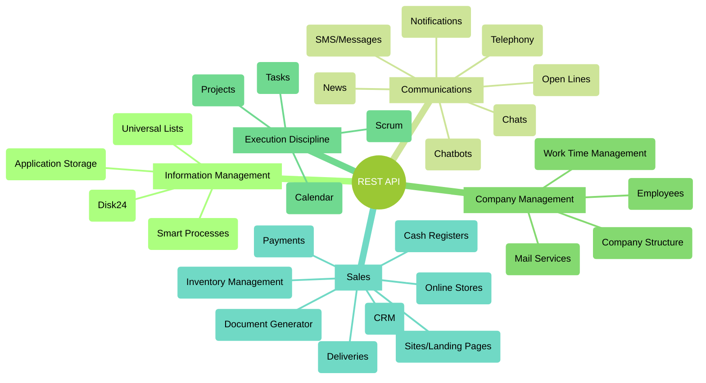

# Bitrix24 Tools Available for Developers

Bitrix24 is a comprehensive suite of interconnected business tools. The deep integration among them and a unified REST API allow for the creation of highly flexible automation scenarios.

The main tools available through the REST API can be divided into the following key sections:

By understanding the needs required to implement the necessary scenario, you will be able to find descriptions of the methods for these tools in the documentation.

It is important to utilize the existing functionality of Bitrix24, eliminating the need to write everything from scratch. It is essential to seek new interaction scenarios between the existing tools that are part of Bitrix24. Such scenarios open up vast opportunities and can be relatively simple to implement technically.

## Bitrix24 Tool

Bitrix24 is a comprehensive product that combines many different tools integrated with each other. This integration allows developers to offer users complete business scenarios using multiple tools.

The API reference contains descriptions of the available methods, events, and widgets for the corresponding Bitrix24 tools.

1. [{#T}](../api-reference/common/index.md)
2. [{#T}](../api-reference/biconnector/index.md)
3. [{#T}](../api-reference/crm/index.md)
4. [{#T}](../api-reference/ai/index.md)
5. [News Feed](../api-reference/log/index.md)
6. [{#T}](../api-reference/sale/index.md)
7. [Users](../api-reference/user/index.md)
8. [Workflows](../api-reference/bizproc/index.md)
9. [Tasks](../api-reference/tasks/index.md)
10. [Document Generator](../api-reference/document-generator/index.md)
11. [{#T}](../api-reference/calendar/index.md)
12. [Payment Systems](../api-reference/pay-system/index.md)
13. [{#T}](../api-reference/departments/index.md)
14. [{#T}](../api-reference/user-consent/index.md)
15. [Workgroups and Projects](../api-reference/sonet-group/sonet-group-create.md)
16. [Open Channels](../api-reference/imopenlines/index.md)
17. [Online Booking](../api-reference/booking/index.md)
18. [Chatbots](../api-reference/chat-bots/index.md)
19. [Chats](../api-reference/chats/index.md)
20. [Sites and Stores](../api-reference/landing/index.md)
21. [Message Providers, SMS Providers](../api-reference/messageservice/index.md)
22. [Universal Lists](../api-reference/lists/index.md)
23. [Work Time Accounting](../api-reference/timeman/index.md)
24. [Data Storage](../api-reference/entity/index.md)
25. [Trade Catalog](../api-reference/catalog/index.md)
26. [Telephony](../api-reference/telephony/index.md)
27. [Drive](../api-reference/disk/index.md)
28. [Mail Services](../api-reference/mailservice/index.md)