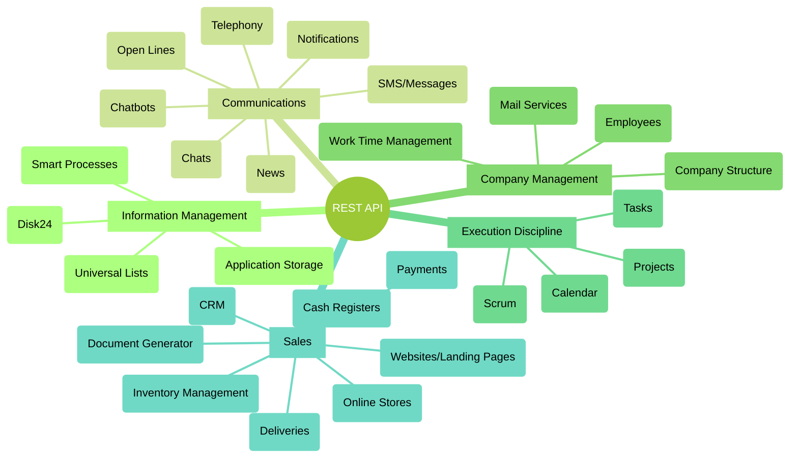

# Tools in Bitrix24 Available for Developers

Bitrix24 is a comprehensive suite of interconnected business tools. The deep integration between them and a unified REST API allows for the creation of highly flexible automation scenarios.

The main tools available through the REST API can be divided into the following key sections:

By understanding the needs required to implement the necessary scenario, you will be able to find descriptions of the methods for these tools in the documentation.

It is important to be able to utilize the existing functionality of Bitrix24, eliminating the need to write everything from scratch. It is crucial to seek new interaction scenarios between the existing tools that are part of Bitrix24. Such scenarios open up vast opportunities and can often be quite simple to implement technically.