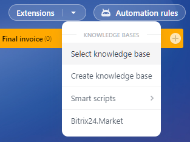

# Knowledge Base Embedding Locations



Some data may be missing here — we will complete it soon.



In the Bitrix24 interface, there are locations where users can embed Knowledge Bases.

Let's explore how to work with this from a REST perspective. Note that these are not pure embedding locations, which are discussed [here](../../../widgets/index.md). This is solely about working with Knowledge Bases from the interface perspective.

First, you need to determine the menu you want to embed into and obtain its code. You can do this by opening the menu binding selection in the interface ("Select Knowledge Base") and checking the address of the opened frame. There will be a parameter, for example, `menuId=crm_switcher:deal`. This is the so-called menu code, and you can work with it.