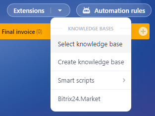

# Knowledge Base Embedding Locations



Some data may be missing here — we will complete it shortly.



In the Bitrix24 interface, there are locations where users can embed Knowledge Bases.

Let’s explore how to work with this through REST. These are not pure embedding locations as described [here](../../../widgets/index.md). This section only covers working with Knowledge Bases from the interface.

First, you need to decide on the menu you want to embed into and obtain its code. You can do this through the "Select Knowledge Base" option in the menu binding form and check the address of the opened frame. There will be a parameter, for example, `menuId=crm_switcher:deal`. This is the menu code that can be used with REST.

#| 
|| **Method** | **Description** ||
|| [landing.site.bindingToGroup](./landing-site-binding-to-group.md) | Binds the Knowledge Base to a Social Network group ||
|| [landing.site.getGroupBindings](./landing-site-get-group-bindings.md) | Retrieves Knowledge Base bindings to groups ||
|| [landing.site.unbindingFromGroup](./landing-site-unbinding-from-group.md) | Unbinds the Knowledge Base from a Social Network group ||
|| [landing.site.bindingToMenu](./landing-site-binding-to-menu.md) | Binds the Knowledge Base to a menu ||
|| [landing.site.getMenuBindings](./landing-site-get-menu-bindings.md) | Retrieves Knowledge Base bindings to menus ||
|| [landing.site.unbindingFromMenu](./landing-site-unbinding-from-menu.md) | Unbinds the Knowledge Base from a menu ||
|#